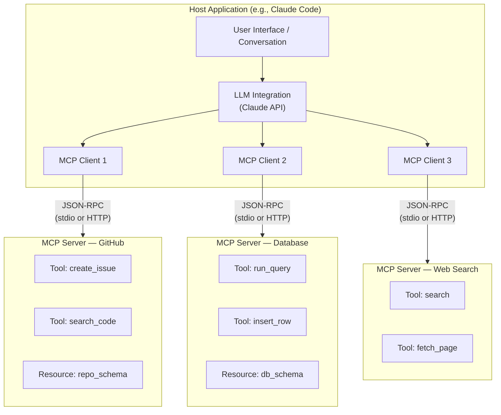
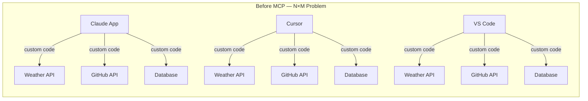
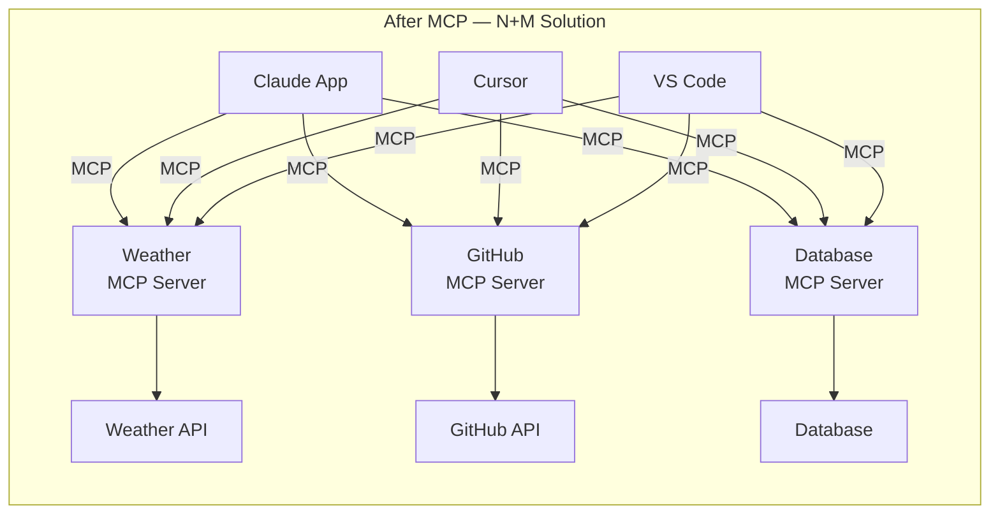
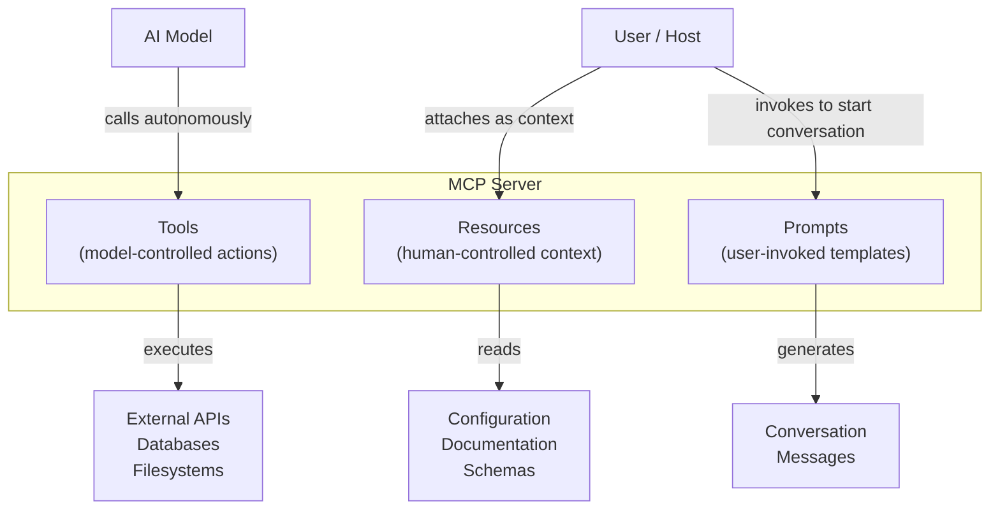
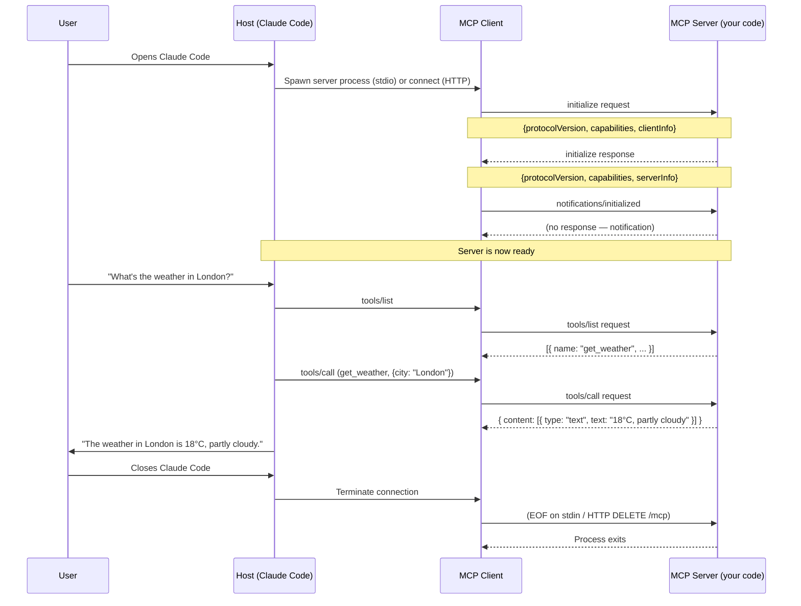
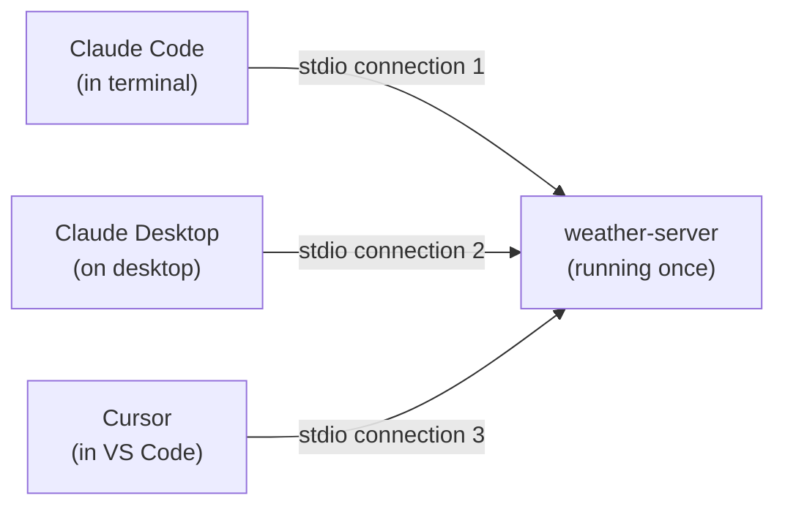
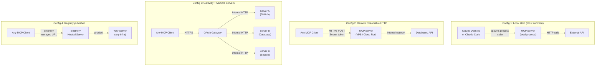

# Chapter 01: What Is MCP and Why It Exists

---

## Front Matter

**Learning Objectives**

By the end of this chapter you will be able to:

- Explain the N×M integration problem and why it made AI tool development unsustainable
- Describe the three-actor model (Host, Client, Server) and the role each plays
- Distinguish between the three server primitives — Tools, Resources, and Prompts — and know when each is appropriate
- Explain why MCP uses JSON-RPC 2.0 instead of REST
- Compare MCP against inline tool definitions, OpenAI function calling, LangChain tools, and direct API integration
- Make a principled decision about whether a given situation calls for MCP or a simpler approach
- Set up a minimal MCP server and connect it to Claude Code in under 15 minutes

**Prerequisites**

- Volume 1, Chapter 10 (AI Agents & Tool Use) — you understand what a tool is and how inline tool definitions work
- Volume 1, Chapter 11 (Multi-Agent Systems) — optional but useful for understanding multi-server architectures
- Python 3.12+ installed
- Node.js 22+ installed
- Claude Code CLI installed (`npm install -g @anthropic-ai/claude-code`)
- An Anthropic API key

**Estimated Reading Time:** 60 minutes

**Estimated Hands-on Time:** 45 minutes

---

## ⚡ Fast Read

> **Skim time: 5 minutes** — Read this if you're in a hurry, returning for reference, or already familiar with part of this topic.

- **What it is:** MCP (Model Context Protocol) is an open standard that lets any AI application connect to any tool or data source using a single, universal protocol — instead of writing custom integration code for every combination.
- **Why it matters:** Before MCP, every AI app had to implement its own version of every tool. Add a new AI provider or a new tool and you rewrite everything. MCP makes tools write-once, use-anywhere.
- **Key insight:** MCP is not a feature of Claude. It is a protocol — like HTTP or USB — that every AI system can implement. OpenAI, Google, Microsoft, and Anthropic all support it. A tool you build today works in Claude, Cursor, VS Code, and future AI systems that don't exist yet.
- **What you build:** A working FastMCP server with one tool, one resource, and one prompt — connected to Claude Code so you can call it in real conversation.
- **Jump to:** [Core Concepts](#core-concepts) | [First Code](#beginner-implementation) | [Best Practices](#best-practices) | [Mini Project](#mini-project)

---

## Why This Topic Exists

In Volume 1, Chapter 10, we built AI agents with tools defined inline — as JSON objects passed directly to the Claude API. Here is what that looked like:

```python
# Volume 1 style: inline tool definition (claude API)
tools = [
    {
        "name": "get_weather",
        "description": "Get the weather for a city",
        "input_schema": {
            "type": "object",
            "properties": {
                "city": {"type": "string"}
            },
            "required": ["city"]
        }
    }
]

response = client.messages.create(
    model="claude-sonnet-4-6",
    tools=tools,
    messages=[{"role": "user", "content": "What's the weather in London?"}]
)
```

This works. For a single application using a single AI provider, it works well.

Then the team adds Cursor to their workflow. Cursor doesn't use the Anthropic SDK — it uses its own integration mechanism. Someone has to rewrite the tool definition.

Then they add VS Code with GitHub Copilot. Same tool, third rewrite.

Then a second application in the company wants to use the same weather tool. Fourth copy of the same code.

Then the weather API changes its response format. Now there are four different files to update, across four different teams.

**This is the N×M problem.** N applications × M tools = N×M integration code. Every connection between an app and a tool is a custom piece of software that must be written, tested, deployed, and maintained separately.

```
Before MCP — N×M integrations:

  App A ──── custom code ──── Weather API
  App A ──── custom code ──── GitHub API
  App A ──── custom code ──── Database
  App B ──── custom code ──── Weather API
  App B ──── custom code ──── GitHub API
  App B ──── custom code ──── Database
  App C ──── custom code ──── Weather API
  ...

  3 apps × 3 tools = 9 integrations to build and maintain
  10 apps × 20 tools = 200 integrations
```

MCP collapses this to N+M:

```
After MCP — N+M integrations:

  App A ──── MCP Client ──┐
  App B ──── MCP Client ──┤──── Weather MCP Server ──── Weather API
  App C ──── MCP Client ──┘
                          ├──── GitHub MCP Server ──── GitHub API
                          └──── Database MCP Server ──── Database

  3 apps + 3 tools = 6 things to build
  10 apps + 20 tools = 30 things to build
  (vs 200 in the N×M world)
```

Each application implements the MCP client protocol once. Each tool implements the MCP server protocol once. They interoperate automatically.

This is the core problem MCP solves, and it is the reason every major AI company — Anthropic, OpenAI, Google, Microsoft, AWS — adopted the same standard within months of it being published.

---

## Real-World Analogy

### Analogy 1: USB-C

Before USB, every device manufacturer used a proprietary connector. Printers had DB-25 connectors. Keyboards had PS/2. Mice had their own connector. Cameras had their own. To connect a new device to a new computer, you needed a specific cable for that specific pair — N×M cables.

USB standardized the protocol. Now one port works with every device. Manufacturers write a USB driver once. It works everywhere.

MCP is USB for AI tools.

Your weather server is the "USB device." Claude Code, Cursor, VS Code, and your custom application are the "USB ports." You build the server once, in the same standard format, and it works everywhere.

### Analogy 2: The Language Server Protocol (LSP)

If you use VS Code with Python support, you get autocomplete, go-to-definition, error highlighting. How? Before LSP, every editor had to implement language support from scratch — VS Code's team wrote Python support, Vim's community wrote Python support, Emacs's community wrote Python support. N editors × M languages = N×M implementations.

In 2016, Microsoft published the Language Server Protocol. Now language teams write one language server. It works in every editor that implements LSP. Python has one language server — `pylsp` — that works in VS Code, Vim, Emacs, Neovim, Helix, and any future editor.

MCP is LSP for AI tool use. Anthropic published the protocol in November 2024. By mid-2026:
- 97 million monthly SDK downloads
- 20,000+ public MCP servers on registries
- Supported by Claude, GPT-4o, Gemini, Copilot, Cursor, VS Code, JetBrains

A tool you write to the MCP standard today works in AI systems that haven't been invented yet.

### Analogy 3: The App Store

Before app stores, if you wrote software, you distributed it yourself. Each user had to find it, download it, install it. The distribution cost was enormous.

App stores created a standard — Apple's or Google's — and provided discovery, distribution, and installation for free. Developers write once, publish once, reach everyone.

MCP registries like Smithery, Glama, and mcp.so are the app stores of MCP. You write a server, publish it once, and any user of any MCP-compatible client can install it with a single command.

---

## Core Concepts

### MCP — Model Context Protocol

**Technical definition:** An open protocol specification by Anthropic that standardizes how AI models communicate with external tools, data sources, and capabilities using JSON-RPC 2.0 as the wire format.

**Plain English:** A universal language that AI applications and tools speak so they can work together without custom integration code.

**Analogy:** HTTP is the language web browsers and web servers speak. MCP is the language AI assistants and tools speak.

---

### The Three Actors

MCP defines exactly three participants in every interaction. Understanding which role each piece of software plays is the first step to understanding the protocol.

#### Host

**Technical definition:** The user-facing application that manages one or more MCP clients and exposes AI capabilities to the user.

**Plain English:** The application the user runs. Claude Desktop, Cursor, VS Code, Claude Code CLI, or your own application.

**What the host does:**
- Decides which MCP servers to connect to
- Manages the Claude (or other LLM) conversation
- Shows the user what tools are available
- Presents tool results in the UI
- May ask the user for permission before tool calls

**Examples:** Claude Desktop, Cursor, VS Code + Claude extension, your custom Python application that embeds a Claude conversation

---

#### Client

**Technical definition:** A component embedded within the host that manages a single MCP connection to a single server, handling protocol negotiation and message routing.

**Plain English:** The glue between the host and one server. There is one client per server connection. The host manages multiple clients.

**What the client does:**
- Establishes and maintains the connection to the server
- Sends requests, receives responses
- Handles the initialization handshake
- Manages session state

**Key point:** Developers rarely write clients from scratch. The host application (Claude Desktop, Cursor) provides its own client. You write clients when building a custom host application. Volume 2 covers client development in Chapter 8.

---

#### Server

**Technical definition:** An independent process that implements the MCP server protocol and exposes capabilities (tools, resources, prompts) to connected clients.

**Plain English:** Your code. The server is what you build in this course. It exposes capabilities — functions the AI can call, data it can read, templates it can use.

**What the server does:**
- Advertises its available tools, resources, and prompts
- Executes tool calls and returns results
- Serves resource content when requested
- Provides prompt templates when asked

**Examples:** A GitHub server that exposes GitHub API as tools, a PostgreSQL server that exposes database queries as tools, a filesystem server that exposes file read/write as tools.

---

### The Three Server Primitives

These are the three things an MCP server can expose. Every capability in every MCP server is one of these three types.

#### Tool

**Technical definition:** A callable function exposed by an MCP server that the AI model can invoke autonomously based on its assessment of what action is needed.

**Plain English:** A thing the AI can *do*. Write a file. Search the web. Query a database. Send an email. The AI decides when to call it.

**Key characteristic:** Model-controlled. The AI reads the tool description and calls it when it thinks it should. The user doesn't have to explicitly say "use the weather tool."

**Examples:**
- `get_weather(city: str)` — AI calls when user asks about weather
- `create_github_issue(title, body, labels)` — AI calls when asked to create an issue
- `run_sql_query(query: str)` — AI calls when it needs data from the database
- `send_email(to, subject, body)` — AI calls when asked to send an email

**Analogy:** A tool is like a function your AI assistant can call. You tell it what to do; it figures out which function to call.

---

#### Resource

**Technical definition:** A read-only, URI-addressable piece of data that a client can request to provide context to the AI.

**Plain English:** A thing the AI (or the user) can *read*. Database schema. File contents. API documentation. Current configuration. The AI doesn't initiate resource reads — the host or user presents them as context.

**Key characteristic:** Human/host-controlled (not model-controlled). The host or user decides to include a resource as context. Think of it as "attaching a document to the conversation."

**Examples:**
- `db://users/schema` — database table definitions for context
- `github://owner/repo/issues` — list of open issues for context
- `file:///project/README.md` — project documentation for context
- `config://app/settings` — application configuration for context

**Analogy:** A resource is like attaching a file to an email. You (the user) decide what context to include; the AI reads it.

---

#### Prompt

**Technical definition:** A reusable, parameterized message template registered by an MCP server that users can invoke to start a structured conversation.

**Plain English:** A saved conversation starter. "Review this code" or "Analyze this SQL query" — pre-built instructions a user can invoke with a single action.

**Key characteristic:** User-invoked, server-defined. The user (not the AI) chooses to use a prompt template. The server provides them as reusable patterns.

**Examples:**
- `code_review(code, language)` — a structured code review prompt
- `sql_explain(query)` — explains what an SQL query does
- `security_audit(component)` — systematic security review template

**Analogy:** A prompt is like a meeting agenda template. Instead of typing all the agenda items from scratch every time, you start from a template.

---

### The Decision: Tool vs Resource vs Prompt

This is one of the most important decisions in MCP engineering. Use this table:

| Situation | Use |
|-----------|-----|
| AI needs to *take an action* (write, call, execute) | **Tool** |
| AI needs *background context* (schema, docs, config) | **Resource** |
| User wants to *start a structured conversation* | **Prompt** |
| Something needs to be called *repeatedly* or *dynamically* | **Tool** |
| Something is *read-only* and doesn't change during a conversation | **Resource** |
| Something is a *reusable workflow pattern* | **Prompt** |

When in doubt: if it changes something in the world, it's a Tool. If it just provides information, it's a Resource. If it's a conversation starter template, it's a Prompt.

---

### JSON-RPC 2.0

**Technical definition:** A remote procedure call protocol encoded in JSON, where each message is a request, response, notification, or error object. MCP uses JSON-RPC 2.0 as its wire format.

**Plain English:** The message format that clients and servers use to talk to each other. Every message between a client and server is a JSON object in JSON-RPC format.

**Why JSON-RPC instead of REST?**

REST is stateless by design. Each request is independent. But MCP needs:
- Stateful sessions (the server remembers who the client is)
- Bidirectional communication (servers can send messages to clients, not just respond)
- Method-based calls (more natural than resource URLs for procedural APIs)
- Efficient multiplexing (multiple requests in-flight simultaneously)

JSON-RPC provides all of these. Chapter 2 covers JSON-RPC in full depth.

---

### Transports

**Technical definition:** The mechanism by which JSON-RPC messages are physically transmitted between client and server.

MCP has two active transports:

**stdio (standard input/output):** The client launches the server as a subprocess. Messages are newline-delimited JSON on stdin/stdout. Used for local servers (Claude Code, Claude Desktop, Cursor). No networking required.

**Streamable HTTP:** The server runs as an HTTP service. Clients POST requests to a `/mcp` endpoint. Used for remote servers accessible over the internet.

Chapter 7 covers both transports in full depth.

---

## Architecture Diagrams

### The Three-Actor Model



---

### N×M Before MCP vs N+M After MCP





**Result:** 9 custom integrations reduced to 6 standard MCP connections. At scale (10 apps × 20 tools): 200 integrations reduced to 30.

---

### MCP Primitive Relationships



---

## Flow Diagrams

### The MCP Connection Lifecycle



---

## Beginner Implementation

The best way to understand MCP is to see the contrast: what you had to write before, and what you write after.

### Before MCP — The Volume 1 Approach

This is the pattern from Volume 1, Chapter 10. Tools are defined inline as JSON and tied to a specific Claude API call.

```python
# before_mcp.py — Learning example
# Tool definitions are JSON embedded in your application code.
# This only works with the Anthropic Claude API specifically.
import anthropic
import json

client = anthropic.Anthropic()

# The tool definition lives in your app — not reusable elsewhere
TOOLS = [
    {
        "name": "get_weather",
        "description": "Get the current weather for a city",
        "input_schema": {
            "type": "object",
            "properties": {
                "city": {
                    "type": "string",
                    "description": "The city name"
                }
            },
            "required": ["city"]
        }
    },
    {
        "name": "get_time",
        "description": "Get the current time in a city",
        "input_schema": {
            "type": "object",
            "properties": {
                "city": {
                    "type": "string",
                    "description": "The city name"
                }
            },
            "required": ["city"]
        }
    }
]

def call_tool(name: str, args: dict) -> str:
    if name == "get_weather":
        return json.dumps({"city": args["city"], "temperature": "18°C", "condition": "Partly cloudy"})
    if name == "get_time":
        return json.dumps({"city": args["city"], "time": "14:30", "timezone": "GMT"})
    return f"Unknown tool: {name}"

def run_agent(user_message: str) -> str:
    messages = [{"role": "user", "content": user_message}]

    while True:
        response = client.messages.create(
            model="claude-haiku-4-5-20251001",
            max_tokens=1024,
            tools=TOOLS,       # Inline definitions — Anthropic SDK only
            messages=messages
        )

        if response.stop_reason == "end_turn":
            return next(b.text for b in response.content if hasattr(b, "text"))

        if response.stop_reason == "tool_use":
            tool_calls = [b for b in response.content if b.type == "tool_use"]
            messages.append({"role": "assistant", "content": response.content})

            tool_results = []
            for call in tool_calls:
                result = call_tool(call.name, call.input)
                tool_results.append({
                    "type": "tool_result",
                    "tool_use_id": call.id,
                    "content": result
                })
            messages.append({"role": "user", "content": tool_results})

if __name__ == "__main__":
    print(run_agent("What's the weather and time in London?"))
```

**What's wrong with this?**

1. The tools are embedded in `before_mcp.py`. If you want the same tools in Cursor, you copy-paste the JSON into a different format.
2. If you update the weather tool's description, you update it in every application that uses it.
3. Only Claude can use these tools — they're in Anthropic's specific JSON format.
4. You can't share these tools with teammates without sharing your entire application.

---

### After MCP — The Server Approach

Now the same tools live in an MCP server. Write it once. Use it everywhere.

**Step 1: Install FastMCP**

```bash
# Create a project
mkdir weather-mcp-server
cd weather-mcp-server
uv init
uv add fastmcp
```

**Step 2: Write the server**

```python
# server.py — Learning example
# Tools defined once as an MCP server.
# Works in Claude Code, Claude Desktop, Cursor, VS Code, and any future MCP client.
import json
from fastmcp import FastMCP

# Create the server — give it a name clients will display
mcp = FastMCP(
    name="weather-server",
    instructions="Provides weather and time information for cities worldwide."
)

# @mcp.tool replaces the inline JSON tool definition.
# FastMCP automatically generates the JSON schema from the type hints.
@mcp.tool
def get_weather(city: str) -> str:
    """Get the current weather for a city.
    
    Args:
        city: The name of the city to get weather for.
    """
    # In a real server, this would call a weather API.
    # For this example, we return sample data.
    data = {
        "city": city,
        "temperature": "18°C",
        "condition": "Partly cloudy",
        "humidity": "72%"
    }
    return json.dumps(data)

@mcp.tool
def get_time(city: str) -> str:
    """Get the current local time for a city.
    
    Args:
        city: The city to get the time for.
    """
    data = {
        "city": city,
        "time": "14:30",
        "timezone": "GMT",
        "utc_offset": "+0"
    }
    return json.dumps(data)

# Resources provide read-only context the AI can use
@mcp.resource("weather://coverage")
def coverage_info() -> str:
    """List of cities this server covers."""
    return json.dumps({
        "covered_cities": ["London", "New York", "Tokyo", "Sydney", "Paris"],
        "update_frequency": "Every 15 minutes",
        "data_source": "WeatherCorp API"
    })

# Prompts provide reusable conversation starters
@mcp.prompt
def weather_report(city: str) -> str:
    """Generate a comprehensive weather report for a city.
    
    Args:
        city: The city to report on.
    """
    return f"Give me a detailed weather report for {city}, including current conditions, forecast for the next 3 days, and any weather warnings."

if __name__ == "__main__":
    # Run with stdio transport — for Claude Code / Claude Desktop
    mcp.run()
```

**Step 3: Connect to Claude Code**

```bash
# Register the server with Claude Code
claude mcp add weather-server -- python /path/to/server.py

# Verify it was added
claude mcp list
```

Or edit `~/.claude/settings.json` directly:

```json
{
  "mcpServers": {
    "weather-server": {
      "command": "python",
      "args": ["/path/to/server.py"]
    }
  }
}
```

**Step 4: Use it**

Open Claude Code and ask:
```
What's the weather in London?
```

Claude will automatically call `get_weather("London")` on your server. You'll see the tool call in the output, along with the result.

**What changed?**

| Before MCP | After MCP |
|-----------|-----------|
| Tools in your app's code | Tools in a standalone server |
| Only works with Anthropic SDK | Works with any MCP client |
| Reused by copy-pasting JSON | Reused by adding one config line |
| Update requires changing every app | Update in one place propagates everywhere |
| No standard discovery | Listed in Smithery/Glama registries |

---

### The TypeScript Equivalent

```typescript
// server.ts — Learning example
// The same server in TypeScript/Node.js — identical capability, different language.
import { McpServer } from "@modelcontextprotocol/sdk/server/mcp.js";
import { StdioServerTransport } from "@modelcontextprotocol/sdk/server/stdio.js";
import { z } from "zod";

const server = new McpServer({
  name: "weather-server",
  version: "1.0.0",
});

// Register the get_weather tool
server.registerTool(
  "get_weather",
  {
    description: "Get the current weather for a city",
    inputSchema: {
      city: z.string().describe("The name of the city"),
    },
    annotations: {
      readOnlyHint: true,
      openWorldHint: true,
    },
  },
  async ({ city }) => ({
    content: [{
      type: "text",
      text: JSON.stringify({
        city,
        temperature: "18°C",
        condition: "Partly cloudy",
        humidity: "72%",
      }),
    }],
  })
);

// Register the get_time tool
server.registerTool(
  "get_time",
  {
    description: "Get the current local time for a city",
    inputSchema: {
      city: z.string().describe("The city to get the time for"),
    },
    annotations: { readOnlyHint: true },
  },
  async ({ city }) => ({
    content: [{
      type: "text",
      text: JSON.stringify({ city, time: "14:30", timezone: "GMT" }),
    }],
  })
);

// Connect with stdio transport
const transport = new StdioServerTransport();
await server.connect(transport);
console.error("Weather MCP server running"); // stderr only — stdout is reserved for MCP
```

```bash
# Run the TypeScript server
npx tsx server.ts

# Or compile first
npx tsc && node dist/server.js
```

```json
// package.json
{
  "name": "weather-mcp-server",
  "version": "1.0.0",
  "type": "module",
  "scripts": {
    "start": "tsx server.ts"
  },
  "dependencies": {
    "@modelcontextprotocol/sdk": "^1.0.0",
    "zod": "^3.23.0"
  },
  "devDependencies": {
    "tsx": "^4.0.0",
    "typescript": "^5.0.0"
  }
}
```

---

## Intermediate Implementation

### The Same Server, Multiple Clients

The real power of MCP becomes visible when the same server connects to multiple clients simultaneously. Here is the same weather server connected to three different clients:



> **Wait — how does one stdio process handle multiple clients?**
>
> It doesn't, quite. Each host spawns its own server process. The weather server runs as three separate processes — one per host. This is how stdio works: one process per connection. For Streamable HTTP, a single server process handles all connections. Chapter 7 covers this distinction in detail.

**Claude Code config** (`~/.claude/settings.json`):
```json
{
  "mcpServers": {
    "weather": { "command": "python", "args": ["server.py"] }
  }
}
```

**Claude Desktop config** (`~/Library/Application Support/Claude/claude_desktop_config.json`):
```json
{
  "mcpServers": {
    "weather": { "command": "python", "args": ["/path/to/server.py"] }
  }
}
```

**Cursor config** (`~/.cursor/mcp.json`):
```json
{
  "mcpServers": {
    "weather": { "command": "python", "args": ["/path/to/server.py"] }
  }
}
```

Three clients. One server implementation. Zero rewriting.

---

### Adding a Resource and Seeing It Used

Resources provide context that helps the AI use tools correctly. Here is a more complete server that shows the interplay between tools and resources:

```python
# server_v2.py — Intermediate example
import json
from fastmcp import FastMCP, Context

mcp = FastMCP(
    name="weather-server-v2",
    instructions=(
        "Provides weather data. "
        "Before using tools, check the weather://coverage resource "
        "to verify the requested city is covered."
    )
)

# The schema resource tells the AI what cities are available
# The AI reads this before deciding whether to call get_weather
@mcp.resource("weather://coverage")
def get_coverage() -> str:
    """Coverage map and available cities."""
    return json.dumps({
        "covered_cities": ["London", "New York", "Tokyo", "Sydney", "Paris"],
        "units": {"temperature": "celsius", "wind": "km/h"},
        "note": "Cities not in this list will return estimated data"
    })

@mcp.resource("weather://api-status")
def get_api_status() -> str:
    """Current API health and rate limits."""
    return json.dumps({
        "status": "operational",
        "requests_remaining": 4850,
        "reset_at": "2026-06-30T15:00:00Z"
    })

@mcp.tool
async def get_weather(city: str, ctx: Context) -> str:
    """Get current weather for a city.
    
    Args:
        city: City name. Check weather://coverage for supported cities.
    """
    await ctx.info(f"Fetching weather for: {city}")
    
    # In a real server, call the weather API here
    data = {
        "city": city,
        "temperature_c": 18,
        "condition": "Partly cloudy",
        "wind_kmh": 15,
        "humidity_pct": 72
    }
    
    await ctx.info(f"Weather data retrieved for {city}")
    return json.dumps(data)

@mcp.tool
async def get_forecast(city: str, days: int = 3, ctx: Context = None) -> str:
    """Get weather forecast for a city.
    
    Args:
        city: City name.
        days: Number of days to forecast (1-7). Default: 3.
    """
    if days < 1 or days > 7:
        from fastmcp.exceptions import ToolError
        raise ToolError(f"Forecast range must be 1–7 days, got {days}")
    
    forecast = [
        {"day": i + 1, "high_c": 20 - i, "low_c": 12 - i, "condition": "Sunny"}
        for i in range(days)
    ]
    return json.dumps({"city": city, "forecast": forecast})

@mcp.prompt
def weather_briefing(city: str, purpose: str = "travel") -> str:
    """Generate a weather briefing optimized for a specific purpose.
    
    Args:
        city: The city to brief on.
        purpose: Why you need the weather info: travel, outdoor_event, commute.
    """
    return (
        f"Give me a weather briefing for {city} optimized for {purpose}. "
        f"Include current conditions, {3 if purpose == 'travel' else 1}-day forecast, "
        f"and specific advice relevant to {purpose}."
    )

if __name__ == "__main__":
    mcp.run()
```

---

## Advanced Implementation

### Production-Grade Server Structure

As your server grows, you organize it across multiple files. This is the directory structure you will use throughout this course:

```
weather-mcp-server/
├── pyproject.toml
├── .env.example
├── .env                    ← local only, in .gitignore
├── src/
│   ├── __init__.py
│   ├── server.py           ← FastMCP server + lifespan
│   ├── tools/
│   │   ├── __init__.py
│   │   ├── weather.py      ← tool implementations
│   │   └── forecast.py
│   ├── resources/
│   │   ├── __init__.py
│   │   └── coverage.py     ← resource implementations
│   └── prompts/
│       ├── __init__.py
│       └── briefings.py    ← prompt definitions
└── tests/
    ├── test_tools.py
    └── test_resources.py
```

```toml
# pyproject.toml
[project]
name = "weather-mcp-server"
version = "1.0.0"
requires-python = ">=3.12"
dependencies = [
    "fastmcp>=3.0",
    "httpx>=0.27",          # For real HTTP calls to weather APIs
    "pydantic-settings>=2", # Environment variable management
]

[project.scripts]
server = "src.server:main"
```

```python
# src/server.py — Production example
from contextlib import asynccontextmanager
import httpx
from fastmcp import FastMCP
from .tools.weather import register_weather_tools
from .tools.forecast import register_forecast_tools
from .resources.coverage import register_coverage_resources
from .prompts.briefings import register_briefing_prompts

@asynccontextmanager
async def lifespan(server: FastMCP):
    # Startup: initialize shared HTTP client
    server.state.http = httpx.AsyncClient(
        base_url="https://api.weathercorp.example.com",
        headers={"Authorization": f"Bearer {server.state.api_key}"},
        timeout=10.0,
    )
    yield
    # Shutdown: close the HTTP client cleanly
    await server.state.http.aclose()

mcp = FastMCP(
    name="weather-server",
    instructions="Production weather server. Check coverage resource before calling tools.",
    mask_error_details=True,   # Don't leak internal details to clients in production
    lifespan=lifespan,
)

# Register all components from separate modules
register_weather_tools(mcp)
register_forecast_tools(mcp)
register_coverage_resources(mcp)
register_briefing_prompts(mcp)

def main():
    mcp.run()

if __name__ == "__main__":
    main()
```

```python
# src/tools/weather.py — Production example
import json
import httpx
from fastmcp import FastMCP, Context
from fastmcp.exceptions import ToolError

def register_weather_tools(mcp: FastMCP) -> None:
    
    @mcp.tool(
        tags={"weather", "current"},
        annotations={"readOnlyHint": True, "openWorldHint": True},
    )
    async def get_weather(city: str, ctx: Context) -> str:
        """Get current weather conditions for a city.
        
        Returns temperature, conditions, humidity, and wind speed.
        Check weather://coverage before calling to confirm the city is supported.
        
        Args:
            city: City name (e.g., "London", "New York", "Tokyo")
        """
        await ctx.info(f"Fetching weather for: {city}")
        
        try:
            response = await ctx.server.state.http.get(
                "/current",
                params={"city": city, "units": "metric"}
            )
            response.raise_for_status()
        except httpx.HTTPStatusError as e:
            if e.response.status_code == 404:
                raise ToolError(f"City '{city}' not found in coverage area")
            raise ToolError(f"Weather API error: {e.response.status_code}")
        except httpx.RequestError as e:
            raise ToolError("Weather API temporarily unavailable — try again in a moment")
        
        return json.dumps(response.json())
```

---

## Production Architecture

In production, MCP servers are deployed in one of four configurations:



**Configuration 1 (local stdio)** is the starting point for most developers. No networking, no authentication, OS process isolation.

**Configuration 2 (remote HTTP)** enables shared team servers and servers that need to be accessed from anywhere. Requires OAuth 2.1 authentication.

**Configuration 3 (gateway)** is the enterprise pattern. One authentication point for many servers. Covered in Chapter 12.

**Configuration 4 (registry)** is the public server pattern. Smithery manages hosting and discovery. Covered in Chapter 14.

---

## Technology Comparison

### MCP vs Alternatives

| Approach | Reusability | Cross-vendor | Discovery | Auth built-in | When to use |
|----------|------------|-------------|-----------|--------------|-------------|
| **MCP** | Yes — any client | Yes — all major AI vendors | Smithery, Glama | OAuth 2.1 (remote) | Shared tools, team use, publish to ecosystem |
| **Inline tools (Vol 1)** | No | No — provider-specific | None | Via app auth | Single app, prototype, learning |
| **OpenAI function calling** | No | OpenAI only | None | Via app auth | OpenAI-specific app |
| **LangChain tools** | Partial — within LangChain | LangChain only | LangChain Hub | Custom | LangChain-based agents |
| **Direct API calls** | No | N/A | None | Custom | Specific, simple integrations |

### When NOT to use MCP

MCP adds overhead (protocol negotiation, server process management). Choose simpler approaches when:

- **You're prototyping.** Inline tools get you running in 5 minutes; MCP adds setup overhead.
- **You have exactly one app that will ever use these tools.** MCP's value is reuse and standardization. One app gets limited benefit.
- **Your tool is trivial.** A single API call that never changes and will only ever be used in one place doesn't need a server.
- **You need sub-millisecond latency.** MCP's process spawn and protocol overhead (typically 50–100ms for stdio startup) is acceptable for most use cases but not for latency-critical hot paths.

---

## Decision Framework

```
Do I need MCP for this?

Is this tool used by more than one application or team member?
├── YES → MCP is the right choice
└── NO
    │
    ├── Will it likely be used by more than one application in the next 6 months?
    │   ├── YES → MCP now saves a rewrite later
    │   └── NO
    │       │
    │       ├── Does this need to work with more than one AI provider?
    │       │   ├── YES → MCP (universal standard)
    │       │   └── NO
    │       │       │
    │       │       ├── Is this a prototype or throwaway tool?
    │       │       │   ├── YES → Inline tools (simpler, faster to ship)
    │       │       │   └── NO → MCP (invest in the right architecture)
```

---

## Best Practices

**1. Name tools as verbs, resources as nouns.**

Tools do things: `get_weather`, `create_issue`, `run_query`. Resources are things: `weather://coverage`, `github://repos`, `db://schema`. This tells the AI and the reader immediately what category they're in.

```python
# Correct
@mcp.tool
def get_weather(city: str) -> str: ...  # verb: get

@mcp.resource("weather://coverage")
def coverage() -> str: ...  # noun: coverage

# Wrong
@mcp.tool
def weather(city: str) -> str: ...  # ambiguous

@mcp.resource("weather://get_coverage")
def get_coverage() -> str: ...  # verb in a resource
```

**2. Write tool descriptions as if you were writing documentation for a junior developer.**

The AI reads the description before deciding whether to call a tool. Vague descriptions cause wrong tool selection. Precise descriptions cause correct tool selection.

```python
# Wrong — too vague
@mcp.tool
def search(q: str) -> str:
    """Search something."""

# Correct — precise and actionable
@mcp.tool
def search_github_issues(
    query: str,
    repo: str,
    state: str = "open",
) -> str:
    """Search GitHub issues in a repository by keyword.
    
    Use this when the user wants to find specific issues, bugs, or feature requests
    in a GitHub repository. Returns up to 30 matching issues sorted by relevance.
    
    Args:
        query: Search terms (e.g., "login page 500 error")
        repo: Repository in "owner/name" format (e.g., "anthropics/anthropic-sdk-python")
        state: Filter by issue state: "open", "closed", or "all"
    """
```

**3. Always define tool annotations.**

Annotations tell the client (and the AI) what kind of operation this is. Missing annotations leave clients unable to show appropriate confirmation dialogs.

```python
from mcp.types import ToolAnnotations

# Read-only operations
@mcp.tool(annotations=ToolAnnotations(readOnlyHint=True, idempotentHint=True))
def get_data(id: str) -> str: ...

# Irreversible operations
@mcp.tool(annotations=ToolAnnotations(destructiveHint=True))
def delete_record(id: str) -> str: ...

# External API calls
@mcp.tool(annotations=ToolAnnotations(openWorldHint=True))
def search_web(query: str) -> str: ...
```

**4. Use resources for context, tools for actions.**

A common beginner mistake is making everything a tool. Resources are more efficient — they can be read once and cached; tool calls cost a round-trip and LLM tokens.

```python
# Wrong: schema as a tool (costs a tool call to read it)
@mcp.tool
def get_database_schema() -> str:
    return json.dumps(SCHEMA)

# Correct: schema as a resource (efficient, human-controlled context)
@mcp.resource("db://schema")
def database_schema() -> str:
    return json.dumps(SCHEMA)
```

**5. Write descriptive server instructions.**

The `instructions` parameter in `FastMCP(instructions=...)` is sent to the AI as a system-level note about the server. Use it to guide the AI toward better tool use.

```python
# Wrong: no instructions
mcp = FastMCP("github-server")

# Correct: guide the AI
mcp = FastMCP(
    "github-server",
    instructions=(
        "This server provides access to GitHub repositories. "
        "Before creating issues or PRs, check the github://repos resource "
        "to confirm the repository exists and you have the right owner/name format. "
        "All write operations (create, update, delete) require confirmation."
    )
)
```

**6. Use `mask_error_details=True` in production.**

Internal exception messages can leak implementation details (database names, file paths, stack traces) to clients. Mask them in production.

```python
# Development
mcp = FastMCP("server", mask_error_details=False)  # Full errors visible

# Production
mcp = FastMCP("server", mask_error_details=True)   # Internal errors are hidden
```

---

## Security Considerations

Chapter 12 covers MCP security in depth. For now, understand the two threat surfaces:

**stdio servers (local):**
- Security model is OS process isolation
- The server runs as the same user as the host
- A malicious MCP server has access to everything that user can access
- Only install MCP servers from sources you trust

**Streamable HTTP servers (remote):**
- Exposed to the internet — must implement OAuth 2.1 + PKCE
- All requests must be authenticated; anonymous access is not acceptable for production
- The server must validate `Origin` headers to prevent DNS rebinding attacks
- Chapter 12 covers the full security model

**The rug pull attack:**
A malicious server describes itself as a harmless utility (weather, calculator) but the description contains hidden instructions that manipulate the AI into harmful actions. Always audit server descriptions before adding them to your config.

---

## Cost Considerations

MCP itself is free — it is an open protocol with no licensing cost.

Costs come from:

| Component | Development | Production |
|-----------|------------|------------|
| FastMCP (Python) | Free | Free |
| MCP Python/TypeScript SDK | Free | Free |
| Local stdio server | $0 (runs on your machine) | $0 (runs on user's machine) |
| Remote Streamable HTTP server | ~$5–10/month (VPS) | ~$10–50/month (VPS) or $0–5/month (Cloud Run, pay-per-use) |
| Smithery hosted server | Free tier available | Free–$29/month |
| Smithery registry listing | Free | Free |
| Claude API calls via the MCP agent | Same as Vol 1 Ch 19 | Same as Vol 1 Ch 19 |

The MCP overhead on Claude API costs is negligible. Each `tools/list` call adds a few hundred tokens to the context, but this is a one-time cost per session, not per tool call.

---

## Common Mistakes

**Mistake 1: Treating resources like tools**

```python
# Wrong: user data as a tool (requires a model decision to fetch)
@mcp.tool
def get_user_profile(user_id: str) -> str:
    return db.get_user(user_id)

# Correct: user-addressable data as a resource
@mcp.resource("users://{user_id}/profile")
def user_profile(user_id: str) -> str:
    return db.get_user(user_id)
```

Resources let the host and user attach data as context without spending a model call to retrieve it.

---

**Mistake 2: Writing to stdout in a stdio server**

```python
# Wrong: this corrupts the stdio MCP stream
@mcp.tool
def my_tool() -> str:
    print("Calling API...")      # print() writes to stdout — breaks MCP protocol
    return do_work()

# Correct: use stderr for logging, or the Context logger
import sys

@mcp.tool
async def my_tool(ctx: Context) -> str:
    await ctx.info("Calling API...")      # Goes through MCP logging protocol
    print("Debug", file=sys.stderr)      # Goes to stderr — safe
    return do_work()
```

---

**Mistake 3: Vague tool names that confuse the AI**

```python
# Wrong: two tools named similarly — AI calls the wrong one
@mcp.tool
def search(query: str) -> str: ...

@mcp.tool
def find(query: str) -> str: ...

# Correct: names are specific and non-overlapping
@mcp.tool
def search_github_issues(query: str, repo: str) -> str: ...

@mcp.tool
def find_local_files(pattern: str, directory: str) -> str: ...
```

---

**Mistake 4: Missing `required` fields in manual JSON schemas**

If you ever write raw JSON schema (in the TypeScript SDK or raw Python SDK), forgetting `required` means all parameters become optional — the AI may omit required fields.

```typescript
// Wrong: no required array — city is optional to the model
server.registerTool("get_weather", {
  inputSchema: {
    city: z.string(),  // Zod handles required correctly
  }
}, handler);

// Wrong (raw JSON Schema): missing required
const schema = {
  type: "object",
  properties: {
    city: { type: "string" }
  }
  // No required: [] — city is optional!
};

// Correct (raw JSON Schema):
const schema = {
  type: "object",
  properties: {
    city: { type: "string" }
  },
  required: ["city"],
  additionalProperties: false  // Reject unknown parameters
};
```

---

**Mistake 5: One giant server with 50 tools**

Research shows LLM tool selection accuracy drops sharply above 15–20 tools. A 50-tool server makes Claude uncertain which tool to call.

```
# Wrong: one giant server
server = FastMCP("everything-server")
# 50 tools for GitHub, database, email, calendar, CRM, payment...

# Correct: domain-separated servers
github_server = FastMCP("github-server")     # GitHub only
database_server = FastMCP("database-server") # Database only
email_server = FastMCP("email-server")       # Email only
```

---

## Debugging Guide

### Diagnostic Flowchart

```
Server not connecting to Claude Code?
├── Run: claude mcp list
│   └── Is the server listed?
│       ├── NO → Run: claude mcp add <name> -- <command>
│       └── YES
│           └── Is the status "connected"?
│               ├── YES → Server is fine; check tool usage next
│               └── NO → Server failed to start
│                   └── Check: does `python server.py` run without errors?

Tools not appearing in Claude?
├── Ask Claude: "What MCP tools do you have available?"
│   └── No tools listed?
│       └── Check: is the server registered? (claude mcp list)
│           └── Does the server declare the tools capability?
│               └── FastMCP does this automatically
│               └── Raw SDK: check create_initialization_options()

Tool called but wrong result?
├── Check: is the tool description precise enough?
├── Check: is the function actually being called? (add logging)
├── Run MCP Inspector to call the tool directly:
│   npx @modelcontextprotocol/inspector python server.py
└── Check the tool's return value format
```

### Common Error Reference

| Symptom | Cause | Fix |
|---------|-------|-----|
| `Server process exited` in Claude Code | Server crashes on startup | Run `python server.py` directly; read the error |
| `Unknown tool: X` (-32602) | Tool name mismatch | Run `claude mcp list` to see registered tools; check spelling |
| Server lists tools but Claude doesn't use them | Tool descriptions too vague | Rewrite descriptions to be more specific |
| `Permission denied` on startup | Wrong Python path | Use absolute path in config, or use `uv run` |
| Server connects but resources missing | Resources not declared | Verify `@mcp.resource` decorators and run MCP Inspector |
| Output appears in wrong format | `print()` to stdout | Use `sys.stderr` or `ctx.info()` |
| Tools work in Inspector but not in Claude | Capability not declared | FastMCP handles this; check for startup errors |

---

## Performance Optimisation

Chapter 1 servers are simple enough that performance is not the concern. Two notes for when it becomes relevant:

**Startup time matters for stdio servers.** Claude Code has a timeout for server startup. If your server takes more than a few seconds to start (large model loading, slow imports), it may time out. Keep startup fast; defer expensive initialization to lifespan.

```python
# Wrong: slow import at module level
import torch  # Takes 2–3 seconds to import — blocks startup
from fastmcp import FastMCP

mcp = FastMCP("slow-server")

# Correct: defer slow imports
from fastmcp import FastMCP

mcp = FastMCP("fast-server")

@mcp.tool
def ml_tool(input: str) -> str:
    import torch  # Imported on first tool call, not at startup
    ...
```

**FastMCP vs raw SDK.** FastMCP adds ~30–40% overhead over the raw SDK in high-throughput scenarios (thousands of tool calls per second). At normal agent usage patterns (1–5 tool calls per conversation), this is irrelevant. The raw SDK is only worth the complexity at extreme scale.

---

## Production Issue: The N×M Rewrite

### Symptoms

Engineering team reports: "We need to switch from GPT-4 to Claude, and it's going to take three months." Specifically:

- All tool definitions are in OpenAI function calling format (`function.parameters` schema)
- Five applications each have their own copy of the same 12 tools
- Every copy has minor variations that have diverged over 18 months
- Some copies have bug fixes that others don't
- One application's version of the `search` tool returns different fields than the others
- The migration requires updating all five applications simultaneously

The team estimates 60 developer-days to migrate.

### Root Cause

The team built tools as inline definitions embedded in each application, using OpenAI's format. When the format changed (provider switch, model upgrade), all copies had to change at once. Because the copies had diverged, there was no single source of truth.

### How to Diagnose It

```bash
# Count how many copies of the same tool exist
grep -r "get_weather" . --include="*.py" | grep -v ".pyc"
# Result: 15 files across 5 applications

# Check for divergence
grep -A 20 '"name": "get_weather"' app1/tools.py > /tmp/tool_a.json
grep -A 20 '"name": "get_weather"' app2/tools.py > /tmp/tool_b.json
diff /tmp/tool_a.json /tmp/tool_b.json
# Result: 6 field differences — tools have diverged
```

### How to Fix It

Migrate each tool to a standalone MCP server. The migration is mechanical: tool JSON schema becomes `@mcp.tool` with type hints; implementation code moves to the server unchanged.

```python
# Before: inline in each application (OpenAI format)
tool_definition = {
    "type": "function",
    "function": {
        "name": "get_weather",
        "description": "Get weather for a city",
        "parameters": {
            "type": "object",
            "properties": {
                "city": {"type": "string"}
            },
            "required": ["city"]
        }
    }
}

def get_weather(city: str) -> str:
    return call_weather_api(city)
```

```python
# After: one MCP server used by all applications
from fastmcp import FastMCP

mcp = FastMCP("weather-server")

@mcp.tool
def get_weather(city: str) -> str:
    """Get current weather for a city."""
    return call_weather_api(city)

if __name__ == "__main__":
    mcp.run()
```

Each application's tool definition JSON is deleted and replaced with one config line:

```json
{ "mcpServers": { "weather": { "command": "python", "args": ["weather_server.py"] } } }
```

### How to Prevent It in Future

The architectural rule: **tools that are used by more than one system live in MCP servers, not in application code.**

Enforce it in code review: any PR that adds tool definitions as inline JSON to an application should be flagged and redirected to an MCP server.

---

## Exercises

**Exercise 1 — Install and verify (15 minutes)**

Install FastMCP. Write a minimal server with one tool that returns your name and the current timestamp. Connect it to Claude Code. Ask Claude "What is today's date and who made this server?" — verify it calls the tool.

**Exercise 2 — Add a resource (20 minutes)**

Add a resource to your Exercise 1 server. The resource at `server://info` should return a JSON object with the server name, version, and a list of available tools. Use MCP Inspector to verify the resource is readable.

**Exercise 3 — Add a prompt (20 minutes)**

Add a prompt to your server called `daily_briefing` that takes a `name: str` parameter and returns a friendly morning briefing prompt template. Test it in Claude Code by invoking the prompt.

**Exercise 4 — TypeScript version (30 minutes)**

Rewrite your Exercise 1 server in TypeScript using the MCP TypeScript SDK. Connect both the Python and TypeScript versions to Claude Code simultaneously. Verify both appear in `claude mcp list` and both respond correctly.

**Exercise 5 — Multiple clients (30 minutes)**

Add your server to both Claude Code and Claude Desktop configurations. In Claude Code, ask a question that uses the tool. In Claude Desktop, ask the same question. Verify both work independently. Examine your system's process list — how many server processes are running?

---

## Quiz

**Question 1:** What problem does MCP primarily solve?

**Answer:** The N×M integration problem. Before MCP, every AI application had to write custom integration code for every tool. With MCP, each application implements the client protocol once and each tool implements the server protocol once — reducing N×M integrations to N+M.

---

**Question 2:** What are the three actors in the MCP architecture? Describe each in one sentence.

**Answer:**
- **Host:** The user-facing application (Claude Desktop, Cursor, your app) that manages MCP clients and presents AI capabilities to the user.
- **Client:** A component inside the host that manages one protocol connection to one MCP server.
- **Server:** Your code — an independent process that exposes tools, resources, and prompts to any connected client.

---

**Question 3:** What are the three server primitives? When do you use each?

**Answer:**
- **Tool:** An action the AI can take autonomously. Use when the AI needs to write, call, execute, or change something.
- **Resource:** Read-only data the host/user attaches as context. Use when you need to give the AI background information it can read.
- **Prompt:** A reusable conversation template the user invokes. Use for standardized workflows and structured conversation starters.

---

**Question 4:** Why does MCP use JSON-RPC 2.0 instead of REST?

**Answer:** REST is stateless and request-only. MCP needs: (1) stateful sessions — the server maintains context across requests; (2) bidirectional communication — servers can send messages to clients; (3) method-based calls — more natural than resource URLs for procedure calls; (4) multiplexing — multiple in-flight requests simultaneously.

---

**Question 5:** What does `@mcp.tool` do differently from a plain function decorator?

**Answer:** It registers the function as an MCP tool, automatically generating a JSON Schema from Python type hints and docstrings, handling async execution, converting return values to MCP content blocks, and adding the tool to the server's `tools/list` response. Without it, the function is just a regular Python function — invisible to MCP clients.

---

**Question 6:** You have a tool that reads a database schema. Another developer suggests making it a resource instead. Who is right and why?

**Answer:** The other developer. Database schema is read-only data that doesn't change during a conversation — the definition of a resource. Making it a resource lets the host attach it as context without spending a model call to retrieve it, and lets users include it with a single click. As a tool, the AI has to decide to call it and use up tool call tokens every time it needs the schema.

---

**Question 7:** What happens to a stdio MCP server when Claude Code closes?

**Answer:** The server process is terminated. Claude Code spawns the server as a subprocess at startup and kills it on exit. The next time Claude Code starts, a fresh server process is spawned. This means stdio servers should not store state in memory between sessions — any persistent state must go to a database or file.

---

**Question 8:** What is the key difference between Streamable HTTP and the deprecated HTTP+SSE transport?

**Answer:** Streamable HTTP uses a single HTTP endpoint (`/mcp`) that handles both POST (client to server) and GET (server-initiated SSE). The old HTTP+SSE transport used a persistent GET connection for SSE and a separate POST endpoint, which required sticky sessions behind load balancers. Streamable HTTP is stateless-friendly and horizontally scalable.

---

**Question 9:** A teammate says "I'll just put all our company's tools in one giant MCP server — easier to manage." What is the problem with this approach?

**Answer:** LLM tool selection accuracy degrades above 15–20 tools. A server with 50 tools covering GitHub, database, email, and CRM makes Claude uncertain which tool to call, leading to wrong tool selections and poor agent performance. The correct pattern is domain-separated servers: one server per concern.

---

**Question 10:** When should you NOT use MCP?

**Answer:** When a simpler approach is appropriate: prototyping (inline tools are faster to ship), a single application that will never share its tools with others (limited reuse benefit), trivial single-purpose API calls that will never change, or latency-critical hot paths where MCP's startup overhead is unacceptable.

---

## Mini Project

### Build and Connect Your First MCP Server

**Time estimate:** 2–3 hours

**What you build:** A personal utility MCP server with at least three tools, one resource, and one prompt — connected to Claude Code and verified working.

**Suggested tools to implement:**

```
get_current_time() → current time in multiple timezones
convert_units(value, from_unit, to_unit) → unit conversion
word_count(text) → word, sentence, and paragraph count
summarize_url(url) → fetches a URL and returns the first 500 characters
```

**Step-by-step:**

1. Create a new project: `mkdir my-utils && cd my-utils && uv init && uv add fastmcp httpx`
2. Write `server.py` with at least three tools using `@mcp.tool`
3. Add one resource (e.g., `utils://help` that lists available tools and examples)
4. Add one prompt (e.g., `quick_task(task)` that structures a task into steps)
5. Test locally: `python server.py` — confirm it starts without errors
6. Add to Claude Code: `claude mcp add my-utils -- python /path/to/server.py`
7. Test in Claude Code: "Convert 100 miles to kilometers"
8. Test the resource in MCP Inspector: `npx @modelcontextprotocol/inspector python server.py`

**Acceptance criteria:**

- [ ] Server starts without errors
- [ ] `claude mcp list` shows the server as connected
- [ ] At least 3 tools respond correctly in Claude Code
- [ ] Resource is readable in MCP Inspector
- [ ] Prompt appears in Claude Code's prompt list
- [ ] No output to stdout (all logs use stderr or ctx methods)

---

## Production Project

### Team Utility Server

**Time estimate:** 1–2 days

**What you build:** A production-structured MCP server with at least five tools that would be genuinely useful to your team. The server is published to a teammate's Claude Code configuration.

**Requirements:**

1. **Multi-module structure** — follow the production directory layout from the Advanced Implementation section
2. **At least 5 tools** — at least two should make real external HTTP calls (weather API, IP lookup, etc.)
3. **At least 2 resources** — one static (help/docs), one dynamic (current status or live data)
4. **At least 1 prompt** — a workflow that your team would actually use
5. **Error handling** — all HTTP calls use `try/except`; errors return `ToolError` with helpful messages
6. **Proper logging** — use `ctx.info()` for operational logs; `ctx.error()` for failures
7. **Tool annotations** — every tool has correct `readOnlyHint`, `destructiveHint` values
8. **A README** — documents the server's tools, required environment variables, and setup steps
9. **Shared config** — commit a `claude-mcp-config.json` your teammates can merge into their own config

**Acceptance criteria:**

- [ ] All tools work correctly in Claude Code
- [ ] A teammate can follow the README and connect the server without assistance
- [ ] MCP Inspector can list all tools and call each one
- [ ] No unhandled exceptions — all error paths return `ToolError` with a useful message
- [ ] Tool descriptions are clear enough that Claude uses the right tool without being told which to use

---

## Key Takeaways

- MCP solves the N×M integration problem: instead of N apps × M tools = N×M custom integrations, you get N+M — each side implements the protocol once.
- MCP is a protocol, not a product. Every major AI vendor supports it. Tools you build today work in AI systems that don't exist yet.
- The three-actor model (Host / Client / Server) maps cleanly to (application / glue / your code). You write servers.
- The three primitives (Tool / Resource / Prompt) have clear roles: Tools do things, Resources provide context, Prompts template conversations.
- JSON-RPC 2.0 is the wire format because MCP needs stateful, bidirectional, multiplexed communication — things REST doesn't provide.
- FastMCP eliminates boilerplate — `@mcp.tool` with type hints generates the entire JSON Schema automatically.
- The same MCP server works in Claude Code, Claude Desktop, Cursor, VS Code, and any future MCP client with zero modification.
- stdio is the default transport for local servers: no networking, no auth, spawned as a subprocess by the host.
- Streamable HTTP is for remote servers that need to be shared over the internet.
- Tool descriptions are the most important thing you write — they determine whether the AI calls the right tool. Treat them like public API documentation.
- One server per domain, not one giant server. Tool selection accuracy degrades above ~20 tools.
- Building on MCP now is equivalent to building on HTTP in 1995 or USB in 2005 — the protocol won and everything else will converge to it.

---

## Chapter Summary

| Concept | Key Takeaway |
|---------|-------------|
| N×M problem | N apps × M tools = unsustainable maintenance; MCP collapses to N+M |
| MCP protocol | Open standard, JSON-RPC 2.0 wire format, all major AI vendors support it |
| Host | The application the user runs (Claude Desktop, Cursor, your app) |
| Client | Lives in the host; manages one connection to one server |
| Server | Your code; exposes capabilities via JSON-RPC over stdio or HTTP |
| Tool | Model-controlled action; the AI decides when to call it |
| Resource | Human/host-controlled context; read-only, URI-addressable |
| Prompt | User-invoked conversation template; predefined workflow |
| stdio transport | Local only; host spawns server as subprocess; pipe communication |
| Streamable HTTP | Remote; HTTP POST + SSE; supports multiple clients; requires auth |
| FastMCP | Python framework; `@mcp.tool` generates JSON Schema from type hints |
| Tool descriptions | Most critical thing you write; determines AI tool selection accuracy |

---

## Resources

**Official Documentation**
- [MCP Official Documentation](https://modelcontextprotocol.io) — spec, concepts, tutorials
- [FastMCP Documentation](https://gofastmcp.com) — the primary Python framework
- [MCP Python SDK](https://github.com/modelcontextprotocol/python-sdk)
- [MCP TypeScript SDK](https://github.com/modelcontextprotocol/typescript-sdk)

**Reference Materials (this course)**
- [JSON-RPC Cheat Sheet](../reference/01-json-rpc-cheat-sheet.md)
- [MCP Spec Cheat Sheet](../reference/02-mcp-spec-cheat-sheet.md)
- [Transport Comparison](../reference/03-transport-comparison.md)
- [FastMCP API Reference](../reference/06-fastmcp-api.md)

**Registries (explore existing servers)**
- [Smithery](https://smithery.ai) — the primary MCP server registry
- [Glama](https://glama.ai/mcp/servers) — 22,000+ servers
- [mcp.so](https://mcp.so) — community registry

**Further Reading**
- [Language Server Protocol](https://microsoft.github.io/language-server-protocol/) — the protocol MCP is modeled after; useful mental model
- [JSON-RPC 2.0 Specification](https://www.jsonrpc.org/specification)

---

## Glossary Terms Introduced

| Term | Definition |
|------|-----------|
| **MCP** | Model Context Protocol — open standard for AI-tool communication using JSON-RPC 2.0 |
| **Host** | The user-facing application that manages MCP clients (Claude Desktop, Cursor, Claude Code) |
| **Client** | A component in the host that manages one connection to one MCP server |
| **Server** | Your code; exposes Tools, Resources, and Prompts to connected clients |
| **Tool** | A callable function the AI model can invoke autonomously to take actions |
| **Resource** | Read-only, URI-addressable data a client can request for context |
| **Prompt** | A parameterized conversation template users can invoke from MCP clients |
| **stdio transport** | Communication via stdin/stdout; server is launched as a subprocess |
| **Streamable HTTP** | HTTP-based transport using POST + SSE; the current standard for remote servers |
| **JSON-RPC 2.0** | The wire format for all MCP messages: structured JSON request/response/notification objects |
| **N×M problem** | The integration scaling problem where N apps × M tools = N×M custom integrations to maintain |
| **FastMCP** | Python framework for building MCP servers; `@mcp.tool` generates schemas from type hints |
| **Capability negotiation** | The initialization handshake where client and server declare what features they support |
| **Tool annotation** | Metadata on a tool (readOnlyHint, destructiveHint, etc.) that tells clients how to handle it |

---

## See Also

| Chapter | Connection |
|---------|-----------|
| [Vol 1, Ch 10 — AI Agents & Tool Use](https://github.com/Bschouha19/AI-Engineering-Handbook/blob/main/chapters/chapter-10-ai-agents.md) | Where inline tool definitions come from; MCP replaces this pattern for shared tools |
| [Vol 1, Ch 11 — Multi-Agent Systems](https://github.com/Bschouha19/AI-Engineering-Handbook/blob/main/chapters/chapter-11-multi-agent.md) | Multi-agent patterns; MCP servers become the tool layer in multi-agent systems |
| [Ch 02 — Protocol Architecture](./chapter-02-protocol-architecture.md) | Deep dive into JSON-RPC 2.0 and the full MCP protocol lifecycle |
| [Ch 03 — Your First MCP Server](./chapter-03-first-server.md) | Builds on this chapter; full server setup with MCP Inspector |
| [Ch 04 — MCP Tools](./chapter-04-tools.md) | Comprehensive tool design patterns and the full `@mcp.tool` API |
| [Ch 05 — Resources and Prompts](./chapter-05-resources-prompts.md) | Comprehensive resource and prompt patterns |
| [Ch 07 — Transports](./chapter-07-transports.md) | Deep dive into stdio and Streamable HTTP implementation |
| [Ch 12 — Auth and Security](./chapter-12-auth-security.md) | OAuth 2.1 + PKCE for remote servers; OWASP MCP Top 10 |
| [Ch 14 — Deployment](./chapter-14-deployment.md) | Taking an MCP server from local to production |

---

## Preparation for Next Chapter

**Chapter 02: MCP Protocol Architecture — How It Actually Works**

In Chapter 2, we go one layer deeper: the exact JSON-RPC 2.0 messages that flow between client and server. You will read actual protocol traces, understand what happens during capability negotiation, and see the complete lifecycle of a tool call at the wire level.

### Technical Checklist

Before Chapter 2:

- [ ] Your MCP server from the Mini Project is running and connected to Claude Code
- [ ] You have run `npx @modelcontextprotocol/inspector python server.py` and can see your tools
- [ ] You have read [JSON-RPC Cheat Sheet](../reference/01-json-rpc-cheat-sheet.md) — Chapter 2 assumes you know the four message types
- [ ] You understand the difference between a Tool, Resource, and Prompt from this chapter

### Conceptual Check

After this chapter, you should be able to answer:

1. Why does the same server work in Claude Code and Cursor without modification?
2. What is the difference between a Tool and a Resource? Give an example of each.
3. What is the Host in the MCP model when you use Claude Code?
4. Why does MCP use JSON-RPC instead of REST?

### Optional Challenge

Look at the [Smithery registry](https://smithery.ai) and find three MCP servers you would actually use. For each one, identify:
- What tools does it expose?
- Does it use stdio or Streamable HTTP?
- What resources or prompts does it offer?
- Who would benefit most from this server?

This builds the intuition for server design that Chapter 4 formalises.
