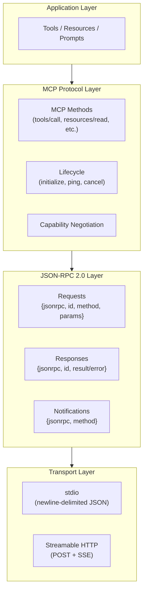
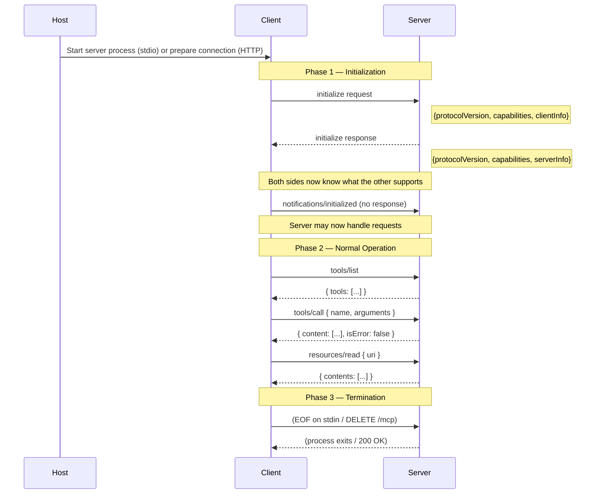
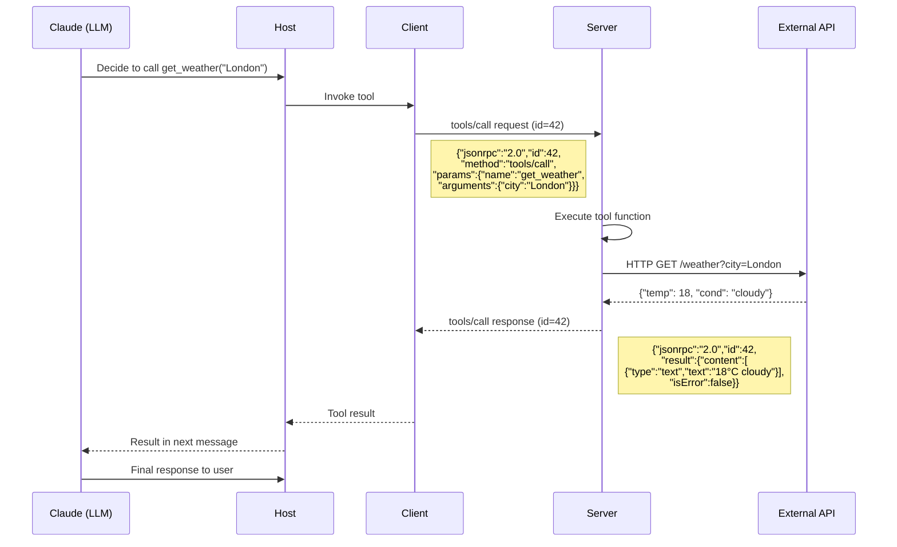
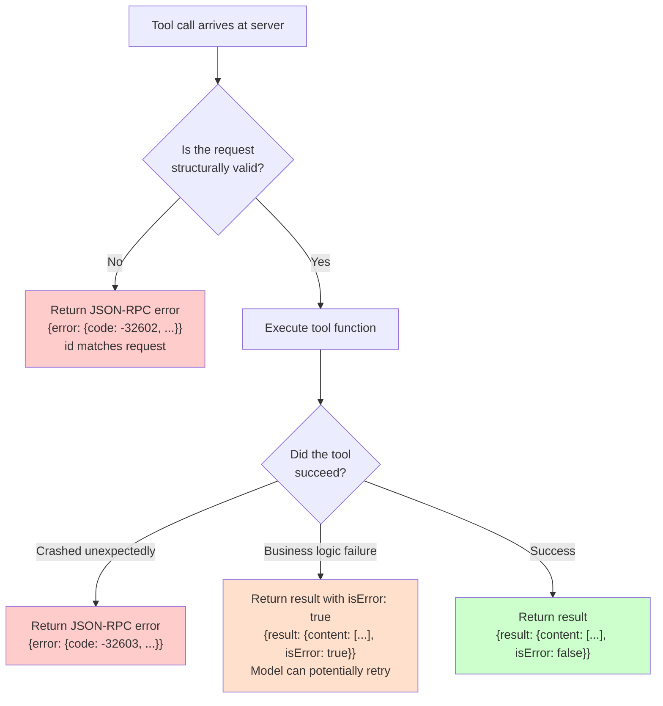
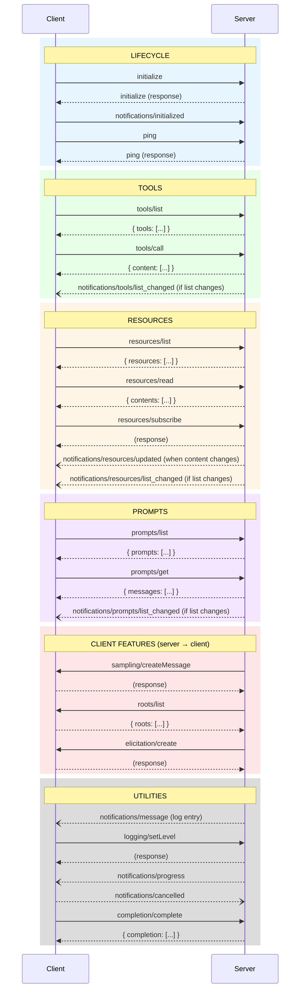
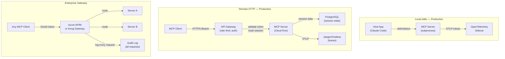

# Chapter 02: MCP Protocol Architecture — How It Actually Works

---

## Front Matter

**Learning Objectives**

By the end of this chapter you will be able to:

- Read and write all four JSON-RPC 2.0 message types that MCP uses
- Trace the complete initialization handshake and explain what every message does
- Describe capability negotiation and explain why a server cannot use a feature it has not declared
- Identify every MCP method, which direction it flows, and what it does
- Explain how the same JSON-RPC messages travel over stdio and Streamable HTTP
- Diagnose protocol-level failures by reading error codes and message sequences
- Use MCP Inspector to inspect live protocol traffic from your own server
- Write a protocol message logger that captures every raw MCP message for debugging

**Prerequisites**

- Chapter 01 complete — you understand what MCP is, the three-actor model, and the three primitives
- Your Chapter 01 server is running and connected to Claude Code
- MCP Inspector installed: `npm install -g @modelcontextprotocol/inspector` (or run via `npx`)
- [JSON-RPC Cheat Sheet](../reference/01-json-rpc-cheat-sheet.md) read

**Estimated Reading Time:** 65 minutes

**Estimated Hands-on Time:** 50 minutes

---

## ⚡ Fast Read

> **Skim time: 5 minutes** — Read this if you're in a hurry, returning for reference, or already know JSON-RPC.

- **What it is:** The exact JSON messages, ordering rules, and lifecycle that govern every interaction between an MCP client and server — from connection to tool call to disconnection.
- **Why it matters:** Every time something breaks in MCP — wrong tool called, server not responding, capability not working — the answer is in the protocol. You cannot debug what you cannot read.
- **Key insight:** Nothing works until the initialization handshake completes. The client sends `initialize`, the server responds, the client sends `notifications/initialized`, and only *then* can any tool, resource, or prompt be used. Skip any step and the server will refuse requests.
- **What you build:** A transparent protocol logger that captures every raw JSON-RPC message flowing through your server — the single most useful debugging tool you will build in this course.
- **Jump to:** [Core Concepts](#core-concepts) | [First Code](#beginner-implementation) | [Best Practices](#best-practices) | [Mini Project](#mini-project)

---

## Why This Topic Exists

Chapter 1 explained what MCP is and why it exists. You wrote a server, connected it to Claude Code, and called a tool. It worked.

Now something breaks. Claude Code says "Server process exited." MCP Inspector shows a connection error. A tool returns an unexpected error code. The Claude API reports the tool call failed.

How do you debug it?

You read the protocol.

Every interaction between an MCP client and server is a sequence of JSON messages. Those messages follow precise rules — ordering constraints, required fields, valid methods, negotiated capabilities. When something goes wrong, one of those rules was violated. Finding the violation tells you exactly what to fix.

This chapter teaches you to read the protocol the way a network engineer reads packets — not as an abstraction, but as the literal bytes that solve your problem.

It also teaches the deeper why. Understanding why the initialization handshake has three steps, why capabilities are negotiated rather than assumed, and why notifications have no response — these decisions reveal the design philosophy behind MCP and make you a better protocol implementer.

---

## Real-World Analogy

### Analogy 1: Telephone Protocol

When you call someone on a phone, there is a protocol you both follow without thinking:

1. **Your phone rings** — connection established
2. **You say "hello"** — greeting, signals you are ready
3. **They say "hello"** — confirms they are ready
4. **Conversation begins** — actual communication

If you skip step 2 and immediately say "Can you pick me up at 6?" the other person doesn't know who is calling or whether the connection is clear. The protocol exists to establish shared state before useful communication begins.

MCP's initialization handshake is the same thing. Before any tool can be called, client and server must establish: what protocol version they share, what each side can do, and that both are ready. This is not bureaucracy — it is the minimum shared state required for reliable communication.

### Analogy 2: HTTP — The Protocol You Already Know

You already understand one application protocol deeply: HTTP. Consider how an HTTP request-response works:

```
Client → GET /weather?city=London HTTP/1.1
         Host: api.weather.com
         Accept: application/json

Server → HTTP/1.1 200 OK
         Content-Type: application/json
         
         {"temperature": 18, "condition": "cloudy"}
```

HTTP has:
- A request with method, path, headers, optional body
- A response with status code, headers, body
- Specific error status codes (404, 500, etc.)
- Connection lifecycle (keep-alive, close)

MCP is the same idea, one level up. Instead of HTTP methods (GET/POST), MCP has JSON-RPC method names (`tools/call`, `resources/read`). Instead of HTTP status codes, MCP has JSON-RPC error codes. Instead of HTTP headers, MCP has capability objects.

If you can read an HTTP request-response trace, you can learn to read an MCP protocol trace. The skills are directly transferable.

### Analogy 3: The LSP Handshake

MCP is explicitly modeled on the Language Server Protocol (LSP) — the protocol that powers code intelligence in VS Code. If you have ever worked on a language extension or wondered how "go to definition" works across editors, you have been using a protocol architecturally identical to MCP.

LSP has the same three-phase structure: `initialize` → `initialized` → normal requests. The terminology is so similar that MCP's specification references LSP as prior art. If you know LSP, MCP is immediately familiar. If you don't, MCP is your on-ramp.

---

## Core Concepts

### JSON-RPC 2.0 — The Wire Format

JSON-RPC 2.0 defines exactly four types of messages. Every byte that flows between an MCP client and server is one of these four types. There are no exceptions.

**Type 1: Request** — caller sends, expects a response

```json
{
  "jsonrpc": "2.0",
  "id": 1,
  "method": "tools/call",
  "params": {
    "name": "get_weather",
    "arguments": { "city": "London" }
  }
}
```

Required fields: `jsonrpc` (always `"2.0"`), `id` (unique per in-flight request), `method` (the operation).

---

**Type 2: Response (success)** — reply to a request

```json
{
  "jsonrpc": "2.0",
  "id": 1,
  "result": {
    "content": [
      { "type": "text", "text": "London: 18°C, partly cloudy" }
    ],
    "isError": false
  }
}
```

Required fields: `jsonrpc`, `id` (matches the request), `result`. Never includes `error`.

---

**Type 3: Error Response** — reply to a request, indicating failure

```json
{
  "jsonrpc": "2.0",
  "id": 1,
  "error": {
    "code": -32602,
    "message": "Unknown tool: invalid_tool",
    "data": { "tool": "invalid_tool" }
  }
}
```

Required fields: `jsonrpc`, `id`, `error` object with `code` and `message`. Never includes `result`. `error` and `result` are mutually exclusive — a response has one or the other, never both.

---

**Type 4: Notification** — one-way message, no response expected

```json
{
  "jsonrpc": "2.0",
  "method": "notifications/initialized"
}
```

No `id` field. This is the defining characteristic of a notification. The sender does not wait for a reply.

---

### The `id` Field — Why It Matters

The `id` field is how the client matches responses to requests when multiple requests are in-flight simultaneously. Consider:

```
Client                    Server
  │                          │
  ├── request id=1 ─────────►│
  ├── request id=2 ─────────►│
  ├── request id=3 ─────────►│
  │◄────────────── response id=2 ──┤  (came back first — that's fine)
  │◄────────────── response id=1 ──┤
  │◄────────────── response id=3 ──┤
```

Responses can arrive in any order. The `id` matches each response to the request that generated it. Without `id`, multiplexing is impossible.

Valid `id` types: string, number, or null. In practice, use integers (1, 2, 3...) or UUIDs. Avoid `null` — it creates ambiguous responses in some implementations.

---

### Capability Negotiation

Capability negotiation is one of MCP's most important protocol features and one of the most misunderstood.

**The problem it solves:** In a protocol where both sides can initiate requests, how do you know whether the other side supports a given feature? You cannot just try it and see — some servers crash on unknown messages; some clients crash on unexpected server-initiated requests.

**The solution:** Both sides declare their capabilities in the initialization handshake. Neither side may use a feature the other has not declared.

**Server capabilities** (what the server offers clients):

```json
{
  "capabilities": {
    "tools": {
      "listChanged": true
    },
    "resources": {
      "subscribe": true,
      "listChanged": true
    },
    "prompts": {
      "listChanged": true
    },
    "logging": {}
  }
}
```

**Client capabilities** (what the client offers servers):

```json
{
  "capabilities": {
    "roots": {
      "listChanged": true
    },
    "sampling": {}
  }
}
```

If a server declares `"tools": { "listChanged": true }` and later its tool list changes, it may send a `notifications/tools/list_changed` notification. If it did not declare this capability, it must not send the notification — the client would reject it.

If a server wants to use `sampling/createMessage` (ask the client to run an LLM inference), it must first check whether the client declared the `sampling` capability. If the client did not declare it, the server cannot use sampling — the request would fail with `-32021 MissingRequiredClientCapability`.

**Rule:** No capability declared → no feature used. The initialization handshake is your contract.

---

### Version Negotiation

MCP versions are date strings: `2024-11-05`, `2025-03-26`, `2025-11-25`. The client proposes a version in the initialize request. The server responds with the version it will use.

```
Client sends: { "protocolVersion": "2025-11-25" }
Server responds:
  - If it supports 2025-11-25: { "protocolVersion": "2025-11-25" }  ← use this version
  - If it doesn't: { "protocolVersion": "2025-03-26" }               ← fall back
  - If incompatible: Error -32022 UnsupportedProtocolVersion
```

The client must use whatever version the server returns. If the server returns an older version, the client must operate in that compatibility mode.

**For Streamable HTTP:** the protocol version is also sent as an HTTP header on every request after initialization:

```
MCP-Protocol-Version: 2025-11-25
```

---

### The Session

A **session** is the stateful relationship between one client and one server, beginning with a successful initialization handshake and ending when either side terminates.

**For stdio:** the session is the process lifetime. One session per process. Session ends when the process exits.

**For Streamable HTTP:** the server may issue a session ID in the `Mcp-Session-Id` response header during initialization. The client includes this header on every subsequent request. The server uses it to route requests to the correct session state.

```
Session lifecycle:
  1. Client → Server: initialize request
  2. Server → Client: initialize response + Mcp-Session-Id header (HTTP only)
  3. Client → Server: notifications/initialized notification
  4. [Normal operation: tool calls, resource reads, etc.]
  5. Client → Server: DELETE /mcp with Mcp-Session-Id (HTTP) or EOF on stdin (stdio)
  6. Session ends
```

---

## Architecture Diagrams

### Protocol Layer Stack



---

### Complete Initialization Sequence



---

### Tool Call — Detailed Message Flow



---

### Error Flow — Protocol vs Execution Error



---

## Flow Diagrams

### The Full MCP Message Exchange Map



---

## Beginner Implementation

### Reading the Protocol — Add a Message Logger

The fastest way to understand MCP is to watch the actual JSON messages flowing through your server. Let us add a transparent logger to the Chapter 1 weather server that prints every raw JSON-RPC message.

**Why this is the most important debugging tool you will build:**

When something goes wrong — a tool isn't being called, a connection fails, a response doesn't match — the first question is always: "What message was actually sent?" A protocol logger answers that immediately, without guessing.

```python
# logger_server.py — Learning example
# Transparent protocol message logger — wraps any FastMCP server
# Shows every raw JSON-RPC message flowing in both directions

import sys
import json
import asyncio
import logging
from fastmcp import FastMCP

# Configure logging to stderr (NOT stdout — stdout carries MCP messages)
logging.basicConfig(
    stream=sys.stderr,
    level=logging.DEBUG,
    format="%(asctime)s [%(levelname)s] %(message)s",
)
logger = logging.getLogger("mcp-trace")

# --- Our server (from Chapter 1) ---
mcp = FastMCP(
    name="weather-server-traced",
    instructions="Weather server with protocol tracing enabled.",
)

@mcp.tool
def get_weather(city: str) -> str:
    """Get weather for a city."""
    return json.dumps({"city": city, "temperature": "18°C", "condition": "Partly cloudy"})

@mcp.resource("weather://coverage")
def coverage() -> str:
    """Available cities."""
    return json.dumps({"cities": ["London", "New York", "Tokyo"]})

# --- Protocol interceptor ---
# FastMCP uses the MCP Python SDK underneath.
# We intercept at the transport layer to log raw messages.

class LoggingStdioTransport:
    """Wraps stdio to log every JSON-RPC message."""

    def __init__(self):
        self._stdin = sys.stdin.buffer
        self._stdout = sys.stdout.buffer
        self._message_count = 0

    def _log_message(self, direction: str, raw: bytes) -> None:
        self._message_count += 1
        try:
            parsed = json.loads(raw)
            msg_type = self._classify(parsed)
            logger.debug(
                f"[{self._message_count:04d}] {direction} {msg_type}\n"
                f"  {json.dumps(parsed, indent=2)}"
            )
        except json.JSONDecodeError:
            logger.debug(f"[{self._message_count:04d}] {direction} [INVALID JSON]\n  {raw!r}")

    def _classify(self, msg: dict) -> str:
        if "method" in msg and "id" in msg:
            return f"REQUEST  method={msg['method']} id={msg['id']}"
        if "method" in msg:
            return f"NOTIFICATION  method={msg['method']}"
        if "result" in msg:
            return f"RESPONSE(ok)  id={msg.get('id')}"
        if "error" in msg:
            code = msg["error"].get("code")
            return f"RESPONSE(err) id={msg.get('id')} code={code}"
        return "UNKNOWN"

    def read_line(self) -> bytes:
        line = self._stdin.readline()
        if line:
            self._log_message("← CLIENT", line.strip())
        return line

    def write_line(self, data: bytes) -> None:
        self._log_message("→ SERVER", data.strip())
        self._stdout.write(data)
        self._stdout.flush()


# The simplest way to see protocol messages: run with MCP Inspector
# which shows them in its UI without any custom code needed.

if __name__ == "__main__":
    logger.info("Starting weather server with protocol tracing")
    logger.info("All JSON-RPC messages will be logged to stderr")
    logger.info("Use MCP Inspector to see messages in a visual UI")
    
    # FastMCP handles stdio transport internally.
    # For production tracing, use MCP Inspector or OpenTelemetry.
    # See the Intermediate Implementation for a proper middleware approach.
    mcp.run()
```

---

### The Easier Way: MCP Inspector

MCP Inspector is the official debugging tool that shows you protocol messages in a visual UI. You don't need to write any logging code to use it.

```bash
# Inspect your Chapter 1 server
npx @modelcontextprotocol/inspector python server.py
```

Open the URL it prints (usually `http://localhost:5173`). You will see:

1. **The initialization handshake** — the very first thing that happens
2. **Tools tab** — lists all tools with their schemas
3. **Resources tab** — lists all resources
4. **Prompts tab** — lists all prompts
5. **Console tab** — raw JSON-RPC messages in both directions

**Use the Console tab.** It shows the exact JSON messages. This is the ground truth for debugging.

Let us trace exactly what happens when you click "List Tools" in MCP Inspector:

```json
// → CLIENT → SERVER (Request)
{
  "jsonrpc": "2.0",
  "id": 2,
  "method": "tools/list",
  "params": {}
}

// ← SERVER → CLIENT (Response)
{
  "jsonrpc": "2.0",
  "id": 2,
  "result": {
    "tools": [
      {
        "name": "get_weather",
        "description": "Get weather for a city.",
        "inputSchema": {
          "type": "object",
          "properties": {
            "city": {
              "type": "string",
              "description": "Get weather for a city.\n\nArgs:\n    city: The name of the city."
            }
          },
          "required": ["city"]
        }
      }
    ]
  }
}
```

Notice: `id: 2`. The initialization handshake used `id: 1`. The IDs increment with each request.

---

### The Initialization Handshake — Complete Message Trace

Here is the full initialization sequence between MCP Inspector and your Chapter 1 server, exactly as it appears in the Console tab:

```json
// Step 1: Client → Server (Request, id=1)
// "I'm a client. Here is my version, capabilities, and info. What are yours?"
{
  "jsonrpc": "2.0",
  "id": 1,
  "method": "initialize",
  "params": {
    "protocolVersion": "2025-11-25",
    "capabilities": {
      "roots": { "listChanged": true },
      "sampling": {}
    },
    "clientInfo": {
      "name": "MCP Inspector",
      "version": "0.14.1"
    }
  }
}

// Step 2: Server → Client (Response, id=1)
// "I support version 2025-11-25. Here is what I can do."
{
  "jsonrpc": "2.0",
  "id": 1,
  "result": {
    "protocolVersion": "2025-11-25",
    "capabilities": {
      "tools": {},
      "resources": {},
      "prompts": {},
      "logging": {}
    },
    "serverInfo": {
      "name": "weather-server",
      "version": "0.1.0"
    }
  }
}

// Step 3: Client → Server (Notification — NO id, NO response)
// "Acknowledged. I am now ready to send real requests."
{
  "jsonrpc": "2.0",
  "method": "notifications/initialized"
}

// ── Handshake complete ──
// The server will now accept tools/list, tools/call, etc.
// Before this point, the server MUST reject all non-lifecycle requests.
```

**Why three steps?**

Step 1: Client declares itself and asks for server capabilities.
Step 2: Server declares its capabilities. But the server cannot trust that the client received them yet — the response might have been lost in a network hiccup.
Step 3: Client confirms receipt with `notifications/initialized`. Only now can the server trust the handshake is complete.

This is a variant of the classic "three-way handshake" you see in TCP. The third step is the acknowledgment that makes the handshake reliable.

---

### Reading a Tool Call — Complete Message Trace

When you click "Call Tool" in MCP Inspector for `get_weather`:

```json
// Client → Server (Request)
{
  "jsonrpc": "2.0",
  "id": 3,
  "method": "tools/call",
  "params": {
    "name": "get_weather",
    "arguments": {
      "city": "London"
    }
  }
}

// Server → Client (Success Response)
{
  "jsonrpc": "2.0",
  "id": 3,
  "result": {
    "content": [
      {
        "type": "text",
        "text": "{\"city\": \"London\", \"temperature\": \"18\\u00b0C\", \"condition\": \"Partly cloudy\"}"
      }
    ],
    "isError": false
  }
}
```

Now intentionally trigger a tool error:

```json
// Client → Server (Request — wrong tool name)
{
  "jsonrpc": "2.0",
  "id": 4,
  "method": "tools/call",
  "params": {
    "name": "nonexistent_tool",
    "arguments": {}
  }
}

// Server → Client (Protocol Error Response)
{
  "jsonrpc": "2.0",
  "id": 4,
  "error": {
    "code": -32602,
    "message": "Unknown tool: nonexistent_tool"
  }
}
```

Notice: this is a protocol error (`error` field), not a tool execution error (`result.isError`). The tool name is invalid — the request structure itself is wrong. The model cannot retry with better arguments. Protocol errors use the `error` field; execution errors use `result.isError: true`.

---

## Intermediate Implementation

### Protocol Middleware — Log All Messages

FastMCP is built on top of the raw MCP Python SDK. The raw SDK uses asyncio streams for its transport. We can wrap those streams to intercept every message. This is the proper approach for production-grade protocol logging.

```python
# middleware_server.py — Intermediate example
# Protocol-level message interceptor using stream wrapping.
# This is the pattern you use when you need full visibility into the protocol.

import sys
import json
import asyncio
from datetime import datetime, timezone
from typing import Any
import anyio
from anyio.abc import ByteStream
from mcp.server.lowlevel import Server
from mcp.server.stdio import stdio_server
from mcp import types


class ProtocolLogger:
    """Records and pretty-prints all JSON-RPC messages."""

    def __init__(self, output=sys.stderr):
        self.output = output
        self._seq = 0

    def log(self, direction: str, raw_bytes: bytes) -> None:
        self._seq += 1
        ts = datetime.now(timezone.utc).strftime("%H:%M:%S.%f")[:-3]
        try:
            msg = json.loads(raw_bytes)
            summary = self._summarize(msg)
            print(
                f"[{ts}] #{self._seq:04d} {direction} {summary}",
                file=self.output,
            )
            # For detailed debugging, uncomment:
            # print(json.dumps(msg, indent=2), file=self.output)
        except Exception:
            print(f"[{ts}] #{self._seq:04d} {direction} <parse error>", file=self.output)

    def _summarize(self, msg: dict) -> str:
        if "method" in msg and "id" in msg:
            params_summary = self._params_summary(msg.get("params", {}))
            return f"REQ  {msg['method']}({params_summary}) id={msg['id']}"
        if "method" in msg:
            return f"NOTIF {msg['method']}"
        if "result" in msg:
            result_keys = list(msg["result"].keys()) if isinstance(msg["result"], dict) else []
            return f"OK    id={msg['id']} result_keys={result_keys}"
        if "error" in msg:
            err = msg["error"]
            return f"ERR   id={msg['id']} code={err['code']} msg={err['message']!r}"
        return "???  " + str(msg)[:60]

    def _params_summary(self, params: Any) -> str:
        if isinstance(params, dict):
            return ", ".join(f"{k}={repr(v)[:20]}" for k, v in list(params.items())[:3])
        return str(params)[:40]


class LoggingReadStream:
    """Wraps an anyio read stream to log incoming bytes."""

    def __init__(self, wrapped: ByteStream, proto_logger: ProtocolLogger):
        self._wrapped = wrapped
        self._logger = proto_logger
        self._buffer = b""

    async def receive(self, max_bytes: int = 65536) -> bytes:
        data = await self._wrapped.receive(max_bytes)
        # Buffer and extract complete lines (JSON-RPC messages)
        self._buffer += data
        while b"\n" in self._buffer:
            line, self._buffer = self._buffer.split(b"\n", 1)
            if line.strip():
                self._logger.log("← IN ", line.strip())
        return data

    async def aclose(self) -> None:
        await self._wrapped.aclose()


class LoggingWriteStream:
    """Wraps an anyio write stream to log outgoing bytes."""

    def __init__(self, wrapped: ByteStream, proto_logger: ProtocolLogger):
        self._wrapped = wrapped
        self._logger = proto_logger

    async def send(self, data: bytes) -> None:
        for line in data.split(b"\n"):
            if line.strip():
                self._logger.log("→ OUT", line.strip())
        await self._wrapped.send(data)

    async def aclose(self) -> None:
        await self._wrapped.aclose()


# --- Build the server using the raw SDK ---
# The raw SDK gives us access to the stream objects we need to wrap.

server = Server("weather-server-traced")
proto_logger = ProtocolLogger()


@server.list_tools()
async def list_tools() -> list[types.Tool]:
    return [
        types.Tool(
            name="get_weather",
            description="Get current weather for a city.",
            inputSchema={
                "type": "object",
                "properties": {
                    "city": {"type": "string", "description": "City name"}
                },
                "required": ["city"],
                "additionalProperties": False,
            },
        )
    ]


@server.call_tool()
async def call_tool(name: str, arguments: dict) -> list[types.TextContent]:
    if name == "get_weather":
        city = arguments.get("city", "Unknown")
        return [types.TextContent(type="text", text=f"{city}: 18°C, partly cloudy")]
    raise ValueError(f"Unknown tool: {name}")


async def main():
    print("Protocol logger active — messages logged to stderr", file=sys.stderr)
    async with stdio_server() as (read_stream, write_stream):
        # Wrap the streams with our loggers
        logged_read = LoggingReadStream(read_stream, proto_logger)
        logged_write = LoggingWriteStream(write_stream, proto_logger)
        
        await server.run(
            logged_read,
            logged_write,
            server.create_initialization_options(),
        )


if __name__ == "__main__":
    asyncio.run(main())
```

**Sample output when a tool is called:**

```
14:32:01.123 #0001 ← IN  REQ  initialize(protocolVersion='2025-11-25', capabilities={'roots':...) id=1
14:32:01.125 → OUT OK    id=1 result_keys=['protocolVersion', 'capabilities', 'serverInfo']
14:32:01.126 ← IN  NOTIF notifications/initialized
14:32:01.200 ← IN  REQ  tools/list() id=2
14:32:01.201 → OUT OK    id=2 result_keys=['tools']
14:32:01.450 ← IN  REQ  tools/call(name='get_weather', arguments={'city': 'London'}) id=3
14:32:01.453 → OUT OK    id=3 result_keys=['content', 'isError']
```

In three seconds, you see the complete lifecycle: initialization, tool discovery, tool call. Each message timestamped and summarized.

---

### Understanding Capability Negotiation in Code

Here is a direct demonstration of what happens when a server attempts to use a capability the client has not declared:

```python
# capability_demo.py — Intermediate example
# Shows how capability negotiation prevents invalid operations.

from fastmcp import FastMCP, Context
from fastmcp.exceptions import ToolError

mcp = FastMCP(
    name="capability-demo",
    instructions="Demonstrates capability negotiation."
)

@mcp.tool
async def demo_sampling(prompt: str, ctx: Context) -> str:
    """Attempt to use sampling (server-initiated LLM call).
    
    This will fail if the client has not declared the 'sampling' capability.
    MCP Inspector typically DOES declare sampling; Claude Code typically does NOT.
    
    Args:
        prompt: The prompt to send to the LLM via sampling.
    """
    try:
        # ctx.sample() sends a sampling/createMessage request to the client.
        # If the client didn't declare 'sampling' capability → error -32021
        response = await ctx.sample(
            prompt=prompt,
            max_tokens=100,
        )
        return f"Sampling succeeded: {response}"
    except Exception as e:
        # In production, check capabilities BEFORE attempting.
        # ctx.client_capabilities tells you what the client declared.
        return (
            f"Sampling failed: {e}\n\n"
            f"This is expected if the client didn't declare the 'sampling' capability.\n"
            f"Check the initialize request in MCP Inspector to see what the client declared."
        )

@mcp.tool
async def show_client_capabilities(ctx: Context) -> str:
    """Show what capabilities this client declared during initialization.
    
    Useful for understanding what features you can use with the current client.
    """
    # FastMCP exposes client info through the context
    client_id = ctx.client_id
    request_id = ctx.request_id
    return (
        f"Client ID: {client_id}\n"
        f"Request ID: {request_id}\n"
        f"Note: Check MCP Inspector's initialization message for full capabilities."
    )

if __name__ == "__main__":
    mcp.run()
```

**What you observe:**

- In MCP Inspector: `demo_sampling` succeeds because Inspector declares `sampling` capability
- In Claude Code: `demo_sampling` fails with `-32021` because Claude Code does not declare `sampling`
- This is correct behavior — MCP enforces capability contracts

---

## Advanced Implementation

### A Protocol-Level Test Harness

When you need to verify that a server implements the MCP protocol correctly — not just that its tools return the right values — you test at the protocol level. This is essential before publishing a server.

```python
# protocol_tests.py — Advanced example
# Verifies correct protocol behavior: initialization, error handling, and message ordering.

import asyncio
import json
import subprocess
import sys
from dataclasses import dataclass
from typing import Any, Optional


@dataclass
class TestResult:
    name: str
    passed: bool
    message: str


class McpProtocolTester:
    """
    Tests an MCP server at the protocol level using raw stdio.
    Sends JSON-RPC messages and validates responses without using any SDK.
    This catches bugs that FastMCP and the SDK might hide from you.
    """

    def __init__(self, command: list[str]):
        self.command = command
        self.process: Optional[subprocess.Popen] = None
        self._id = 0

    def _next_id(self) -> int:
        self._id += 1
        return self._id

    async def start(self):
        self.process = subprocess.Popen(
            self.command,
            stdin=subprocess.PIPE,
            stdout=subprocess.PIPE,
            stderr=subprocess.DEVNULL,  # Discard server logs during testing
        )

    def send(self, message: dict) -> dict | None:
        """Send a JSON-RPC message and return the response (if any)."""
        if self.process is None:
            raise RuntimeError("Server not started")
        
        raw = json.dumps(message) + "\n"
        self.process.stdin.write(raw.encode())
        self.process.stdin.flush()
        
        # If the message has an id, we expect a response
        if "id" in message:
            line = self.process.stdout.readline()
            return json.loads(line)
        return None  # Notifications have no response

    def stop(self):
        if self.process:
            self.process.terminate()
            self.process.wait()

    # --- Test cases ---

    def test_initialize_response_structure(self) -> TestResult:
        """Server must respond to initialize with correct structure."""
        response = self.send({
            "jsonrpc": "2.0",
            "id": self._next_id(),
            "method": "initialize",
            "params": {
                "protocolVersion": "2025-11-25",
                "capabilities": {},
                "clientInfo": {"name": "protocol-tester", "version": "1.0.0"},
            },
        })

        if "result" not in response:
            return TestResult("initialize_response_structure", False,
                            f"No 'result' field. Got: {response}")
        
        result = response["result"]
        required_keys = {"protocolVersion", "capabilities", "serverInfo"}
        missing = required_keys - set(result.keys())
        
        if missing:
            return TestResult("initialize_response_structure", False,
                            f"Missing keys in result: {missing}")
        
        if result["protocolVersion"] not in {"2025-11-25", "2025-03-26", "2024-11-05"}:
            return TestResult("initialize_response_structure", False,
                            f"Unsupported protocol version: {result['protocolVersion']}")
        
        return TestResult("initialize_response_structure", True,
                         f"OK — version={result['protocolVersion']}, "
                         f"name={result['serverInfo']['name']}")

    def test_initialized_notification_accepted(self) -> TestResult:
        """Server must accept notifications/initialized without response."""
        # This is a notification — no id, no response expected
        self.send({
            "jsonrpc": "2.0",
            "method": "notifications/initialized",
        })
        # If we get here without the server crashing, the test passes
        return TestResult("initialized_notification", True,
                         "Notification accepted (no error)")

    def test_tools_list_returns_array(self) -> TestResult:
        """tools/list must return a 'tools' array."""
        response = self.send({
            "jsonrpc": "2.0",
            "id": self._next_id(),
            "method": "tools/list",
            "params": {},
        })

        if "result" not in response:
            return TestResult("tools_list_format", False,
                            f"Error response: {response.get('error')}")
        
        if "tools" not in response["result"]:
            return TestResult("tools_list_format", False,
                            f"No 'tools' key in result: {response['result']}")
        
        tools = response["result"]["tools"]
        if not isinstance(tools, list):
            return TestResult("tools_list_format", False,
                            f"'tools' is not an array: {type(tools)}")
        
        # Validate each tool has required fields
        for tool in tools:
            for required in ("name", "description", "inputSchema"):
                if required not in tool:
                    return TestResult("tools_list_format", False,
                                    f"Tool missing '{required}': {tool.get('name', '?')}")
        
        return TestResult("tools_list_format", True,
                         f"OK — {len(tools)} tools, all with required fields")

    def test_unknown_tool_returns_error(self) -> TestResult:
        """Calling an unknown tool must return JSON-RPC error -32602."""
        response = self.send({
            "jsonrpc": "2.0",
            "id": self._next_id(),
            "method": "tools/call",
            "params": {
                "name": "THIS_TOOL_DOES_NOT_EXIST",
                "arguments": {},
            },
        })

        if "error" not in response:
            return TestResult("unknown_tool_error", False,
                            f"Expected error response, got: {response}")
        
        code = response["error"]["code"]
        if code != -32602:
            return TestResult("unknown_tool_error", False,
                            f"Wrong error code: {code} (expected -32602)")
        
        return TestResult("unknown_tool_error", True,
                         f"OK — error code -32602 returned correctly")

    def test_ping_pong(self) -> TestResult:
        """Server must respond to ping."""
        response = self.send({
            "jsonrpc": "2.0",
            "id": self._next_id(),
            "method": "ping",
        })

        if "result" not in response:
            return TestResult("ping_pong", False,
                            f"No result from ping: {response}")
        
        return TestResult("ping_pong", True, "OK — ping responded")

    def test_invalid_json_method(self) -> TestResult:
        """Unknown method should return -32601 Method Not Found."""
        response = self.send({
            "jsonrpc": "2.0",
            "id": self._next_id(),
            "method": "totally/unknown/method",
            "params": {},
        })

        if "error" not in response:
            return TestResult("unknown_method_error", False,
                            f"Expected error, got result: {response}")
        
        code = response["error"]["code"]
        if code != -32601:
            return TestResult("unknown_method_error", False,
                            f"Wrong code: {code} (expected -32601)")
        
        return TestResult("unknown_method_error", True,
                         f"OK — -32601 returned for unknown method")


async def run_tests(server_command: list[str]) -> None:
    tester = McpProtocolTester(server_command)
    await tester.start()
    
    tests = [
        tester.test_initialize_response_structure,
        tester.test_initialized_notification_accepted,
        tester.test_tools_list_returns_array,
        tester.test_unknown_tool_returns_error,
        tester.test_ping_pong,
        tester.test_invalid_json_method,
    ]
    
    results = []
    for test_fn in tests:
        try:
            result = test_fn()
        except Exception as e:
            result = TestResult(test_fn.__name__, False, f"Exception: {e}")
        results.append(result)
    
    tester.stop()
    
    # Report
    print("\n── MCP Protocol Compliance Report ──")
    passed = 0
    for r in results:
        icon = "✓" if r.passed else "✗"
        print(f"  {icon} {r.name}: {r.message}")
        if r.passed:
            passed += 1
    
    print(f"\n  {passed}/{len(results)} tests passed")
    if passed < len(results):
        sys.exit(1)


if __name__ == "__main__":
    # Run against your Chapter 1 server
    asyncio.run(run_tests(["python", "server.py"]))
```

```bash
# Run the protocol tests
python protocol_tests.py
```

```
── MCP Protocol Compliance Report ──
  ✓ initialize_response_structure: OK — version=2025-11-25, name=weather-server
  ✓ initialized_notification: Notification accepted (no error)
  ✓ tools_list_format: OK — 2 tools, all with required fields
  ✓ unknown_tool_error: OK — error code -32602 returned correctly
  ✓ ping_pong: OK — ping responded
  ✓ unknown_method_error: OK — -32601 returned for unknown method

  6/6 tests passed
```

---

## Production Architecture

In production, the protocol layer is where monitoring and compliance enforcement happen. Here is how the three major production patterns handle the protocol:



The protocol layer handles:
- **Request tracing** — each request gets a trace ID that flows through all downstream calls
- **Session management** — `Mcp-Session-Id` maps to session state in the database
- **Capability enforcement** — gateway rejects calls that violate declared capabilities
- **Audit logging** — every `tools/call` is logged with user ID, tool name, timestamp, and success/failure

---

## Best Practices

**1. Always send `notifications/initialized` after the server responds to `initialize`.**

The protocol requires this. Some servers work without it (they don't enforce the lifecycle), but this is a server bug. Always send the notification.

```python
# FastMCP handles this automatically. In raw SDK:
await session.send_notification(
    types.ClientNotification(
        method="notifications/initialized",
        params=types.InitializedNotification(method="notifications/initialized")
    )
)
```

**2. Never assume the other side supports a feature — check capabilities.**

```python
# Wrong: assume sampling is available
response = await ctx.sample("Summarize this")

# Correct: the capability was negotiated at init time
# FastMCP will raise an appropriate error if sampling is unavailable
# In raw SDK, check the initialization result:
if "sampling" in init_result.capabilities:
    response = await session.create_message(...)
else:
    # Fallback: do the work locally without sampling
    response = call_local_llm(...)
```

**3. Assign monotonically increasing integer IDs to requests.**

```python
# Wrong: random IDs — valid but harder to debug
import secrets
id = secrets.token_hex(8)

# Correct: monotonic integers — easy to follow in logs
class IdGenerator:
    def __init__(self):
        self._counter = 0
    
    def next(self) -> int:
        self._counter += 1
        return self._counter

id_gen = IdGenerator()
request_id = id_gen.next()  # 1, 2, 3, ...
```

**4. Use `isError: true` for tool execution failures; use JSON-RPC error for protocol failures.**

```python
# Tool execution failure (business logic) — model can retry
@mcp.tool
def fetch_url(url: str) -> str:
    try:
        response = requests.get(url, timeout=5)
        response.raise_for_status()
        return response.text
    except requests.Timeout:
        # Return as tool result with isError=true — model knows to retry
        raise ToolError("Request timed out after 5 seconds. Try again or use a different URL.")

# Protocol failure — use raise (FastMCP converts to JSON-RPC error automatically)
@mcp.tool
def divide(a: float, b: float) -> float:
    if not isinstance(b, (int, float)):
        # This is a schema validation issue — protocol error, not business logic
        raise ValueError("b must be a number")  # FastMCP → -32602
    if b == 0:
        raise ToolError("Cannot divide by zero")  # FastMCP → isError: true
    return a / b
```

**5. Log the request ID (`id`) with every log entry.**

When you see an error in production, you need to correlate the error with the original request. Without the request ID, you are guessing.

```python
@mcp.tool
async def expensive_operation(data: str, ctx: Context) -> str:
    request_id = ctx.request_id  # The JSON-RPC request id
    await ctx.info(f"Starting operation | request_id={request_id}")
    
    result = await do_work(data)
    
    await ctx.info(f"Operation complete | request_id={request_id} | result_len={len(result)}")
    return result
```

**6. Validate that `jsonrpc: "2.0"` is exactly the string `"2.0"`, not the number `2`.**

This is the most common JSON-RPC parsing mistake.

```python
# Wrong
message = {"jsonrpc": 2.0, "id": 1, "method": "ping"}  # Number, not string

# Correct
message = {"jsonrpc": "2.0", "id": 1, "method": "ping"}  # String
```

---

## Security Considerations

### Protocol-Level Injection

A malicious client can send crafted messages that attempt to bypass server logic:

```json
// Malicious: extra fields attempting parameter pollution
{
  "jsonrpc": "2.0",
  "id": 1,
  "method": "tools/call",
  "params": {
    "name": "get_user",
    "arguments": {
      "user_id": "123",
      "user_id_override": "admin",
      "__proto__": {"admin": true}
    }
  }
}
```

**Mitigation:**

FastMCP's Pydantic validation and schema `additionalProperties: false` reject unknown fields automatically. In raw SDK implementations, explicitly validate the `arguments` object against the tool's declared schema before execution.

```python
# In raw SDK tool handlers, validate arguments
from jsonschema import validate, ValidationError

TOOL_SCHEMAS = {
    "get_user": {
        "type": "object",
        "properties": {"user_id": {"type": "string"}},
        "required": ["user_id"],
        "additionalProperties": False,  # Reject unknown fields
    }
}

@server.call_tool()
async def call_tool(name: str, arguments: dict) -> list[types.TextContent]:
    if name not in TOOL_SCHEMAS:
        raise ValueError(f"Unknown tool: {name}")
    
    try:
        validate(instance=arguments, schema=TOOL_SCHEMAS[name])
    except ValidationError as e:
        raise ValueError(f"Invalid arguments: {e.message}")
    
    # Now safe to process
    ...
```

### Replay Attacks

In Streamable HTTP, if an attacker captures a valid `tools/call` request with a Bearer token and replays it, the server may execute the tool again. Mitigations:

- **Short token expiry** — tokens expire in 1 hour; replays beyond that window fail
- **Idempotent tools** — annotate read-only tools with `idempotentHint: true`; use `isError: true` for non-idempotent tools that detect re-execution
- **Request nonce** — include a nonce in requests; server tracks used nonces for the token lifetime

### Session Fixation

If a server generates session IDs predictably, an attacker can predict a valid session ID before the legitimate client initializes. Always use cryptographically random session IDs:

```python
import secrets

session_id = secrets.token_urlsafe(32)  # 256 bits of entropy — unguessable
```

---

## Cost Considerations

The MCP protocol itself adds negligible cost to Claude API usage. The cost breakdown:

| Message | Tokens added to context | Frequency |
|---------|------------------------|-----------|
| `tools/list` response | ~50–500 tokens per tool definition | Once per session |
| `tools/call` request | ~20–100 tokens for arguments | Per tool call |
| `tools/call` response | ~50–5000 tokens for result | Per tool call |
| `resources/read` response | Varies widely (can be large) | Per resource read |
| Protocol overhead (init, ping) | ~100 tokens | Once per session |

The `tools/list` response is included in the Claude API context automatically. A server with 20 tools, each with a detailed description and schema, might add 3,000–5,000 tokens to every conversation context. This is the main protocol cost — and the reason you should not have 50 tools in one server.

**Optimising protocol cost:**
- Keep tool descriptions concise but complete (aim for under 200 tokens per tool)
- Use selective tool listing if your server supports many tools for different users
- Cache the `tools/list` response client-side — it doesn't change unless `listChanged` notification arrives

---

## Common Mistakes

**Mistake 1: Sending tool calls before `notifications/initialized`**

```python
# Wrong: protocol is not ready yet
response = send({"jsonrpc": "2.0", "id": 1, "method": "initialize", ...})
# → immediately send a tool call before notifications/initialized
response = send({"jsonrpc": "2.0", "id": 2, "method": "tools/call", ...})
# Server may reject this or behave unexpectedly

# Correct: complete the handshake first
response = send({"jsonrpc": "2.0", "id": 1, "method": "initialize", ...})
send({"jsonrpc": "2.0", "method": "notifications/initialized"})  # No id — notification
# Now safe to send requests
response = send({"jsonrpc": "2.0", "id": 2, "method": "tools/call", ...})
```

---

**Mistake 2: Using the same `id` for concurrent requests**

```python
# Wrong: two in-flight requests with id=1
send({"jsonrpc": "2.0", "id": 1, "method": "tools/call", "params": {...}})
send({"jsonrpc": "2.0", "id": 1, "method": "resources/read", "params": {...}})
# When responses arrive, you can't tell which is which

# Correct: unique id per in-flight request
send({"jsonrpc": "2.0", "id": 1, "method": "tools/call", "params": {...}})
send({"jsonrpc": "2.0", "id": 2, "method": "resources/read", "params": {...}})
```

---

**Mistake 3: Responding to a notification**

```python
# Wrong: sending a response to notifications/initialized
if message.get("method") == "notifications/initialized":
    send({"jsonrpc": "2.0", "id": ???, "result": {}})  # What id? There is none.
    # The client may hang waiting for a matching request

# Correct: notifications require no response
if message.get("method") == "notifications/initialized":
    pass  # Do nothing — just process the notification internally
```

---

**Mistake 4: Mixing `result` and `error` in the same response**

```python
# Wrong: both fields present — which one is the answer?
response = {
    "jsonrpc": "2.0",
    "id": 1,
    "result": {"content": [...]},
    "error": {"code": -32603, "message": "Also failed?"}
}

# Correct: exactly one of result or error
success = {"jsonrpc": "2.0", "id": 1, "result": {"content": [...]}}
failure = {"jsonrpc": "2.0", "id": 1, "error": {"code": -32603, "message": "Failed"}}
```

---

**Mistake 5: Writing logs to stdout in a stdio server**

```python
# Wrong: corrupts the MCP stdio stream
print("Tool called")           # Goes to stdout — breaks JSON-RPC framing
logging.basicConfig()          # Default handler writes to stdout
logger.info("Starting up")     # Same problem

# Correct: always use stderr for server-side logs
import sys
print("Tool called", file=sys.stderr)           # Safe
logging.basicConfig(stream=sys.stderr)          # Safe
# Or use the MCP context logger (goes through the protocol as log notifications)
await ctx.info("Tool called")                   # Goes through protocol, not stdout
```

---

## Debugging Guide

### Diagnostic Flowchart

```
Server connects but tools don't work?
│
├── Step 1: Check initialization
│   Open MCP Inspector → Console tab
│   Do you see the initialize request and response?
│   ├── NO → Server crashed before replying
│   │        Check: python server.py runs without error?
│   └── YES
│       ├── Does the response have "tools" in capabilities?
│       │   └── NO → Server didn't declare tools capability
│       │            FastMCP does this automatically
│       │            Raw SDK: check create_initialization_options()
│       └── Does "notifications/initialized" appear after the response?
│           └── NO → Client bug; not your server
│
├── Step 2: Check tools/list
│   Click "Tools" tab in MCP Inspector
│   Do your tools appear?
│   ├── NO → tools/list returned empty or error
│   │        Check: is @mcp.tool applied correctly?
│   │        Check: is the tool function registered before mcp.run()?
│   └── YES
│       └── Are the schemas correct?
│           └── Use "Inspect Schema" to check inputSchema
│
└── Step 3: Check tools/call
    Click a tool and fill in parameters
    Click "Run"
    ├── Error -32602 → Tool name mismatch or parameter validation failed
    ├── Error -32603 → Server exception — check server stderr logs
    ├── isError: true → Tool execution error — check tool code
    └── Success → Protocol works; issue is in how Claude uses the tool
```

### Error Reference Table

| Error Code | Name | Common Cause | Fix |
|-----------|------|-------------|-----|
| `-32700` | Parse Error | Server received invalid JSON | Check for embedded newlines in stdio; check JSON encoding |
| `-32600` | Invalid Request | Message missing required fields | Check `jsonrpc: "2.0"` is present; check `method` field exists |
| `-32601` | Method Not Found | Calling unsupported method | Check server declared capability; check method name spelling |
| `-32602` | Invalid Params | Unknown tool name or bad parameters | Verify tool is registered; check parameter types match schema |
| `-32603` | Internal Error | Server exception during execution | Check server stderr; add try/except to tool handler |
| `-32020` | Header Mismatch | Wrong or missing HTTP headers | Check `Mcp-Session-Id`, `MCP-Protocol-Version`, `Origin` headers |
| `-32021` | Missing Capability | Using feature client didn't declare | Check client's initialization capabilities object |
| `-32022` | Unsupported Version | Protocol version mismatch | Check both client and server support same protocol version |

---

## Performance Optimisation

### Message Batching (Where Supported)

JSON-RPC 2.0 defines batch requests — multiple requests in one array:

```json
[
  { "jsonrpc": "2.0", "id": 1, "method": "tools/list" },
  { "jsonrpc": "2.0", "id": 2, "method": "resources/list" },
  { "jsonrpc": "2.0", "id": 3, "method": "prompts/list" }
]
```

This reduces round-trips. However, MCP servers are not required to support batch requests and many don't. FastMCP does not currently support batch requests by default. Use batching only when you have confirmed server support.

**Benchmark:** Without batching, three sequential list requests at 2ms latency each = 6ms. Batched = ~2ms. At 1ms latency (local stdio), the difference is negligible. At 50ms latency (remote HTTP), batching saves 100ms per session initialization.

### Caching `tools/list` Results

The `tools/list` response rarely changes during a session. Cache it client-side and only refresh when you receive a `notifications/tools/list_changed` notification.

```python
# Pattern: cache tools list, invalidate on notification

class McpClientWithCache:
    def __init__(self, session):
        self.session = session
        self._tools_cache: list | None = None
    
    async def list_tools(self) -> list:
        if self._tools_cache is None:
            result = await self.session.list_tools()
            self._tools_cache = result.tools
        return self._tools_cache
    
    def on_tools_list_changed(self):
        self._tools_cache = None  # Invalidate cache on notification
```

**Impact:** Each `tools/list` call adds the full tools schema to your context window costs. Caching means one call per session instead of one per conversation turn. At 20 tools × 200 tokens each = 4,000 tokens saved per turn that would have re-fetched.

### Protocol Message Size

Large tool results increase round-trip time and add tokens to the AI's context. Guidelines:

- Return summaries, not full data dumps, when possible
- Paginate large result sets (MCP supports cursor-based pagination in `tools/list` and `resources/list`)
- For large binary data (images, PDFs), consider returning a resource URI instead of embedding the content in the tool result

---

## Production Issue: Session Mismatch Causing 400 Errors

### Symptoms

A remote MCP server running on Cloud Run starts returning HTTP 400 errors intermittently. The error appears in logs as:

```
[ERROR] HTTP 400 from MCP server: {"error": {"code": -32020, "message": "Session not found"}}
[ERROR] Mcp-Session-Id: b3a2f1e9-... not found in active sessions
```

Users report that tools work for a few minutes, then stop working and require restarting Claude Code. The pattern is irregular — some users are affected immediately, others work for 30+ minutes.

### Root Cause

The server is deployed with two Cloud Run instances behind a load balancer. Sessions are stored in memory inside each server process. When a client starts a session with Instance A (which issues the `Mcp-Session-Id`), subsequent requests may be routed to Instance B — which has no record of that session ID. Instance B returns `-32020 Header Mismatch` / "Session not found."

```
Client                    Instance A               Instance B
   │                          │                        │
   ├── POST /mcp (init) ──────►│                        │
   │◄── Mcp-Session-Id: abc ───┤                        │
   │                          │ (session "abc" stored)  │
   ├── POST /mcp id=2 ────────────────────────────────►│
   │                          │               │ "abc"? Who's that?
   │◄── 400 Session not found ────────────────┤
```

### How to Diagnose It

```bash
# Look for 400 errors correlated with requests that have Mcp-Session-Id
grep "400" /var/log/mcp-server.log | grep "Mcp-Session-Id"

# Check Cloud Run instance count
gcloud run services describe my-mcp-server --region us-central1 \
  --format="value(spec.template.spec.containerConcurrency)"

# Verify requests are being served by different instances
# Add instance ID to response headers temporarily:
# X-Instance-Id: $(hostname)
grep "X-Instance-Id" access.log | sort | uniq -c
# If you see multiple instance IDs, sessions are being split
```

### How to Fix It

**Option A: External session store (recommended)**

Move session state from process memory to Redis or PostgreSQL:

```python
# session_store.py — Production example
import redis.asyncio as redis
import json
import secrets
from fastapi import Request, Response

redis_client = redis.from_url("redis://localhost:6379")
SESSION_TTL = 3600  # 1 hour

async def create_session(capabilities: dict) -> str:
    session_id = secrets.token_urlsafe(32)
    await redis_client.setex(
        f"mcp:session:{session_id}",
        SESSION_TTL,
        json.dumps({"capabilities": capabilities, "active": True}),
    )
    return session_id

async def get_session(session_id: str) -> dict | None:
    data = await redis_client.get(f"mcp:session:{session_id}")
    if data:
        # Refresh TTL on access
        await redis_client.expire(f"mcp:session:{session_id}", SESSION_TTL)
        return json.loads(data)
    return None

async def delete_session(session_id: str) -> None:
    await redis_client.delete(f"mcp:session:{session_id}")
```

```python
# In your MCP endpoint handler:
@app.post("/mcp")
async def mcp_endpoint(request: Request, response: Response):
    session_id = request.headers.get("mcp-session-id")
    
    if session_id:
        session = await get_session(session_id)
        if not session:
            return JSONResponse(
                status_code=404,
                content={"error": {"code": -32020, "message": "Session not found or expired"}}
            )
    
    # ... handle request ...
    
    # On initialize: create new session
    if is_initialize_request(body):
        new_session_id = await create_session(capabilities)
        response.headers["Mcp-Session-Id"] = new_session_id
```

**Option B: Stateless mode** (simpler, but loses some features)

Configure the server to be fully stateless — no session IDs, no per-session state. Every request is independent. This works if your server doesn't need per-session memory.

```python
# FastMCP stateless HTTP mode
mcp.run(
    transport="streamable-http",
    host="0.0.0.0",
    port=8000,
    stateless=True,  # No session tracking; any instance handles any request
)
```

### How to Prevent It in Future

**The architectural rule:** Streamable HTTP servers that will run more than one instance must store all session state externally — never in process memory.

Add this to your deployment checklist: if `min-instances > 1` or `max-instances > 1`, the server must use Redis or PostgreSQL for session state.

---

## Exercises

**Exercise 1 — Read the initialization trace (20 minutes)**

Install MCP Inspector and connect it to your Chapter 1 server. Use the Console tab to read the complete initialization sequence. Write down:
- What protocol version was negotiated?
- What capabilities did the client (Inspector) declare?
- What capabilities did your server declare?
- What was the `id` of the `initialize` request?
- How many messages total in the initialization handshake?

**Exercise 2 — Intentionally trigger each error code (30 minutes)**

Using MCP Inspector's "Raw" tool (or curl), send malformed requests to your server and observe the error responses:
- Send a `tools/call` with a tool name that doesn't exist → expect `-32602`
- Send a request with method `not/a/real/method` → expect `-32601`
- Send a JSON object with no `method` field → expect `-32600`
- Trigger a Python exception inside a tool handler → observe `-32603` or `isError: true`

Record the full JSON-RPC error response for each case.

**Exercise 3 — Build the protocol logger (45 minutes)**

Implement the `ProtocolLogger` from the Intermediate Implementation section. Connect it to your Chapter 1 server. Call each tool and resource using MCP Inspector while watching the log output. Verify you can read every message that flows in both directions.

**Exercise 4 — Protocol compliance tests (45 minutes)**

Implement the `McpProtocolTester` from the Advanced Implementation. Add two more test cases:
- `test_resources_list_returns_array` — verify `resources/list` works if your server has resources
- `test_tool_execution_error` — call a tool with arguments that cause an error; verify `isError: true` in the result (not a JSON-RPC error response)

**Exercise 5 — Capability negotiation experiment (30 minutes)**

Add the `capability-demo` server from the Intermediate Implementation to Claude Code. Call `demo_sampling` from Claude Code. Observe what happens. Then call it from MCP Inspector. Observe the difference. Write a note explaining why the two clients behave differently, referring to their initialization capability declarations.

---

## Quiz

**Question 1:** What are the four JSON-RPC 2.0 message types? How do you tell them apart?

**Answer:**
1. **Request** — has `jsonrpc`, `id`, `method`, optional `params`. Expects a response.
2. **Success Response** — has `jsonrpc`, `id`, `result`. No `error` field.
3. **Error Response** — has `jsonrpc`, `id`, `error`. No `result` field.
4. **Notification** — has `jsonrpc`, `method`, no `id`. Never receives a response.

To tell them apart: if there is an `id` and a `method`, it is a Request. If there is an `id` and a `result`, it is a Success Response. If there is an `id` and an `error`, it is an Error Response. If there is a `method` but no `id`, it is a Notification.

---

**Question 2:** Why is the `notifications/initialized` notification required? Why not just send requests after the `initialize` response?

**Answer:** The three-way handshake mirrors TCP's design: the server needs confirmation that the client received its response. The server cannot trust that its `initialize` response was received — the client might have crashed, the network might have dropped the response. `notifications/initialized` is the acknowledgment that tells the server "you can now trust the handshake is complete." Without this, the server might process requests from a client that doesn't have the correct capability information.

---

**Question 3:** A client declares `"capabilities": {}` in the initialize request. What does this mean for the server?

**Answer:** The client has declared no capabilities. The server may not use any client features: it cannot use `sampling/createMessage`, cannot access filesystem roots via `roots/list`, and cannot use elicitation. If the server attempts any of these, it will receive error `-32021 MissingRequiredClientCapability`. The server can still serve tools, resources, and prompts normally — those are server capabilities, not client capabilities.

---

**Question 4:** What is the difference between a tool execution error (`isError: true`) and a protocol error (JSON-RPC `error` field)?

**Answer:** A tool execution error means the tool ran but the business logic failed — the database was unavailable, the API rate limited, the date was invalid. The result is returned in the `result` field with `isError: true`. The AI model can potentially retry with different arguments. A protocol error means the request itself was wrong — unknown tool name, missing required parameter, server crash. This uses the JSON-RPC `error` field. The model is less likely to recover by retrying.

---

**Question 5:** You send `{"jsonrpc": 2.0, "id": 1, "method": "ping"}`. What is wrong?

**Answer:** `jsonrpc` must be the string `"2.0"`, not the number `2.0`. This is a `Parse Error` (-32700) or `Invalid Request` (-32600) depending on when the server detects it. The value must be exactly the string `"2.0"`.

---

**Question 6:** Why must every line in stdio transport be a complete, single-line JSON object?

**Answer:** The stdio transport is line-delimited: each message is exactly one line ending with `\n`. If a JSON object contains embedded newlines (from pretty-printing), the server reads it as multiple partial messages and fails to parse any of them. The `\n` is the message delimiter — there can be no `\n` inside a message, only at the end.

---

**Question 7:** You are debugging a Streamable HTTP server and receive HTTP 404 on a request that includes `Mcp-Session-Id: abc123`. What has happened?

**Answer:** The session `abc123` has expired or does not exist on this server instance. Either: (1) the session timed out; (2) the server was restarted and lost in-memory session state; (3) the request was load-balanced to a different instance that doesn't have this session. The client should start a new session by sending a new `initialize` request without a session ID.

---

**Question 8:** A server wants to send a progress update while a long-running tool is executing. What message type does it use?

**Answer:** A notification: `notifications/progress`. Notifications require no response — the server sends them unilaterally during tool execution to keep the client informed. The notification includes a `progressToken` (from the original `tools/call` request) and a `progress`/`total` count. The client uses the token to correlate the progress update with the correct in-flight request.

---

**Question 9:** Your server has 30 tools. A client calls `tools/list`. The response includes a `nextCursor` field. What does this mean?

**Answer:** The tool list is paginated. The server is returning a partial list (the first page). To get the rest, the client sends another `tools/list` request with `{ "cursor": "<the cursor value>" }`. The cursor is an opaque string — the client treats it as a bookmark, not a page number. When `nextCursor` is absent from the response, the client has received all tools.

---

**Question 10:** Why should you never reuse an ID for a request that is still in-flight?

**Answer:** The `id` field is how responses are matched to requests when multiple requests are in flight simultaneously. If you send request id=5 and before the response arrives you send another request also with id=5, you have two in-flight requests with the same ID. When the first response arrives with id=5, you cannot know which request it answers. This causes incorrect behavior — potentially using the wrong result for the wrong request.

---

## Mini Project

### Protocol Message Dashboard

**Time estimate:** 2–3 hours

**What you build:** A real-time protocol message dashboard that shows all JSON-RPC messages flowing through your MCP server, displayed in a terminal UI.

**What you need:**
- Your Chapter 1 server
- Python with `rich` library: `uv add rich`

**Implementation:**

```python
# dashboard.py
# Run this alongside your server: it wraps the server and displays protocol messages
# Usage: python dashboard.py -- python server.py

import sys
import json
import subprocess
import threading
from datetime import datetime
from rich.console import Console
from rich.table import Table
from rich.live import Live
from rich.text import Text

console = Console()

class ProtocolDashboard:
    def __init__(self, server_cmd: list[str]):
        self.server_cmd = server_cmd
        self.messages = []
        self.stats = {"requests": 0, "responses_ok": 0, "responses_err": 0, "notifications": 0}
    
    def classify(self, msg: dict) -> tuple[str, str]:
        if "method" in msg and "id" in msg:
            self.stats["requests"] += 1
            return "REQUEST", f"[cyan]{msg['method']}[/] id={msg['id']}"
        if "method" in msg:
            self.stats["notifications"] += 1
            return "NOTIF", f"[blue]{msg['method']}[/]"
        if "result" in msg:
            self.stats["responses_ok"] += 1
            return "OK", f"[green]id={msg['id']}[/]"
        if "error" in msg:
            self.stats["responses_err"] += 1
            code = msg["error"]["code"]
            return "ERROR", f"[red]id={msg['id']} code={code}[/]"
        return "???", str(msg)[:40]

    def make_table(self) -> Table:
        table = Table(title="MCP Protocol Messages", show_header=True)
        table.add_column("Time", style="dim", width=12)
        table.add_column("Dir", width=4)
        table.add_column("Type", width=10)
        table.add_column("Details")
        
        for ts, direction, msg_type, details in self.messages[-20:]:
            dir_style = "[yellow]→[/]" if direction == "OUT" else "[magenta]←[/]"
            table.add_row(ts, dir_style, msg_type, details)
        
        return table
    
    def run(self):
        proc = subprocess.Popen(
            self.server_cmd,
            stdin=subprocess.PIPE,
            stdout=subprocess.PIPE,
            stderr=sys.stderr,
        )
        
        def read_stdin():
            for line in sys.stdin.buffer:
                if line.strip():
                    try:
                        msg = json.loads(line)
                        kind, details = self.classify(msg)
                        ts = datetime.now().strftime("%H:%M:%S.%f")[:12]
                        self.messages.append((ts, "IN", kind, details))
                    except Exception:
                        pass
                    proc.stdin.write(line)
                    proc.stdin.flush()
        
        def read_stdout():
            for line in proc.stdout:
                if line.strip():
                    try:
                        msg = json.loads(line)
                        kind, details = self.classify(msg)
                        ts = datetime.now().strftime("%H:%M:%S.%f")[:12]
                        self.messages.append((ts, "OUT", kind, details))
                    except Exception:
                        pass
                    sys.stdout.buffer.write(line)
                    sys.stdout.buffer.flush()
        
        t1 = threading.Thread(target=read_stdin, daemon=True)
        t2 = threading.Thread(target=read_stdout, daemon=True)
        t1.start()
        t2.start()
        proc.wait()

if __name__ == "__main__":
    # Usage: python dashboard.py python server.py
    cmd = sys.argv[1:]
    dashboard = ProtocolDashboard(cmd)
    dashboard.run()
```

**Acceptance criteria:**
- [ ] All JSON-RPC messages (both directions) appear in the dashboard
- [ ] Messages are classified as REQUEST, RESPONSE, NOTIFICATION, or ERROR
- [ ] The initialization handshake (3 messages) appears first
- [ ] Tool calls show the tool name and arguments
- [ ] Error responses show the error code

---

## Production Project

### MCP Server Compliance Suite

**Time estimate:** 1–2 days

**What you build:** A reusable protocol compliance test suite that can be run against any MCP server to verify correct protocol behavior before deployment.

**Requirements:**

1. Tests all lifecycle phases: initialization, normal operation, error cases, termination
2. Tests protocol compliance: correct message format, correct error codes, correct capability enforcement
3. Tests edge cases: concurrent requests, invalid tool names, malformed JSON, oversized payloads
4. Generates a structured JSON compliance report
5. Can be run in CI/CD as a gate before server deployment
6. Supports both stdio and Streamable HTTP transports

**Core test cases to implement:**

| Category | Test | Expected behavior |
|----------|------|------------------|
| Lifecycle | initialize handshake | 3-message sequence, correct structure |
| Lifecycle | initialized notification | No response sent |
| Lifecycle | ping | Empty result response |
| Tools | tools/list format | Array of tools with required fields |
| Tools | tools/call success | Result with content array |
| Tools | tools/call unknown name | Error -32602 |
| Tools | tools/call missing arg | Error -32602 or isError:true |
| Resources | resources/list format | Array of resources with required fields |
| Resources | resources/read known URI | Content with text or blob |
| Resources | resources/read unknown URI | Error -32602 |
| Prompts | prompts/list format | Array of prompts |
| Prompts | prompts/get known name | Result with messages array |
| Protocol | unknown method | Error -32601 |
| Protocol | invalid JSON | Error -32700 |
| Protocol | request before initialized | Error or rejection |
| Concurrency | 5 concurrent requests | All 5 respond correctly |

**Acceptance criteria:**

- [ ] Test suite runs against any stdio MCP server with `python compliance.py -- <server command>`
- [ ] Generates `compliance_report.json` with pass/fail per test
- [ ] Exit code 0 if all pass, non-zero if any fail (CI/CD compatible)
- [ ] Concurrent request test sends 5 simultaneous requests and verifies all 5 respond
- [ ] Report includes server name, version, protocol version, and timestamp

---

## Key Takeaways

- Every MCP interaction is one of four JSON-RPC 2.0 message types: Request (has id + method), Success Response (has id + result), Error Response (has id + error), Notification (has method, no id).
- The `id` field links each response to the request that generated it — essential for multiplexing concurrent requests.
- The initialization handshake has exactly three messages: `initialize` request, `initialize` response, `notifications/initialized` notification. Nothing else works until all three complete.
- Capability negotiation is a contract: if you didn't declare a capability in the handshake, you cannot use the corresponding feature. Violations return `-32021 MissingRequiredClientCapability`.
- Tool execution errors (`isError: true` in result) and protocol errors (JSON-RPC `error` field) are fundamentally different. Execution errors can potentially be retried with different arguments; protocol errors cannot.
- MCP Inspector is the fastest way to debug protocol issues — it shows every raw JSON-RPC message in real time.
- The stdio transport is newline-delimited: one JSON object per line, no embedded newlines, `\n` as the sole delimiter.
- Session IDs in Streamable HTTP must be stored externally (Redis, database) if the server runs more than one instance — in-memory sessions break under load balancing.
- Log the `request_id` with every server-side log entry — this is how you correlate errors to requests in production.
- The protocol is transport-agnostic: the same JSON-RPC messages work identically over stdio and Streamable HTTP. Only the framing changes.

---

## Chapter Summary

| Concept | Key Takeaway |
|---------|-------------|
| JSON-RPC Request | Has `id` + `method`; sender waits for matching response |
| JSON-RPC Notification | Has `method`, no `id`; no response expected or sent |
| JSON-RPC Response | Has `id` + `result` OR `id` + `error` — mutually exclusive |
| Initialization handshake | 3-step: request → response → `notifications/initialized` notification |
| Capability negotiation | Features must be declared in handshake before they can be used |
| Version negotiation | Client proposes; server confirms or downgrades; both must use negotiated version |
| Session (HTTP) | `Mcp-Session-Id` header; must be stored externally for multi-instance servers |
| `-32602 Invalid Params` | Unknown tool/resource/prompt name; bad parameter types |
| `-32601 Method Not Found` | Calling a method the server doesn't support or didn't declare |
| `-32021 Missing Capability` | Server tried to use a feature the client didn't declare |
| `isError: true` | Tool ran but failed; model may retry with different arguments |
| stdout restriction | In stdio servers, stdout carries MCP messages; logs must go to stderr |

---

## Resources

**Official Documentation**
- [MCP Protocol Specification — 2025-11-25](https://modelcontextprotocol.io/specification/2025-11-25) — complete protocol reference
- [JSON-RPC 2.0 Specification](https://www.jsonrpc.org/specification) — the underlying wire format
- [MCP Inspector](https://modelcontextprotocol.io/docs/tools/inspector) — official debugging tool

**Reference Materials (this course)**
- [JSON-RPC Cheat Sheet](../reference/01-json-rpc-cheat-sheet.md) — four message types, framing rules
- [MCP Spec Cheat Sheet](../reference/02-mcp-spec-cheat-sheet.md) — all methods, capabilities, lifecycle
- [Error Codes](../reference/04-error-codes.md) — complete error code reference

**Further Reading**
- [Language Server Protocol Specification](https://microsoft.github.io/language-server-protocol/specifications/lsp/3.17/specification/) — the inspiration for MCP's architecture
- [RFC 7230 — HTTP/1.1](https://www.rfc-editor.org/rfc/rfc7230) — useful comparison for understanding protocol design
- [Understanding JSON-RPC](https://www.simple-talk.com/dotnet/asp-net/calling-a-web-service-using-json-rpc/) — accessible introduction

---

## Glossary Terms Introduced

| Term | Definition |
|------|-----------|
| **JSON-RPC 2.0** | The wire protocol for all MCP messages: request, response, error, notification |
| **Request** | A JSON-RPC message with `id` and `method` that expects a matching response |
| **Response** | A JSON-RPC message with `id` and either `result` (success) or `error` (failure) |
| **Notification** | A JSON-RPC message with `method` but no `id`; no response is sent or expected |
| **Initialization handshake** | The mandatory 3-message sequence before any MCP operations can begin |
| **Capability negotiation** | The process by which client and server declare what features they support |
| **Version negotiation** | The agreement on which MCP spec version to use for the session |
| **Session** | The stateful relationship between one client and one server from handshake to termination |
| **`Mcp-Session-Id`** | HTTP header carrying the session identifier for Streamable HTTP servers |
| **Protocol error** | JSON-RPC `error` field response; request structure was wrong |
| **Execution error** | Tool result with `isError: true`; request was valid but tool logic failed |
| **`listChanged` capability** | Server declares it will notify clients when tool/resource/prompt lists change |
| **`subscribe` capability** | Server declares it supports resource subscriptions (push updates) |
| **Multiplexing** | Multiple requests in-flight simultaneously; `id` field enables this |
| **MCP Inspector** | Official visual debugging tool for MCP protocol messages |

---

## See Also

| Chapter / Resource | Connection |
|-------------------|-----------|
| [Ch 01 — What Is MCP](./chapter-01-what-is-mcp.md) | Introduces the three actors and primitives; Ch 02 shows the exact messages they exchange |
| [Ch 03 — Your First MCP Server](./chapter-03-first-server.md) | Applies protocol knowledge to build a complete server with MCP Inspector debugging |
| [Ch 04 — MCP Tools](./chapter-04-tools.md) | Deep dive into `tools/list` and `tools/call` message formats and patterns |
| [Ch 07 — Transports](./chapter-07-transports.md) | How JSON-RPC messages are framed and transmitted over stdio and Streamable HTTP |
| [Ch 12 — Auth and Security](./chapter-12-auth-security.md) | OAuth 2.1 flows at the protocol level; session security |
| [JSON-RPC Cheat Sheet](../reference/01-json-rpc-cheat-sheet.md) | Quick reference for all four message types and framing rules |
| [MCP Spec Cheat Sheet](../reference/02-mcp-spec-cheat-sheet.md) | All MCP methods, their directions, and purpose |
| [Error Codes](../reference/04-error-codes.md) | Every error code explained with diagnosis guide |

---

## Preparation for Next Chapter

**Chapter 03: Your First MCP Server**

Chapter 3 puts protocol knowledge into practice. You will build a complete, fully working MCP server and connect it to Claude Code, Claude Desktop, and Cursor — using MCP Inspector throughout to verify every step at the protocol level.

### Technical Checklist

Before Chapter 3:

- [ ] You can read the MCP Inspector Console tab and identify each message type
- [ ] You understand the three-step initialization handshake
- [ ] You know the difference between a protocol error and an execution error
- [ ] FastMCP installed: `uv add fastmcp`
- [ ] MCP Inspector available: `npx @modelcontextprotocol/inspector --help`
- [ ] Node.js 22+ installed (for the TypeScript implementation)
- [ ] Claude Code connected to your Chapter 1 server and working

### Conceptual Check

After this chapter, you should be able to answer:

1. What three messages make up the initialization handshake?
2. A response message has an `error` field instead of `result`. What does this mean?
3. You write `print("debug")` in a FastMCP tool. Where does the output go? Is this a problem?
4. A client declares no capabilities. Can the server use sampling? Can it expose tools?

### Optional Challenge

Write a minimal JSON-RPC 2.0 message sender in Python (no MCP SDK — just raw socket or subprocess) that sends an `initialize` request to your server and reads the response. Parse the response and print the server name and protocol version. This gives you a deep understanding of what all the abstractions (FastMCP, the SDK) are doing underneath.
