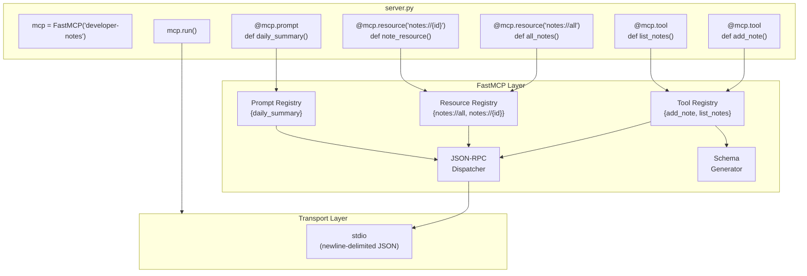
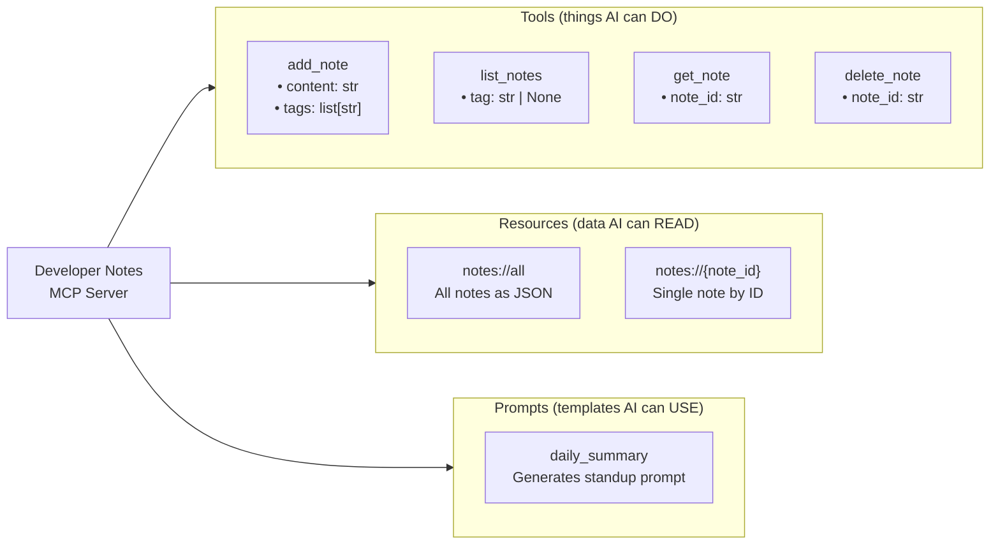
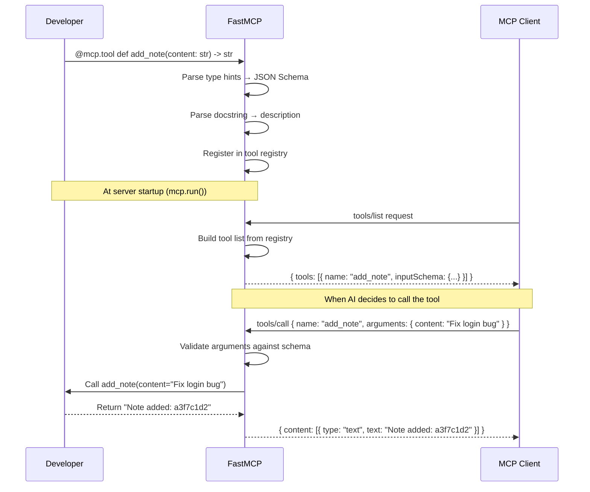
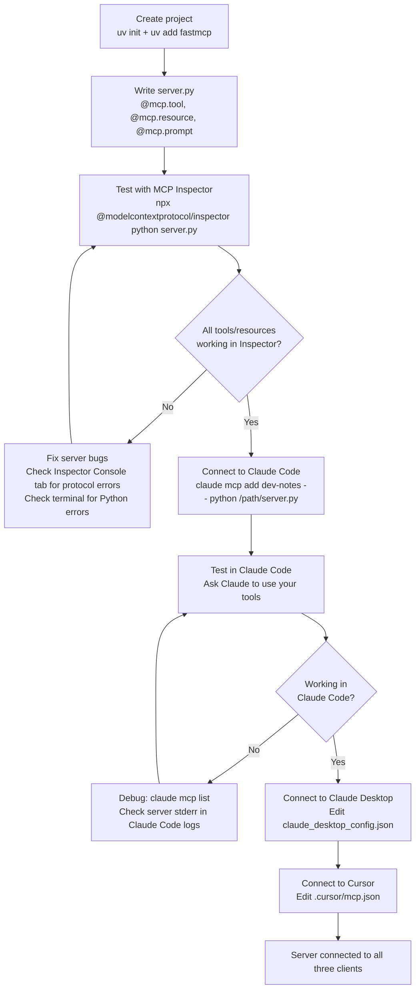
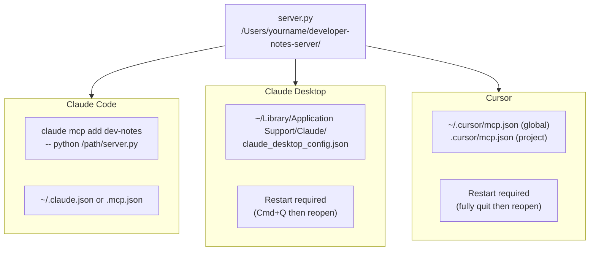
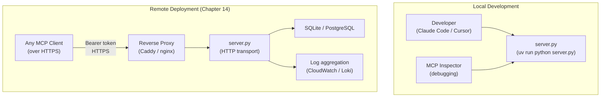

# Chapter 03: Your First MCP Server

---

## Front Matter

**Learning Objectives**

By the end of this chapter you will be able to:

- Create a FastMCP server with tools, resources, and prompts from scratch in under 30 minutes
- Explain what each part of a FastMCP server file does and why it exists
- Test every tool, resource, and prompt interactively using MCP Inspector before touching any client
- Connect a local server to Claude Code using `claude mcp add`
- Connect a local server to Claude Desktop by editing `claude_desktop_config.json`
- Connect a local server to Cursor by editing `.cursor/mcp.json`
- Build the same server in TypeScript using the official MCP SDK
- Diagnose the five most common first-server failures from their symptoms

**Prerequisites**

- Chapter 01 complete — you understand what MCP is, why it exists, the three primitives, and the three-actor model
- Chapter 02 complete — you can read the JSON-RPC messages flowing through a server
- Python 3.11+ installed (`python --version`)
- `uv` installed: `curl -LsSf https://astral.sh/uv/install.sh | sh` (Mac/Linux) or see [uv docs](https://docs.astral.sh/uv/getting-started/installation/)
- Node.js 22+ installed (`node --version`)
- MCP Inspector available: `npx @modelcontextprotocol/inspector --version`
- Claude Code installed and working (optional but recommended — you will connect to it in this chapter)
- Claude Desktop installed (optional — you will connect to it in this chapter)

**Estimated Reading Time:** 70 minutes

**Estimated Hands-on Time:** 90 minutes

---

## ⚡ Fast Read

> **Skim time: 5 minutes** — Read this if you're in a hurry, returning for reference, or have already built MCP servers in other frameworks.

- **What it is:** A FastMCP server is a Python file with decorated functions — the framework handles all JSON-RPC protocol details automatically.
- **Why it matters:** Every MCP capability you will build in this course (tools, resources, prompts) lives in a server. This chapter is where theory becomes working software.
- **Key insight:** MCP Inspector lets you test a server completely before connecting any real client. Always test with Inspector first. The most common mistake is skipping Inspector and spending an hour debugging a Claude Desktop configuration problem that isn't a configuration problem at all — it's a server bug.
- **What you build:** The Developer Notes Server — a fully working MCP server with four tools, two resources, and one prompt, connected to Claude Code, Claude Desktop, and Cursor.
- **Jump to:** [Core Concepts](#core-concepts) | [First Code](#beginner-implementation) | [Wiring to Clients](#wiring-to-real-clients) | [Best Practices](#best-practices) | [Mini Project](#mini-project)

---

## Why This Topic Exists

Chapters 01 and 02 gave you the map. You know what MCP is, why it exists, and how the protocol works at the message level.

Now you build the territory.

Everything in this course from here forward is about servers: designing them, deploying them, securing them, scaling them. Chapter 03 is where you cross the line from reader to implementer.

There is a specific challenge unique to first-server building: unlike a REST API or a Python script, a local MCP server cannot be tested with `curl`. You cannot just run it and see what happens — without a client connected, it sits silently waiting. This creates a testing gap that trips up most beginners.

The answer is MCP Inspector. It is a complete MCP client that you run locally, connects to your server via stdio, and gives you a visual UI for calling every tool, reading every resource, and testing every prompt. You will use Inspector throughout this chapter — before you touch Claude Code, before you touch Claude Desktop, before you configure anything.

Test with Inspector first. Wire to clients second. This order matters.

---

## Real-World Analogy

### Analogy 1: The Plugin Architecture

You have used software plugins: VS Code extensions, Photoshop plugins, WordPress plugins. Each plugin is a self-contained piece of code that registers capabilities with the host application. The host does not care how the plugin works internally — it cares only about the interface the plugin exposes.

An MCP server is a plugin for AI hosts. Claude Code, Claude Desktop, and Cursor are the host applications. Your server registers its tools, resources, and prompts. The host discovers them via `tools/list`, `resources/list`, and `prompts/list`. The host calls them when the AI decides they are needed.

The parallel goes further: just as a VS Code extension has an `activate()` function where it registers its commands, an MCP server has an initialization handshake where it declares its capabilities. Just as a plugin can be enabled or disabled without restarting VS Code, an MCP server can be added or removed from Claude Code without restarting the whole application.

Building an MCP server is building a plugin for AI applications. Everything in the ecosystem follows this plugin model.

### Analogy 2: The Library That Becomes an API

Imagine you have a Python module `notes.py` with functions: `add_note()`, `list_notes()`, `get_note()`. You can call these directly from any Python code. They work perfectly. But they are not accessible to an AI — the AI can't import your Python module.

FastMCP is a bridge that wraps your Python functions in the MCP protocol. The functions stay exactly as they are. FastMCP reads their type hints and docstrings, generates JSON schemas from them, registers them as MCP tools, and handles all the JSON-RPC communication. You write Python. FastMCP handles the protocol.

This is why FastMCP code looks like ordinary Python with a decorator. Because it is.

### Analogy 3: Express.js for AI

If you have built a Node.js web server, you know Express.js:

```javascript
const app = express()
app.get('/weather', (req, res) => {
  res.json({ city: req.query.city, temp: '18°C' })
})
app.listen(3000)
```

FastMCP follows the same pattern:

```python
mcp = FastMCP("weather-server")

@mcp.tool
def get_weather(city: str) -> str:
    return json.dumps({"city": city, "temp": "18°C"})

mcp.run()
```

Register handlers. Add a decorator. Run. FastMCP manages everything else — routing, parsing, serialization, transport — exactly as Express manages HTTP routing and response serialization.

---

## Core Concepts

### The FastMCP Instance — Your Server Registry

```python
from fastmcp import FastMCP

mcp = FastMCP(
    name="developer-notes",    # Server name shown in client UIs
    instructions="...",        # Optional: tells the AI how to use this server
)
```

The `FastMCP` instance (`mcp`) is the registry where you register all your server's capabilities. Every `@mcp.tool`, `@mcp.resource`, and `@mcp.prompt` decorator registers something into this instance. When the server runs, FastMCP reads all registered capabilities and serves them via the MCP protocol.

**Technical definition:** A FastMCP instance is an MCP server object that manages tool, resource, and prompt registries, handles JSON-RPC message dispatch, and manages transport lifecycle.

**Plain English:** It is the main object you build your server around. You create it once, decorate functions with it, and run it.

**Analogy:** It is the Flask `app` or Express `app` — the central object that everything else attaches to.

**Constructor parameters of note:**

| Parameter | Type | Purpose |
|-----------|------|---------|
| `name` | `str` | Server name shown in client UIs like Claude Code's tool picker |
| `instructions` | `str` | Optional text telling the AI model what this server does and when to use its tools |
| `version` | `str` | Server version string, defaults to `"1.0.0"` |
| `on_duplicate_tools` | `str` | How to handle duplicate tool names: `"warn"`, `"error"`, `"replace"`, `"ignore"` |

---

### The @mcp.tool Decorator — Functions as Tools

```python
@mcp.tool
def add_note(content: str, tags: list[str] = []) -> str:
    """Add a note to your developer notebook.
    
    Args:
        content: The note text to save.
        tags: Optional list of tags for organisation.
    """
    ...
```

When you decorate a function with `@mcp.tool`, FastMCP:

1. Reads the function's **name** → becomes the MCP tool name (`add_note`)
2. Reads the **type hints** → generates the JSON Schema for `inputSchema`
3. Reads the **docstring** → becomes the tool's `description`
4. Reads **Args section** of docstring → becomes per-parameter descriptions
5. Wraps the function in error handling
6. Registers it in the tools registry

The result: the LLM sees a tool called `add_note` with a clear description and a validated input schema. You wrote a Python function. FastMCP wrote the MCP spec.

**With customisation:**

```python
from mcp.types import ToolAnnotations

@mcp.tool(
    name="note_add",                    # Override function name
    description="Save a developer note", # Override docstring description
    annotations=ToolAnnotations(
        readOnlyHint=False,             # This tool writes data
        destructiveHint=False,          # It doesn't destroy existing data
        idempotentHint=False,           # Calling twice creates two notes
    ),
    timeout=5.0,                        # Fail after 5 seconds
)
def add_note(content: str) -> str:
    ...
```

---

### The @mcp.resource Decorator — URIs as Data Sources

```python
@mcp.resource("notes://all")
def all_notes() -> str:
    """All developer notes as JSON."""
    return json.dumps(list(notes.values()))
```

Resources are read-only data sources identified by a URI. The AI model (or client) can read a resource without calling a tool — resources represent the *current state* of something, not an action.

**Static resource** — fixed URI, no parameters:

```python
@mcp.resource("notes://all")
def all_notes() -> str:
    ...
```

**Dynamic (template) resource** — URI with parameters, one instance per value:

```python
@mcp.resource("notes://{note_id}")
def note_resource(note_id: str) -> str:
    """A specific note by ID. URI: notes://{note_id}"""
    return json.dumps(notes.get(note_id, {}))
```

The `{note_id}` in the URI template is extracted and passed as a function parameter. The server registers a resource *template* — clients can request `notes://a3f7c1d2`, `notes://b9e2f4a1`, etc. and each one is handled by the same function with a different `note_id` value.

**Technical definition:** An MCP resource is a data endpoint with a URI that clients can read via `resources/read`. Resources support subscriptions (clients receive push notifications when content changes) and templates (parameterised URIs generating families of related resources).

**Plain English:** A resource is a URL for data. Instead of `GET /api/notes/all`, it is `notes://all`. The AI reads resources the same way it reads documents.

---

### The @mcp.prompt Decorator — Reusable Prompt Templates

```python
@mcp.prompt
def daily_summary() -> str:
    """Generate a standup summary of your notes for today."""
    note_list = "\n".join(
        f"- [{n['id']}] {n['content']}" for n in notes.values()
    )
    return f"Please summarise these developer notes into a concise daily standup update:\n\n{note_list}"
```

Prompts are reusable message templates that clients can fetch via `prompts/get` and inject into a conversation. Unlike tools (which *do* something) and resources (which *provide* data), prompts *structure how the AI should think about* a task.

**Technical definition:** An MCP prompt is a template that generates one or more `Message` objects (user, assistant, or system) that clients inject into the AI context.

**Plain English:** A prompt is a saved instruction you can pull up any time. "Summarise my notes as a standup update" is a prompt you might use every morning.

---

### The Context Object — Accessing MCP Features from Inside a Tool

```python
from fastmcp import FastMCP, Context

@mcp.tool
async def add_note(content: str, ctx: Context) -> str:
    """Add a note."""
    await ctx.info(f"Adding note: {content[:50]}...")  # Sends log to client
    await ctx.report_progress(progress=50, total=100)   # Progress notification
    # ... do work ...
    await ctx.info("Note added successfully")
    return note_id
```

The `Context` object is injected automatically by FastMCP — you do not pass it yourself. Add `ctx: Context` as a parameter and FastMCP provides it. The LLM does not see the `ctx` parameter — it is invisible in the tool's schema.

**Available Context methods:**

| Method | What it does |
|--------|-------------|
| `await ctx.debug(msg)` | Send debug log to client |
| `await ctx.info(msg)` | Send info log to client |
| `await ctx.warning(msg)` | Send warning log to client |
| `await ctx.error(msg)` | Send error log to client |
| `await ctx.report_progress(progress, total)` | Send progress notification |
| `await ctx.read_resource(uri)` | Read a resource from within the tool |
| `await ctx.sample(prompt, max_tokens)` | Ask the client to run an LLM call (sampling) |

Context requires `async def` — tools using `ctx` must be async functions.

---

## Architecture Diagrams

### FastMCP Server Internals



---

### What the Server Exposes to Clients



---

### From Decorator to Protocol Message



---

## Flow Diagrams

### The Complete First-Server Development Workflow



---

## Beginner Implementation

### Step 0 — Project Setup

Before writing a single line of server code, set up a proper Python project. This keeps dependencies isolated and makes the server reproducible.

```bash
# Create a new project directory
mkdir developer-notes-server
cd developer-notes-server

# Initialise a uv project (creates pyproject.toml + virtual environment)
uv init --name developer-notes

# Add FastMCP as a dependency
uv add fastmcp

# Verify FastMCP is installed
uv run fastmcp version
```

Expected output from `uv run fastmcp version`:

```
FastMCP version: 3.x.x
MCP version: 1.x.x
Python version: 3.11.x
```

> **Why uv?** `uv` is 10–100x faster than pip, manages virtual environments automatically, and is the tool the FastMCP team recommends. Every production MCP server in this course uses uv. If you prefer pip, `pip install fastmcp` works too — but uv is the better habit.

---

### Step 1 — The Simplest Possible Server

Build the absolute minimum: one tool, no resources, no prompts. Run it. Verify it works with MCP Inspector. Only then add more.

```python
# server.py — Learning example: Step 1
# The absolute minimum MCP server. One tool.

from fastmcp import FastMCP

# Create the server instance
# 'name' is what clients display in their UI
mcp = FastMCP(name="developer-notes")

# Register one tool
# The function name becomes the tool name
# The type hints become the JSON Schema
# The docstring becomes the description
@mcp.tool
def add_note(content: str) -> str:
    """Add a note to your developer notebook.
    
    Args:
        content: The note text to save.
    """
    # For now: just echo back. We'll add real storage in Step 2.
    return f"Note would be saved: {content}"

# Run the server
# mcp.run() starts the stdio transport and blocks until the client disconnects
if __name__ == "__main__":
    mcp.run()
```

Run it with MCP Inspector:

```bash
npx @modelcontextprotocol/inspector uv run python server.py
```

> **Note:** Use `uv run python server.py` (not just `python server.py`) so that uv activates the virtual environment where FastMCP is installed.

MCP Inspector opens at `http://localhost:6274`. In your browser you will see:

1. **Connected** status in the top-left
2. **Tools tab** → click it → `add_note` appears
3. Click `add_note` → fill in `content` → click **Run Tool**
4. You see the result: `"Note would be saved: Fix the login bug"`

**What just happened:** MCP Inspector sent the initialization handshake, called `tools/list` (which returned your one tool), then called `tools/call` when you clicked Run. Your Python function executed and returned its string. FastMCP converted that string to a `TextContent` object in the MCP result format.

> **Inspector Console tab:** Click the **Console** tab in Inspector. You will see the exact JSON-RPC messages from Chapter 02 — the `initialize` request, `notifications/initialized`, `tools/list`, `tools/call`. This is the protocol working in real time.

---

### Step 2 — Add Real Storage

The current server doesn't store anything. Add an in-memory store and multiple tools.

```python
# server.py — Learning example: Step 2
# Real storage with multiple tools.

import json
import secrets
from datetime import datetime, timezone
from fastmcp import FastMCP
from fastmcp.exceptions import ToolError

mcp = FastMCP(name="developer-notes")

# In-memory note store
# In production this would be a database (covered in Chapter 10)
# Structure: { note_id: { id, content, tags, created_at } }
notes: dict[str, dict] = {}


@mcp.tool
def add_note(content: str, tags: list[str] = []) -> str:
    """Add a note to your developer notebook.
    
    Args:
        content: The note text to save.
        tags: Optional list of tags for categorisation (e.g. ["bug", "urgent"]).
    """
    # Generate a short, readable ID
    note_id = secrets.token_hex(4)  # e.g. "a3f7c1d2"
    
    notes[note_id] = {
        "id": note_id,
        "content": content,
        "tags": tags,
        "created_at": datetime.now(timezone.utc).isoformat(),
    }
    
    tag_display = f" [tags: {', '.join(tags)}]" if tags else ""
    return f"Note saved with ID: {note_id}{tag_display}"


@mcp.tool
def list_notes(tag: str | None = None) -> str:
    """List all notes, optionally filtered by tag.
    
    Args:
        tag: If provided, only return notes with this tag.
    """
    if not notes:
        return "No notes yet. Use add_note to create your first note."
    
    # Filter by tag if requested
    filtered = [
        n for n in notes.values()
        if tag is None or tag in n["tags"]
    ]
    
    if not filtered:
        return f"No notes found with tag '{tag}'."
    
    # Format as a readable list
    lines = []
    for note in filtered:
        tag_str = f" [{', '.join(note['tags'])}]" if note["tags"] else ""
        lines.append(f"[{note['id']}]{tag_str} {note['content']}")
    
    header = f"Notes (tag={tag!r}):" if tag else f"All notes ({len(filtered)}):"
    return header + "\n" + "\n".join(lines)


@mcp.tool
def get_note(note_id: str) -> str:
    """Get a specific note by its ID.
    
    Args:
        note_id: The 8-character note ID returned by add_note.
    """
    note = notes.get(note_id)
    if note is None:
        # ToolError sends isError: true — the model can tell the user and suggest trying list_notes
        raise ToolError(f"Note '{note_id}' not found. Use list_notes to see available note IDs.")
    
    return json.dumps(note, indent=2)


@mcp.tool
def delete_note(note_id: str) -> str:
    """Delete a note by its ID. This action cannot be undone.
    
    Args:
        note_id: The 8-character note ID to delete.
    """
    if note_id not in notes:
        raise ToolError(f"Note '{note_id}' not found. Use list_notes to see available note IDs.")
    
    content_preview = notes[note_id]["content"][:50]
    del notes[note_id]
    return f"Deleted note {note_id}: '{content_preview}...'"


if __name__ == "__main__":
    mcp.run()
```

Test again with Inspector:

```bash
npx @modelcontextprotocol/inspector uv run python server.py
```

Try this sequence in the Inspector UI:
1. Call `add_note` with content="Fix login bug" and tags=["bug", "urgent"]
2. Call `add_note` with content="Review PR #42"
3. Call `list_notes` — see both notes
4. Call `list_notes` with tag="bug" — see only the first note
5. Call `get_note` with the ID from step 1
6. Call `delete_note` with that ID
7. Call `get_note` again — see the error response with `isError: true`

All four tools are working. The server has real state (though it resets on restart — persistence comes in Chapter 10).

---

### Step 3 — Add a Resource

Resources let the AI read the current note list without calling a tool. Add two resources: one for all notes, one for a specific note by ID.

```python
# server.py — Learning example: Step 3
# Add resources to Step 2 server. (Show only the new additions.)

import json
import secrets
from datetime import datetime, timezone
from fastmcp import FastMCP
from fastmcp.exceptions import ToolError

mcp = FastMCP(name="developer-notes")
notes: dict[str, dict] = {}

# ... (tools from Step 2 remain unchanged) ...

# Static resource — notes://all
# A client or the AI can read this URI to get the full note list
# No parameters — always returns all notes
@mcp.resource("notes://all")
def all_notes_resource() -> str:
    """All developer notes as a JSON list.
    
    Read this resource to see all current notes without searching.
    """
    return json.dumps(list(notes.values()), indent=2)


# Template resource — notes://{note_id}
# The {note_id} is extracted from the URI and passed as a parameter
# Client requests notes://a3f7c1d2 → note_id = "a3f7c1d2"
@mcp.resource("notes://{note_id}")
def note_resource(note_id: str) -> str:
    """A specific developer note by ID.
    
    URI: notes://{note_id}
    """
    note = notes.get(note_id)
    if note is None:
        return json.dumps({"error": f"Note '{note_id}' not found"})
    return json.dumps(note, indent=2)


if __name__ == "__main__":
    mcp.run()
```

In MCP Inspector → **Resources tab**:
- `notes://all` appears as a static resource → click **Read Resource** → see the JSON (empty at first)
- Create a few notes using the Tools tab
- Read `notes://all` again → see the notes
- In the Resources tab, click **Subscribe** on `notes://all` → this is how clients get push notifications when notes change (covered in Chapter 05)

---

### Step 4 — Add a Prompt

Add a prompt that generates a daily standup summary from the current notes.

```python
# Prompt — daily_summary
# Prompts generate message content that clients inject into conversations
# This prompt returns a string that Claude will receive as a user message

@mcp.prompt
def daily_summary() -> str:
    """Generate a standup summary of your notes for today.
    
    Use this prompt to get a structured daily standup update from your notes.
    """
    if not notes:
        return "I have no developer notes for today. Let's start fresh — what are you working on?"
    
    note_list = "\n".join(
        f"- [{n['id']}] ({', '.join(n['tags']) if n['tags'] else 'no tags'}) {n['content']}"
        for n in notes.values()
    )
    
    return (
        "Please summarise the following developer notes into a concise daily standup update. "
        "Format it as: What I did, What I'm doing, Any blockers.\n\n"
        f"Notes:\n{note_list}"
    )
```

In MCP Inspector → **Prompts tab**:
- `daily_summary` appears
- Click **Get Prompt** → see the generated message content
- The content includes your notes formatted as a standup request

---

### Step 5 — The Complete Server

Here is the full, complete server combining all four steps:

```python
# server.py — Learning example: Complete Developer Notes Server
# A fully working MCP server with 4 tools, 2 resources, 1 prompt.
# This is the Module 1 project server.

import json
import secrets
from datetime import datetime, timezone
from fastmcp import FastMCP, Context
from fastmcp.exceptions import ToolError

mcp = FastMCP(
    name="developer-notes",
    instructions=(
        "This server manages a developer notebook. "
        "Use add_note to save things you're working on, observations, or bugs. "
        "Use list_notes to see what's been noted. "
        "Use daily_summary prompt at the end of the day for a standup update."
    ),
)

# In-memory note store: { note_id: { id, content, tags, created_at } }
notes: dict[str, dict] = {}


# ─── Tools ────────────────────────────────────────────────────────────────────

@mcp.tool
def add_note(content: str, tags: list[str] = []) -> str:
    """Add a note to your developer notebook.
    
    Args:
        content: The note text to save.
        tags: Optional list of tags for categorisation (e.g. ["bug", "urgent"]).
    """
    note_id = secrets.token_hex(4)
    notes[note_id] = {
        "id": note_id,
        "content": content,
        "tags": tags,
        "created_at": datetime.now(timezone.utc).isoformat(),
    }
    tag_display = f" [tags: {', '.join(tags)}]" if tags else ""
    return f"Note saved with ID: {note_id}{tag_display}"


@mcp.tool
def list_notes(tag: str | None = None) -> str:
    """List all notes, optionally filtered by tag.
    
    Args:
        tag: If provided, only return notes with this tag.
    """
    if not notes:
        return "No notes yet. Use add_note to create your first note."
    
    filtered = [n for n in notes.values() if tag is None or tag in n["tags"]]
    
    if not filtered:
        return f"No notes found with tag '{tag}'."
    
    lines = []
    for note in filtered:
        tag_str = f" [{', '.join(note['tags'])}]" if note["tags"] else ""
        lines.append(f"[{note['id']}]{tag_str} {note['content']}")
    
    header = f"Notes (tag={tag!r}):" if tag else f"All notes ({len(filtered)}):"
    return header + "\n" + "\n".join(lines)


@mcp.tool
def get_note(note_id: str) -> str:
    """Get a specific note by its ID.
    
    Args:
        note_id: The 8-character note ID returned by add_note.
    """
    note = notes.get(note_id)
    if note is None:
        raise ToolError(f"Note '{note_id}' not found. Use list_notes to see available IDs.")
    return json.dumps(note, indent=2)


@mcp.tool
def delete_note(note_id: str) -> str:
    """Delete a note by its ID. This action cannot be undone.
    
    Args:
        note_id: The 8-character note ID to delete.
    """
    if note_id not in notes:
        raise ToolError(f"Note '{note_id}' not found. Use list_notes to see available IDs.")
    preview = notes[note_id]["content"][:50]
    del notes[note_id]
    return f"Deleted note {note_id}: '{preview}'"


# ─── Resources ────────────────────────────────────────────────────────────────

@mcp.resource("notes://all")
def all_notes_resource() -> str:
    """All developer notes as a JSON list. Read this to see all current notes."""
    return json.dumps(list(notes.values()), indent=2)


@mcp.resource("notes://{note_id}")
def note_resource(note_id: str) -> str:
    """A specific note. URI: notes://{note_id}"""
    note = notes.get(note_id)
    if note is None:
        return json.dumps({"error": f"Note '{note_id}' not found"})
    return json.dumps(note, indent=2)


# ─── Prompts ──────────────────────────────────────────────────────────────────

@mcp.prompt
def daily_summary() -> str:
    """Generate a standup summary of your notes for today."""
    if not notes:
        return "I have no developer notes for today. Let's start fresh — what are you working on?"
    
    note_list = "\n".join(
        f"- [{n['id']}] ({', '.join(n['tags']) if n['tags'] else 'no tags'}) {n['content']}"
        for n in notes.values()
    )
    return (
        "Please summarise the following developer notes into a concise daily standup update. "
        "Format it as: What I did, What I'm doing, Any blockers.\n\n"
        f"Notes:\n{note_list}"
    )


# ─── Entry Point ──────────────────────────────────────────────────────────────

if __name__ == "__main__":
    mcp.run()
```

Final Inspector check before wiring to clients:

```bash
npx @modelcontextprotocol/inspector uv run python server.py
```

Verify in Inspector:
- Tools tab: 4 tools listed (`add_note`, `list_notes`, `get_note`, `delete_note`)
- Resources tab: 2 resources listed (`notes://all`, `notes://{note_id}`)
- Prompts tab: 1 prompt listed (`daily_summary`)
- Call each tool at least once
- Read each resource
- Get the prompt

All working in Inspector? Now wire to clients.

---

## Wiring to Real Clients

> **Critical principle:** Always test with MCP Inspector before connecting to any client. A server that fails in Inspector is a server bug. A server that works in Inspector but fails in a client is a configuration bug. These require completely different fixes.

You need the **absolute path** to your `server.py` file and to the `python` executable in your uv virtual environment. Get them:

```bash
# Absolute path to server.py (run from project directory)
pwd
# Example output: /Users/yourname/developer-notes-server

# Absolute path to Python in the uv virtual environment
uv run which python
# Example output: /Users/yourname/developer-notes-server/.venv/bin/python

# Or get both in one shot:
echo "Script: $(pwd)/server.py"
echo "Python: $(uv run which python)"
```

Write these down — you'll need them for all three clients.

---

### Client 1: Claude Code

Claude Code manages MCP servers via its `claude mcp` subcommand. Servers are stored in `~/.claude.json` (user-scope) or `.mcp.json` (project-scope).

**Add the server (user-scope — available in all projects):**

```bash
claude mcp add dev-notes -- python /absolute/path/to/server.py
```

Or with the full uv path:

```bash
claude mcp add dev-notes -- /absolute/path/to/.venv/bin/python /absolute/path/to/server.py
```

**Verify it was added:**

```bash
claude mcp list
```

Expected output:

```
dev-notes: python /absolute/path/to/server.py (user)
```

**Test it:** Open a new Claude Code session and ask:

```
Can you add a note saying "Testing MCP server from Claude Code" with tag "test"?
```

Claude should call `add_note` and return a note ID. If it does, the server is working.

**Scope options:**

| Scope | Flag | Config location | Best for |
|-------|------|----------------|---------|
| User | (default) | `~/.claude.json` | Personal tools, all projects |
| Project | `-s project` | `.mcp.json` in project root | Team-shared servers, per-project |
| Local | `-s local` | `.claude/settings.local.json` | Local overrides, not in git |

```bash
# Add as project-scope (committed to git, shared with team)
claude mcp add -s project dev-notes -- python server.py

# Add as local-scope (not committed to git)
claude mcp add -s local dev-notes -- python /path/to/server.py
```

**Remove a server:**

```bash
claude mcp remove dev-notes
```

---

### Client 2: Claude Desktop

Claude Desktop reads MCP server configuration from a JSON file. You must edit this file manually and restart Claude Desktop fully (not just close the window).

**Config file location:**

- **macOS:** `~/Library/Application Support/Claude/claude_desktop_config.json`
- **Windows:** `%APPDATA%\Claude\claude_desktop_config.json`

**Open it (macOS):**

```bash
# Create it if it doesn't exist, then open in your editor
open -a "TextEdit" ~/Library/Application\ Support/Claude/claude_desktop_config.json
```

Or navigate to it in Finder: `~/Library/Application Support/Claude/`.

**Add your server:**

```json
{
  "mcpServers": {
    "developer-notes": {
      "command": "/absolute/path/to/.venv/bin/python",
      "args": ["/absolute/path/to/server.py"]
    }
  }
}
```

**Using uv run (simpler path management):**

```json
{
  "mcpServers": {
    "developer-notes": {
      "command": "uv",
      "args": [
        "--directory",
        "/absolute/path/to/developer-notes-server",
        "run",
        "python",
        "server.py"
      ]
    }
  }
}
```

> **Why absolute paths?** Claude Desktop starts the server process with a working directory of `/` (root) on macOS. Relative paths like `./server.py` resolve to `/server.py` — which does not exist. Always use absolute paths in Claude Desktop config.

**Restart Claude Desktop:**

Quit completely: `Cmd+Q` (macOS) or `File → Quit` (Windows). Closing the window is not enough — the server processes keep running.

Reopen Claude Desktop. Look for the **MCP icon** in the bottom-right of the chat input box. Click it to see connected servers and available tools.

**Test it:** Ask:

```
Do you have access to a developer notes server? If so, list my notes.
```

**Viewing logs (when things go wrong):**

```bash
# macOS — watch all MCP logs in real time
tail -n 20 -F ~/Library/Logs/Claude/mcp*.log

# The per-server log file:
tail -F ~/Library/Logs/Claude/mcp-server-developer-notes.log
```

---

### Client 3: Cursor

Cursor reads MCP server configuration from a JSON file with the same format as Claude Desktop's config.

**Config file location:**

- **Global (all projects):** `~/.cursor/mcp.json`
- **Project-specific:** `.cursor/mcp.json` in the project root

**Global config (recommended for personal tools):**

```bash
# Create the directory if it doesn't exist
mkdir -p ~/.cursor

# Create/edit the config file
open -a "TextEdit" ~/.cursor/mcp.json
```

**mcp.json content:**

```json
{
  "mcpServers": {
    "developer-notes": {
      "command": "uv",
      "args": [
        "--directory",
        "/absolute/path/to/developer-notes-server",
        "run",
        "python",
        "server.py"
      ]
    }
  }
}
```

**Project-specific config (for team sharing):**

```bash
# In your project root
mkdir -p .cursor
# Add .cursor/mcp.json to git (safe — no secrets in this file)
```

`.cursor/mcp.json`:

```json
{
  "mcpServers": {
    "developer-notes": {
      "command": "uv",
      "args": ["--directory", "${workspaceFolder}/developer-notes-server", "run", "python", "server.py"]
    }
  }
}
```

**Restart Cursor** completely after editing the config. MCP servers only load at startup.

**Verify:** In Cursor's chat (Cmd+L), ask:

```
What MCP tools do you have available?
```

You should see `add_note`, `list_notes`, `get_note`, `delete_note` listed.

---

### Configuration Summary



---

## Intermediate Implementation

### The TypeScript Version

The Developer Notes Server in TypeScript using the official MCP SDK. This produces a server with identical protocol behaviour — any client that works with the Python version works with this one too.

**Project setup:**

```bash
mkdir developer-notes-server-ts
cd developer-notes-server-ts
npm init -y
npm install @modelcontextprotocol/sdk zod
npm install -D typescript tsx @types/node
```

**`tsconfig.json`:**

```json
{
  "compilerOptions": {
    "target": "ES2022",
    "module": "Node16",
    "moduleResolution": "Node16",
    "outDir": "./dist",
    "strict": true,
    "skipLibCheck": true,
    "esModuleInterop": true
  },
  "include": ["src/**/*"],
  "exclude": ["node_modules", "dist"]
}
```

**`package.json` scripts:**

```json
{
  "scripts": {
    "dev": "tsx src/server.ts",
    "build": "tsc",
    "start": "node dist/server.js"
  }
}
```

**`src/server.ts`:**

```typescript
// server.ts — Learning example: Developer Notes Server (TypeScript)
// Identical functionality to the Python version.

import { McpServer } from "@modelcontextprotocol/sdk/server/mcp.js";
import { StdioServerTransport } from "@modelcontextprotocol/sdk/server/stdio.js";
import { z } from "zod";
import crypto from "node:crypto";

// ─── Types ────────────────────────────────────────────────────────────────────

interface Note {
  id: string;
  content: string;
  tags: string[];
  createdAt: string;
}

// ─── In-memory store ──────────────────────────────────────────────────────────

const notes = new Map<string, Note>();

// ─── Server ───────────────────────────────────────────────────────────────────

const server = new McpServer({
  name: "developer-notes",
  version: "1.0.0",
});

// ─── Tools ────────────────────────────────────────────────────────────────────

server.tool(
  "add_note",
  "Add a note to your developer notebook.",
  {
    content: z.string().describe("The note text to save."),
    tags: z.array(z.string()).optional().default([]).describe("Optional tags."),
  },
  async ({ content, tags = [] }) => {
    const id = crypto.randomBytes(4).toString("hex");
    notes.set(id, {
      id,
      content,
      tags,
      createdAt: new Date().toISOString(),
    });
    const tagDisplay = tags.length > 0 ? ` [tags: ${tags.join(", ")}]` : "";
    return {
      content: [{ type: "text", text: `Note saved with ID: ${id}${tagDisplay}` }],
    };
  }
);

server.tool(
  "list_notes",
  "List all notes, optionally filtered by tag.",
  {
    tag: z.string().optional().describe("If provided, only return notes with this tag."),
  },
  async ({ tag }) => {
    if (notes.size === 0) {
      return {
        content: [{ type: "text", text: "No notes yet. Use add_note to create your first note." }],
      };
    }

    const filtered = [...notes.values()].filter(
      (n) => !tag || n.tags.includes(tag)
    );

    if (filtered.length === 0) {
      return {
        content: [{ type: "text", text: `No notes found with tag '${tag}'.` }],
      };
    }

    const lines = filtered.map((n) => {
      const tagStr = n.tags.length > 0 ? ` [${n.tags.join(", ")}]` : "";
      return `[${n.id}]${tagStr} ${n.content}`;
    });

    const header = tag ? `Notes (tag='${tag}'):` : `All notes (${filtered.length}):`;
    return {
      content: [{ type: "text", text: `${header}\n${lines.join("\n")}` }],
    };
  }
);

server.tool(
  "get_note",
  "Get a specific note by its ID.",
  {
    note_id: z.string().describe("The 8-character note ID returned by add_note."),
  },
  async ({ note_id }) => {
    const note = notes.get(note_id);
    if (!note) {
      return {
        content: [{ type: "text", text: `Note '${note_id}' not found. Use list_notes to see available IDs.` }],
        isError: true,
      };
    }
    return {
      content: [{ type: "text", text: JSON.stringify(note, null, 2) }],
    };
  }
);

server.tool(
  "delete_note",
  "Delete a note by its ID. This action cannot be undone.",
  {
    note_id: z.string().describe("The 8-character note ID to delete."),
  },
  async ({ note_id }) => {
    const note = notes.get(note_id);
    if (!note) {
      return {
        content: [{ type: "text", text: `Note '${note_id}' not found.` }],
        isError: true,
      };
    }
    const preview = note.content.slice(0, 50);
    notes.delete(note_id);
    return {
      content: [{ type: "text", text: `Deleted note ${note_id}: '${preview}'` }],
    };
  }
);

// ─── Resources ────────────────────────────────────────────────────────────────

server.resource(
  "notes-all",
  "notes://all",
  async () => ({
    contents: [
      {
        uri: "notes://all",
        mimeType: "application/json",
        text: JSON.stringify([...notes.values()], null, 2),
      },
    ],
  })
);

// ─── Prompts ──────────────────────────────────────────────────────────────────

server.prompt(
  "daily_summary",
  "Generate a standup summary of your notes for today.",
  () => {
    if (notes.size === 0) {
      return {
        messages: [
          {
            role: "user",
            content: {
              type: "text",
              text: "I have no developer notes for today. Let's start fresh — what are you working on?",
            },
          },
        ],
      };
    }

    const noteList = [...notes.values()]
      .map((n) => `- [${n.id}] (${n.tags.join(", ") || "no tags"}) ${n.content}`)
      .join("\n");

    return {
      messages: [
        {
          role: "user",
          content: {
            type: "text",
            text:
              "Please summarise the following developer notes into a concise daily standup update. " +
              "Format it as: What I did, What I'm doing, Any blockers.\n\n" +
              `Notes:\n${noteList}`,
          },
        },
      ],
    };
  }
);

// ─── Entry Point ──────────────────────────────────────────────────────────────

async function main() {
  const transport = new StdioServerTransport();
  await server.connect(transport);
  // Server is now running — stdio transport blocks until disconnected
}

main().catch(console.error);
```

**Test with Inspector:**

```bash
npx @modelcontextprotocol/inspector node --import tsx/esm src/server.ts
```

Or build first:

```bash
npm run build
npx @modelcontextprotocol/inspector node dist/server.js
```

**Add to Claude Code:**

```bash
claude mcp add dev-notes-ts -- node /absolute/path/to/dist/server.js
```

**Key differences between Python and TypeScript versions:**

| Aspect | Python (FastMCP) | TypeScript (SDK) |
|--------|-----------------|-----------------|
| Schema definition | Inferred from type hints | Explicit Zod schemas |
| Error handling | `raise ToolError(...)` | `return { isError: true, ... }` |
| Async support | Optional (`async def`) | Mandatory (`async` functions) |
| Resource definition | `@mcp.resource("uri")` decorator | `server.resource(name, uri, handler)` |
| Boilerplate | Minimal | Moderate |
| Type safety | Runtime only (Pydantic) | Compile-time (TypeScript) |

Both produce identical JSON-RPC messages over the wire. Protocol compliance is the same.

---

### The Raw Python SDK Version (Brief)

FastMCP is built on top of the official MCP Python SDK. Here is the `add_note` tool implemented with the raw SDK — to show what FastMCP automates:

```python
# raw_sdk_demo.py — Intermediate example: Raw SDK (abbreviated)
# Shows what FastMCP does for you automatically.

from mcp.server.lowlevel import Server
from mcp import types
import json, secrets

server = Server("developer-notes-raw")

# The raw SDK requires you to implement list_tools and call_tool separately.
# FastMCP merges these into a single @mcp.tool decorator.

@server.list_tools()
async def list_tools() -> list[types.Tool]:
    return [
        types.Tool(
            name="add_note",
            description="Add a note to your developer notebook.",
            inputSchema={
                "type": "object",
                "properties": {
                    "content": {
                        "type": "string",
                        "description": "The note text to save."
                    },
                    "tags": {
                        "type": "array",
                        "items": {"type": "string"},
                        "description": "Optional tags.",
                        "default": []
                    }
                },
                "required": ["content"],
                "additionalProperties": False,
            }
        )
    ]

@server.call_tool()
async def call_tool(name: str, arguments: dict) -> list[types.TextContent]:
    if name == "add_note":
        note_id = secrets.token_hex(4)
        content = arguments["content"]
        tags = arguments.get("tags", [])
        # ... store note ...
        return [types.TextContent(type="text", text=f"Note saved: {note_id}")]
    raise ValueError(f"Unknown tool: {name}")

# Must also implement run() manually with asyncio and stdio_server
# ... (FastMCP handles all of this)
```

This is why FastMCP exists. The raw SDK is correct and complete, but requires substantially more code for the same result. In this course, we use FastMCP for all Python server work except where the raw SDK is specifically needed.

---

## Advanced Implementation

### Adding Lifespan Events — Startup and Shutdown

For production servers, you need to set up resources on startup (database connections, API clients) and clean them up on shutdown. FastMCP provides a lifespan context manager for this.

```python
# server_production.py — Advanced example
# Production-grade server with startup/shutdown and context injection.

import json
import secrets
import sqlite3
from contextlib import asynccontextmanager
from datetime import datetime, timezone
from typing import AsyncIterator

from fastmcp import FastMCP, Context
from fastmcp.exceptions import ToolError


# ─── Lifespan: setup and teardown ──────────────────────────────────────────────

@asynccontextmanager
async def lifespan(server: FastMCP) -> AsyncIterator[dict]:
    """Set up resources at startup, clean up at shutdown."""
    # Startup: open SQLite database
    conn = sqlite3.connect("notes.db", check_same_thread=False)
    conn.execute("""
        CREATE TABLE IF NOT EXISTS notes (
            id TEXT PRIMARY KEY,
            content TEXT NOT NULL,
            tags TEXT NOT NULL DEFAULT '[]',
            created_at TEXT NOT NULL
        )
    """)
    conn.commit()
    
    print("Database ready.", flush=True)  # To stderr via mcp.run() redirect
    
    # Yield the context that tools can access via ctx.request_context.lifespan_context
    yield {"db": conn}
    
    # Shutdown: close database
    conn.close()
    print("Database closed.", flush=True)


mcp = FastMCP(
    name="developer-notes-production",
    instructions="Persistent developer notes stored in SQLite.",
    lifespan=lifespan,
)


# ─── Tools using lifespan context ────────────────────────────────────────────

@mcp.tool
async def add_note(content: str, tags: list[str] = [], ctx: Context = None) -> str:
    """Add a note to the persistent developer notebook.
    
    Args:
        content: The note text to save.
        tags: Optional tags for categorisation.
    """
    db: sqlite3.Connection = ctx.request_context.lifespan_context["db"]
    
    note_id = secrets.token_hex(4)
    created_at = datetime.now(timezone.utc).isoformat()
    
    db.execute(
        "INSERT INTO notes (id, content, tags, created_at) VALUES (?, ?, ?, ?)",
        (note_id, content, json.dumps(tags), created_at)
    )
    db.commit()
    
    await ctx.info(f"Note {note_id} saved to database")
    
    tag_display = f" [tags: {', '.join(tags)}]" if tags else ""
    return f"Note saved with ID: {note_id}{tag_display}"


@mcp.tool
async def list_notes(tag: str | None = None, ctx: Context = None) -> str:
    """List all notes, optionally filtered by tag.
    
    Args:
        tag: If provided, only return notes with this tag.
    """
    db: sqlite3.Connection = ctx.request_context.lifespan_context["db"]
    
    rows = db.execute("SELECT id, content, tags FROM notes").fetchall()
    
    if not rows:
        return "No notes yet."
    
    result = []
    for row_id, row_content, row_tags_json in rows:
        row_tags = json.loads(row_tags_json)
        if tag is None or tag in row_tags:
            tag_str = f" [{', '.join(row_tags)}]" if row_tags else ""
            result.append(f"[{row_id}]{tag_str} {row_content}")
    
    if not result:
        return f"No notes with tag '{tag}'."
    
    return f"Notes ({len(result)}):\n" + "\n".join(result)


if __name__ == "__main__":
    import sys
    import logging
    # Route all logs to stderr — never stdout (stdout carries MCP messages)
    logging.basicConfig(stream=sys.stderr, level=logging.INFO)
    mcp.run()
```

Key patterns in this production version:

1. **`lifespan` context manager** — opens DB once at startup, closes at shutdown
2. **Lifespan context injection** — `ctx.request_context.lifespan_context["db"]` accesses the DB connection
3. **`await ctx.info()`** — logs appear in MCP Inspector's Notifications tab and in client logs
4. **`sys.stderr` for logging** — never writes to stdout

---

### Structured Return Values

FastMCP supports returning structured data alongside text content. This is useful when the AI needs machine-readable data, not just a text string.

```python
# Returning structured data — Advanced example

from fastmcp import FastMCP
from pydantic import BaseModel

mcp = FastMCP("structured-demo")


class NoteResult(BaseModel):
    note_id: str
    content: str
    tags: list[str]
    char_count: int


@mcp.tool
def add_note_structured(content: str, tags: list[str] = []) -> NoteResult:
    """Add a note and return structured data.
    
    Args:
        content: The note text.
        tags: Optional tags.
    
    Returns:
        Structured note data including ID and character count.
    """
    note_id = secrets.token_hex(4)
    return NoteResult(
        note_id=note_id,
        content=content,
        tags=tags,
        char_count=len(content),
    )
```

FastMCP automatically:
- Serialises the Pydantic model to JSON
- Returns it as `TextContent` with the JSON string
- Also provides it as `structuredContent` in the tool result for clients that support it (2026-07 RC feature)

---

## Production Architecture

In production, your server does not run as a loose Python script — it runs as a managed process with logging, monitoring, and restart capability.



For Chapter 03, the local pattern is correct. Remote deployment and HTTP transport are covered in Chapter 07 and Chapter 14.

**Production file structure:**

```
developer-notes-server/
├── pyproject.toml          ← uv project + dependencies
├── server.py               ← FastMCP server (main entrypoint)
├── notes.db                ← SQLite database (production; in .gitignore)
├── .env                    ← Environment variables (never commit)
├── .env.example            ← Template for .env (committed)
├── .gitignore              ← Excludes notes.db, .env, .venv
└── tests/
    └── test_server.py      ← Protocol compliance tests (Chapter 13)
```

---

## Best Practices

**1. Test with MCP Inspector before every client connection.**

Inspector catches server bugs. Config problems affect clients but not Inspector. Always test in the right order.

```bash
# The test command you should run after every change
npx @modelcontextprotocol/inspector uv run python server.py
```

**2. Write your `instructions` parameter to tell the AI when to use your server.**

```python
# Wrong: no instructions — AI may not know when to use the server
mcp = FastMCP(name="dev-notes")

# Correct: instructions guide the AI on appropriate use
mcp = FastMCP(
    name="dev-notes",
    instructions=(
        "Use this server to save and retrieve developer notes during coding sessions. "
        "Call add_note whenever you observe something worth remembering: a bug, a decision, "
        "a TODO, or a helpful fact. Call list_notes to recall what has been noted. "
        "At the end of a session, use the daily_summary prompt for a standup update."
    ),
)
```

**3. Write docstrings as if explaining the tool to a non-technical project manager.**

The AI uses the docstring to decide when and how to call the tool. Vague docstrings cause wrong tool calls.

```python
# Wrong: vague — the AI doesn't know when to use this vs get_note
@mcp.tool
def list_notes(tag: str | None = None) -> str:
    """List notes."""
    ...

# Correct: explains the use case, the parameter, and the output format
@mcp.tool
def list_notes(tag: str | None = None) -> str:
    """List all saved developer notes, optionally filtered by tag.
    
    Use this to see what has been noted in the current session before adding a duplicate.
    Use get_note to retrieve the full content of a specific note.
    
    Args:
        tag: Filter to only notes with this tag. If omitted, returns all notes.
    
    Returns:
        A formatted list of notes with their IDs and tags. Returns a message if no notes exist.
    """
    ...
```

**4. Always use `raise ToolError(...)` for recoverable failures; let unexpected exceptions propagate naturally.**

```python
from fastmcp.exceptions import ToolError

@mcp.tool
def get_note(note_id: str) -> str:
    """Get a specific note by ID."""
    # Recoverable: AI can suggest the user run list_notes
    if note_id not in notes:
        raise ToolError(f"Note '{note_id}' not found. Use list_notes to see available IDs.")
    
    # Unexpected: let it propagate as a protocol error
    # Do NOT do: except Exception: raise ToolError(str(e))
    return json.dumps(notes[note_id])
```

**5. Add `additionalProperties: False` to schemas when using raw SDK.** FastMCP does this automatically. Raw SDK implementations must set it explicitly to reject unknown parameters.

**6. Never write to stdout in a stdio server.** Use `sys.stderr` or `await ctx.info()`.

```python
# Wrong: corrupts JSON-RPC stream
print("Server started")
logging.basicConfig()  # Default writes to stdout

# Correct
import sys
print("Server started", file=sys.stderr)
logging.basicConfig(stream=sys.stderr)
# Or: FastMCP ctx logger (sends via MCP protocol, visible in Inspector)
await ctx.info("Server started")
```

**7. Pin FastMCP to a specific version in production.**

```toml
# pyproject.toml
[project]
dependencies = [
    "fastmcp==3.2.4",  # Pin exact version — FastMCP evolves quickly
]
```

---

## Security Considerations

### Tool Input Validation

FastMCP validates inputs against the JSON Schema derived from your type hints. But type validation is not security validation. Add explicit checks for anything security-sensitive.

```python
@mcp.tool
def read_file(path: str) -> str:
    """Read a file from the notes directory.
    
    Args:
        path: Relative path within the notes directory.
    """
    import os
    
    # FastMCP validates: path is a string. That's all it can know.
    # YOU must validate: path is safe.
    
    NOTES_DIR = "/Users/yourname/notes"
    
    # Prevent path traversal attacks
    # An attacker could pass: "../../etc/passwd"
    full_path = os.path.realpath(os.path.join(NOTES_DIR, path))
    if not full_path.startswith(NOTES_DIR):
        raise ToolError("Access denied: path is outside the notes directory.")
    
    if not os.path.exists(full_path):
        raise ToolError(f"File not found: {path}")
    
    with open(full_path) as f:
        return f.read()
```

### Tool Annotations for Destructive Operations

Mark destructive tools explicitly. Clients that support annotations will warn the user before calling them.

```python
from mcp.types import ToolAnnotations

@mcp.tool(
    annotations=ToolAnnotations(
        destructiveHint=True,      # This tool modifies or deletes data
        idempotentHint=False,      # Calling twice does not have the same effect
        readOnlyHint=False,        # This is NOT a read-only operation
    )
)
def delete_note(note_id: str) -> str:
    """Delete a note by its ID. This action cannot be undone."""
    ...
```

### Local Server Trust Model

Local stdio servers (running as a subprocess on your machine) share your operating system user's permissions. They can read any file you can read, make any network request you can make. This is the expected behaviour for local developer tools — but it means:

- Never accept file paths from tool arguments without validation
- Never accept shell commands as arguments (never call `subprocess.run(user_input)`)
- Be careful with tools that make network requests based on user-supplied URLs

Remote servers require OAuth 2.1 authentication — covered in Chapter 12.

---

## Cost Considerations

### Token Cost of Tool Definitions

Every tool schema is included in the Claude API context on every request. Cost estimates:

| Server size | Approx tokens per tool | Total in context |
|------------|------------------------|-----------------|
| 1 tool (minimal schema) | ~80 tokens | ~80 tokens |
| 4 tools (our server) | ~150 tokens each | ~600 tokens |
| 10 tools (larger server) | ~150 tokens each | ~1,500 tokens |
| 30 tools (complex server) | ~200 tokens each | ~6,000 tokens |

At Claude Sonnet 4.6 pricing (~$3/M input tokens), 30 tools add ~$0.018 per 1,000 requests purely for the tool definitions. For typical developer usage this is negligible. For high-volume production use, keep tool counts low and descriptions concise.

**Free options:** Claude Code and Claude Desktop are free applications — no per-request API cost for tool calls in those clients. API cost applies when you build your own MCP client using the Claude API (Chapter 08).

### Note About In-Memory State

The Chapter 03 server stores notes in memory. Notes disappear when the server restarts. This is intentional for learning — no database setup required. Persistence is covered in Chapter 10.

---

## Common Mistakes

**Mistake 1: Using a relative path in Claude Desktop config**

```json
// Wrong: relative paths don't work — Claude Desktop starts from /
{
  "mcpServers": {
    "dev-notes": {
      "command": "python",
      "args": ["server.py"]
    }
  }
}

// Correct: always use absolute paths
{
  "mcpServers": {
    "dev-notes": {
      "command": "/Users/yourname/developer-notes-server/.venv/bin/python",
      "args": ["/Users/yourname/developer-notes-server/server.py"]
    }
  }
}
```

**Symptom:** Claude Desktop shows no MCP icon, or shows the icon but tools are missing. Logs show `No such file or directory: server.py`.

---

**Mistake 2: Writing logs to stdout**

```python
# Wrong: stdout carries JSON-RPC messages — print() corrupts the stream
print("Tool called")
print(f"Note saved: {note_id}")

# Correct: always use stderr or ctx logger
import sys
print("Tool called", file=sys.stderr)
await ctx.info(f"Note saved: {note_id}")
```

**Symptom:** MCP Inspector connects but immediately shows a parse error. The error is: `Failed to parse JSON: {"tool called"}\n{"jsonrpc"...}` — your print statement got mixed into the JSON stream.

---

**Mistake 3: Forgetting `if __name__ == "__main__":` around `mcp.run()`**

```python
# Wrong: mcp.run() at module level
@mcp.tool
def my_tool() -> str:
    ...

mcp.run()  # This runs immediately on import — breaks testing

# Correct
if __name__ == "__main__":
    mcp.run()
```

**Symptom:** The protocol compliance tests from Chapter 02 fail to import the server module. FastMCP's test utilities cannot import the server without running it.

---

**Mistake 4: Not restarting the client after config changes**

**Symptom:** New tool appears in `claude mcp list` but Claude Code doesn't offer it. Or Claude Desktop config is saved but tools don't appear.

**Fix:** For Claude Code: open a new session. For Claude Desktop and Cursor: fully quit and reopen.

---

**Mistake 5: Type annotation mismatch between Python and schema**

```python
# Wrong: tags has mutable default argument AND wrong type hint
@mcp.tool
def add_note(content: str, tags: list = []) -> str:  # list (untyped) → schema: array of anything
    ...

# Correct: typed list → schema: array of strings
@mcp.tool
def add_note(content: str, tags: list[str] = []) -> str:  # list[str] → schema: { type: array, items: { type: string } }
    ...
```

**Symptom:** The AI sends `tags: "bug, urgent"` (a string) instead of `tags: ["bug", "urgent"]` (an array). Untyped `list` in the schema means "any array" — the model may guess the contents format incorrectly.

---

**Mistake 6: Using mutable default arguments**

```python
# Wrong: Python mutable default argument bug — all calls share the SAME list
@mcp.tool
def add_note(content: str, tags: list[str] = []) -> str:
    tags.append("auto")  # This modifies the default! Every call shares it.
    ...

# Correct: use None and create inside the function
@mcp.tool
def add_note(content: str, tags: list[str] | None = None) -> str:
    if tags is None:
        tags = []
    tags.append("auto")
    ...
```

**Symptom:** After the first call, every subsequent call includes the "auto" tag even if not specified — or accumulates all previous "auto" tags.

---

## Debugging Guide

### Diagnostic Flowchart

```
Server not working in a client?
│
├── Step 1: Does it work in MCP Inspector?
│   npx @modelcontextprotocol/inspector uv run python server.py
│   ├── Inspector can't connect?
│   │   └── Server crashes on startup
│   │       Run: uv run python server.py
│   │       Look at the Python error in your terminal
│   ├── Inspector connects but tools are missing?
│   │   └── @mcp.tool decorator not applied, or function defined after mcp.run()
│   └── Tools work in Inspector?
│       └── Continue to Step 2 (client config problem, not server problem)
│
├── Step 2: Check the client configuration
│   For Claude Code:
│       claude mcp list
│       → Is the server listed?
│       → Is the command/path correct?
│   For Claude Desktop / Cursor:
│       Open config file and verify:
│       → JSON is valid (paste into jsonlint.com to check)
│       → Command and args use absolute paths
│       → Python/uv executable path is correct
│
├── Step 3: Check client logs
│   Claude Desktop logs:
│       tail -F ~/Library/Logs/Claude/mcp-server-developer-notes.log
│       Look for: "No such file", "ModuleNotFoundError", "SyntaxError"
│   Claude Code: check the terminal output when starting a session
│       The server stderr appears in Claude Code's output
│
└── Step 4: Check the MCP Inspector Console tab
    Connect Inspector to your server
    Look at the tools/list response
    Does the schema match what you expect?
    Is there a -32602 error on any tool call?
```

### Error Reference Table

| Symptom | Likely cause | Fix |
|---------|-------------|-----|
| Inspector can't connect | Server crashes on startup | Run `python server.py` in terminal; read the Python traceback |
| `ModuleNotFoundError: fastmcp` | FastMCP not installed in the correct environment | `uv add fastmcp` or use `uv run python server.py` |
| Tools listed but calls fail with `-32602` | Parameter validation error | Check required vs optional parameters; check type hints |
| Tool returns `isError: true` | `ToolError` raised inside tool | Read the error message; check your business logic |
| Tool result is garbled JSON | `print()` call writing to stdout | Move all `print()` to `sys.stderr` |
| Claude Desktop: no MCP icon | Server failed to start | Check `~/Library/Logs/Claude/mcp*.log` |
| Claude Desktop: icon shows but no tools | Wrong server path or missing dependency | Check log for Python error; verify absolute path |
| Cursor: server not listed | Wrong config file location or syntax | Verify `~/.cursor/mcp.json` or `.cursor/mcp.json` exists and is valid JSON |
| Server works in Inspector, not in Claude | Client capability mismatch | Check if you're using features the client doesn't declare (e.g. sampling) |
| Notes disappear on restart | In-memory storage | Expected in Chapter 03. Persistence covered in Chapter 10 |

### The One-Command Debug Sequence

When something goes wrong, run these three commands in order:

```bash
# 1. Does the server start without error?
uv run python server.py
# Expected: hangs waiting for input (that's correct — it's waiting for a client)
# Bad: Python traceback

# 2. Does MCP Inspector see it correctly?
npx @modelcontextprotocol/inspector uv run python server.py
# Expected: http://localhost:6274 opens with your tools listed

# 3. Does Claude Code see it?
claude mcp list
# Expected: your server listed with correct path
```

---

## Performance Optimisation

### Keep Tool Count Under 20 Per Server

Every tool definition is sent to the AI in the `tools/list` response. Servers with too many tools:

- Add more tokens to the context (cost)
- Confuse the AI about which tool to use (quality)
- Slow down tool selection decisions (latency)

**Guidance:**

| Tool count | Impact |
|-----------|--------|
| 1–5 | Ideal: AI easily selects the right tool |
| 6–15 | Good: write clear descriptions to distinguish tools |
| 16–30 | Acceptable: risk of wrong tool selection; add `instructions` |
| 30+ | Split into multiple servers, each with a focused domain |

### Keep Tool Descriptions Under 200 Tokens

Each tool's `description` + `inputSchema` is included in context. A 500-token description for a simple tool wastes context that could hold more conversation history.

Target: 30–80 tokens for description, 20–50 tokens per parameter description.

### Async for I/O-Bound Tools

FastMCP runs sync tools in a threadpool automatically (`run_in_thread=True` default). For explicit control:

```python
# I/O bound tool — use async to avoid blocking the event loop
@mcp.tool
async def fetch_url(url: str) -> str:
    """Fetch the content of a URL."""
    import httpx
    async with httpx.AsyncClient() as client:
        response = await client.get(url, timeout=10.0)
        return response.text

# CPU bound tool — stays sync, runs in threadpool automatically
@mcp.tool
def calculate_hash(content: str) -> str:
    """Calculate SHA-256 hash of content."""
    import hashlib
    return hashlib.sha256(content.encode()).hexdigest()
```

---

## Production Issue: Server Crashes Silently After Claude Desktop Restart

### Symptoms

Claude Desktop's MCP icon disappears after the first session ends. On reopening Claude Desktop, the icon does not reappear. The tool calls return errors with no specific message. Restarting Claude Desktop multiple times does not help.

### Root Cause

The server crashes during startup on the second launch because it cannot bind to a resource left in an inconsistent state by the previous run. For example: a SQLite database was left locked, a port was not released, or a PID file was not cleaned up.

In this specific case: the developer added `logging.basicConfig()` to debug the first session and the default handler wrote to stdout, corrupting the MCP protocol stream. The server never successfully completed the handshake, so Claude Desktop marked it as failed and stopped trying.

### How to Diagnose It

```bash
# Check MCP logs for error details
tail -n 50 ~/Library/Logs/Claude/mcp-server-developer-notes.log

# Common log messages and their meanings:
# "Process exited with code 1" → Python error on startup
# "Parse error" or "Invalid JSON" → print() writing to stdout
# "No such file or directory" → wrong path in config
# "ModuleNotFoundError" → wrong Python environment

# Test manually outside Claude Desktop
/absolute/path/to/python /absolute/path/to/server.py
# If you see Python output immediately, something is printing to stdout
```

### How to Fix It

```python
# server.py — Before (broken)
import logging
logging.basicConfig()  # Writes to stdout by default — corrupts stdio MCP stream

# server.py — After (correct)
import logging
import sys
logging.basicConfig(
    stream=sys.stderr,          # ALWAYS stderr for stdio MCP servers
    level=logging.WARNING,      # Only log warnings and above in production
    format="%(asctime)s [%(levelname)s] %(name)s: %(message)s",
)
```

### How to Prevent It in Future

Add a stderr-only logging setup to your server template. Never leave default `logging.basicConfig()` in an MCP server:

```python
# server_template.py — Safe logging setup for every MCP server
import logging
import sys

def configure_logging(level: str = "WARNING") -> None:
    logging.basicConfig(
        stream=sys.stderr,
        level=getattr(logging, level.upper()),
        format="%(asctime)s [%(levelname)s] %(name)s: %(message)s",
    )

# Call at startup
configure_logging()
mcp = FastMCP(name="my-server")
```

---

## Exercises

**Exercise 1 — Run the complete server with MCP Inspector (20 minutes)**

Copy the complete server from Step 5, set up the uv project, and run it with MCP Inspector. Use Inspector to:
- Add three notes with different tags
- List all notes
- List notes filtered by one tag
- Get a specific note by ID
- Delete a note
- Get the daily_summary prompt

Record the JSON-RPC messages for a tool call in the Console tab and identify: the request id, the tool name, the arguments, and the result content.

**Exercise 2 — Connect to all three clients (30 minutes)**

Connect your server to Claude Code, Claude Desktop, and Cursor. In each client, ask the AI to add a note about what you just learned. Verify the note appears in all three clients (note: in-memory storage is per-server-process, so each client starts a fresh server instance — notes don't cross clients without persistence).

**Exercise 3 — Add a search tool (30 minutes)**

Add a `search_notes` tool that takes a `query: str` parameter and returns notes whose content contains the query string (case-insensitive). Write a good docstring. Test with Inspector. Verify that Claude Code uses it correctly when you ask "can you search my notes for bug?".

**Exercise 4 — Add a template resource (45 minutes)**

Add a resource at URI `notes://tags/{tag_name}` that returns all notes with that specific tag as JSON. The URI parameter `{tag_name}` is extracted and passed to your function. Test with MCP Inspector's Resources tab by clicking **Read Resource** with the URI `notes://tags/bug`.

**Exercise 5 — Build the TypeScript version (60 minutes)**

Set up the TypeScript project from the Intermediate Implementation section and implement the complete four-tool server. Run it with MCP Inspector and verify it behaves identically to the Python version. Connect both the Python and TypeScript servers to Claude Code simultaneously using different names (`dev-notes-python` and `dev-notes-ts`).

---

## Quiz

**Question 1:** What does the `name` parameter of `FastMCP(name="...")` control?

**Answer:** It controls the `serverInfo.name` value returned in the MCP initialization handshake response. Clients display this name in their server lists and logs. It appears in `claude mcp list` output and in Claude Desktop's server status UI. It does not affect how tools are called — tools are called by the names of the decorated functions.

---

**Question 2:** A FastMCP tool is defined with `def add_note(content: str, tags: list[str] = []) -> str:`. What does the generated JSON Schema's `required` array contain?

**Answer:** Only `["content"]`. Parameters with default values (`tags = []`) become optional in the JSON Schema — they are not in `required`. Parameters without defaults (`content: str`) become required. FastMCP derives this automatically from the function signature.

---

**Question 3:** What is the difference between `@mcp.resource("notes://all")` and `@mcp.resource("notes://{note_id}")`?

**Answer:** The first is a static resource — it has a fixed URI and returns the same data regardless of how it is requested (all notes). The second is a template resource — the `{note_id}` portion is a path parameter extracted from the requested URI. If a client requests `notes://a3f7c1d2`, the server calls the function with `note_id="a3f7c1d2"`. Static resources appear once in `resources/list`; template resources describe a family of resources.

---

**Question 4:** You add a tool to your server but it doesn't appear in Claude Code. What are the three most likely causes?

**Answer:**
1. The Claude Code session was not restarted after adding the tool — Claude Code caches the tool list per session; open a new session
2. The server crashed on startup (Python error, missing dependency, wrong path in config) — check with `uv run python server.py` and look at the error
3. The `@mcp.tool` decorator was applied incorrectly or the function was defined after `mcp.run()` — the decorator must be applied before `mcp.run()` executes

---

**Question 5:** What is the `instructions` parameter of `FastMCP` for? Who reads it?

**Answer:** The `instructions` string is included in the server's initialization response as guidance for the AI model. It tells Claude *when* to use the server's tools, *what kinds of tasks* the server is suited for, and *how to use the tools* effectively. It is distinct from individual tool descriptions — it provides context for the server as a whole. Claude (the LLM) reads and follows it when deciding whether to use the server's tools for a given task.

---

**Question 6:** Why must all logging in a stdio MCP server go to stderr, not stdout?

**Answer:** In stdio transport, stdout is the MCP protocol channel. Every byte written to stdout is treated as a JSON-RPC message by the client. If you write a log line like `"Tool called\n"` to stdout, the client tries to parse it as a JSON-RPC message and fails with a parse error. The entire session may break. stderr is the correct channel for all non-protocol output: logs, print statements, exception tracebacks.

---

**Question 7:** In the TypeScript SDK, you call `server.connect(transport)` to start the server. What does `connect` do?

**Answer:** `connect` attaches the server to the transport and begins listening for MCP messages. For `StdioServerTransport`, this means reading from `process.stdin` and writing to `process.stdout`. The call is asynchronous and resolves when the connection is established. After `connect`, the server handles incoming messages until the transport disconnects. It is the TypeScript equivalent of FastMCP's `mcp.run()`.

---

**Question 8:** A tool raises `ToolError("Note not found")`. What JSON-RPC message does the client receive?

**Answer:** The client receives a *success response* (not an error response) with `isError: true`:
```json
{
  "jsonrpc": "2.0",
  "id": 3,
  "result": {
    "content": [{ "type": "text", "text": "Note not found" }],
    "isError": true
  }
}
```
The key distinction: this is a tool execution failure (business logic error), not a protocol error. The model can read the error message and potentially recover — for example, by calling `list_notes` first to find the correct ID. A JSON-RPC `error` field response (e.g. `-32602`) would mean the request itself was malformed and recovery is harder.

---

**Question 9:** What happens if you define two functions decorated with `@mcp.tool` that have the same name?

**Answer:** FastMCP's behaviour depends on the `on_duplicate_tools` parameter (default: `"warn"`). With the default, it logs a warning and uses the second definition (the first is overwritten). With `"error"`, FastMCP raises an exception at startup. With `"replace"`, it silently uses the second. With `"ignore"`, it keeps the first. In practice, function names are unique in Python by default, so this usually happens only when you have two separate registrations with the same explicit `name=` parameter.

---

**Question 10:** What is the correct MCP Inspector command to test a TypeScript server that has been compiled to `dist/server.js`?

**Answer:**
```bash
npx @modelcontextprotocol/inspector node dist/server.js
```
During development (before compilation), use `tsx`:
```bash
npx @modelcontextprotocol/inspector node --import tsx/esm src/server.ts
```
Or with `npx tsx` directly:
```bash
npx @modelcontextprotocol/inspector npx tsx src/server.ts
```
The Inspector wraps the provided command as an stdio server process.

---

## Mini Project

### Time Tracker MCP Server

**Time estimate:** 2–3 hours

**What you build:** A time-tracking MCP server that lets Claude help you track time spent on tasks during a work session. More realistic than the notes server — demonstrates state management, computed outputs, and a prompt with arguments.

**What you need:** uv, Python 3.11+, MCP Inspector

**Requirements:**

1. Tool: `start_timer(task_name: str) -> str` — starts a timer for a named task; only one timer can run at a time
2. Tool: `stop_timer() -> str` — stops the current timer and records the elapsed time
3. Tool: `log_time(task_name: str, minutes: int, note: str = "") -> str` — manually log time without using the timer
4. Tool: `get_summary() -> str` — shows time spent per task sorted by most time first
5. Resource: `time://current` — shows whether a timer is running and for how long
6. Resource: `time://log` — shows all time entries as JSON
7. Prompt with argument: `@mcp.prompt def weekly_report(target_hours: int = 40) -> str:` — generates a prompt asking Claude to evaluate the week's time usage against a target

**Acceptance criteria:**
- [ ] All 3 tools work correctly in MCP Inspector
- [ ] Starting a timer while one is already running returns an informative error
- [ ] `get_summary` correctly calculates total minutes per task across manual logs and timer entries
- [ ] `time://current` resource updates immediately after starting/stopping a timer
- [ ] `weekly_report` prompt injects the current time log and the target_hours argument
- [ ] All tools have docstrings that would help an AI use them correctly without additional guidance
- [ ] Server is connected to Claude Code and can be used in a real work session

---

## Production Project

### Team Notes MCP Server

**Time estimate:** 1–2 days

**What you build:** A shared developer notes server that a small team can use, with file-backed persistence, note categories, and search.

**Requirements:**

**Core features:**
1. Notes persist across server restarts using a JSON file or SQLite database
2. Notes have: content, tags, category (one of: "bug", "todo", "decision", "observation"), priority (low/medium/high), and author
3. `add_note`, `list_notes`, `get_note`, `update_note`, `delete_note` tools
4. `search_notes(query: str, category: str | None, priority: str | None)` — full-text search with filters
5. `get_stats() -> str` — note count by category, note count by priority, oldest/newest note dates

**Resources:**
6. `notes://all` — all notes as JSON
7. `notes://{note_id}` — single note
8. `notes://stats` — statistics as JSON

**Prompts:**
9. `daily_standup(author: str = "")` — standup focused on one author's recent notes
10. `action_items()` — generate a prioritised action list from all TODO notes

**Production requirements:**
11. All file I/O is wrapped in try/except with appropriate ToolError messages
12. The JSON/SQLite file path is configurable via environment variable (`NOTES_FILE`)
13. Server logs startup info to stderr (not stdout)
14. The server is connected to Claude Code, Claude Desktop, and Cursor
15. All tools have complete docstrings with Args sections

**Acceptance criteria:**
- [ ] Notes survive server restart (verified by adding a note, killing the server, restarting, listing notes)
- [ ] `search_notes` correctly filters by category and priority simultaneously
- [ ] `get_stats` returns accurate counts
- [ ] Environment variable `NOTES_FILE` controls the storage location
- [ ] All tools return helpful error messages for common mistakes (wrong note ID, wrong category value)
- [ ] Server passes the protocol compliance test suite from Chapter 02

---

## Key Takeaways

- A FastMCP server is a Python file with decorated functions — `@mcp.tool`, `@mcp.resource`, `@mcp.prompt` on ordinary functions, with `mcp.run()` to start. That is the whole pattern.
- FastMCP derives the MCP tool schema automatically from Python type hints and docstrings. You write Python; FastMCP writes the protocol.
- Always test with MCP Inspector before connecting to any client. Inspector catches server bugs; configuration problems affect clients but not Inspector — keeping these separate saves hours of debugging.
- MCP Inspector runs at `http://localhost:6274` and shows all JSON-RPC messages in the Console tab.
- Tool docstrings are the AI's primary guide for when and how to use a tool. Vague docstrings cause wrong tool calls. Write them as if explaining the tool to a non-technical person who decides when to use it.
- `raise ToolError(...)` returns `isError: true` in the tool result — the model can recover. Unexpected exceptions become JSON-RPC `-32603` errors — harder for the model to recover from.
- All logging must go to `sys.stderr` in stdio servers. Writing to stdout corrupts the JSON-RPC message stream and breaks the server silently.
- `ToolAnnotations` (readOnlyHint, destructiveHint, idempotentHint) tell clients how to handle the tool — used for safety confirmations in clients like Claude Desktop.
- Claude Code uses `claude mcp add`; Claude Desktop uses `~/Library/Application Support/Claude/claude_desktop_config.json`; Cursor uses `~/.cursor/mcp.json`. All require absolute paths and a client restart to take effect.
- The TypeScript SDK uses `server.tool(name, description, zodSchema, handler)` and `server.connect(transport)`. Protocol behaviour is identical to FastMCP — both produce valid MCP servers.
- The `instructions` parameter tells the AI when to reach for your server's tools. Without it, the AI must guess from individual tool descriptions alone.
- In-memory state is fine for Chapter 03 learning. Production persistence (SQLite, PostgreSQL) is covered in Chapter 10.

---

## Chapter Summary

| Concept | Key Takeaway |
|---------|-------------|
| `FastMCP(name=...)` | Creates the server registry; name appears in client UIs |
| `@mcp.tool` | Converts a Python function into an MCP tool; type hints → schema, docstring → description |
| `@mcp.resource("uri://...")` | Exposes a data source at a fixed URI; `{param}` in URI creates a template resource |
| `@mcp.prompt` | Creates a reusable message template; returns a string or list of Message objects |
| `Context` | Optional parameter injected by FastMCP; provides logging, progress, resource access |
| `mcp.run()` | Starts the stdio transport; blocks until disconnected; must be in `if __name__ == "__main__":` |
| `raise ToolError(msg)` | Returns `isError: true` in tool result; model can recover |
| `sys.stderr` | The only correct destination for logs in a stdio server |
| MCP Inspector | `npx @modelcontextprotocol/inspector <command>` → visual tool testing at `http://localhost:6274` |
| Claude Code config | `claude mcp add <name> -- <command> [args]`; scoped: user, project, or local |
| Claude Desktop config | `claude_desktop_config.json`; absolute paths required; full restart required |
| Cursor config | `~/.cursor/mcp.json` or `.cursor/mcp.json`; same format as Claude Desktop |
| TypeScript SDK | `McpServer` + `server.tool()` + `StdioServerTransport` + `server.connect(transport)` |

---

## Resources

**Official Documentation**
- [FastMCP Documentation](https://gofastmcp.com) — server creation, tools, resources, prompts, Context
- [FastMCP Installation](https://gofastmcp.com/getting-started/installation) — uv/pip setup
- [MCP TypeScript SDK](https://github.com/modelcontextprotocol/typescript-sdk) — official Node.js SDK
- [MCP Inspector](https://modelcontextprotocol.io/docs/tools/inspector) — testing and debugging tool
- [Connect local servers to Claude Desktop](https://modelcontextprotocol.io/docs/develop/connect-local-servers) — config file reference

**Reference Materials (this course)**
- [FastMCP API Cheat Sheet](../reference/06-fastmcp-api.md) — quick reference for decorators and parameters
- [Python SDK API Cheat Sheet](../reference/07-python-sdk-api.md) — raw SDK reference
- [TypeScript SDK API Cheat Sheet](../reference/08-typescript-sdk-api.md) — Node.js SDK reference

**Community and Examples**
- [MCP Servers — Official Examples](https://github.com/modelcontextprotocol/servers) — community-maintained server collection
- [FastMCP on GitHub](https://github.com/PrefectHQ/fastmcp) — source code and examples

---

## Glossary Terms Introduced

| Term | Definition |
|------|-----------|
| **FastMCP** | A Python framework that wraps the MCP Python SDK with decorator-based APIs; eliminates protocol boilerplate |
| **`FastMCP` instance** | The central registry object (`mcp`) that tools, resources, and prompts attach to |
| **`@mcp.tool`** | FastMCP decorator that registers a Python function as an MCP tool |
| **`@mcp.resource`** | FastMCP decorator that registers a function as an MCP resource, addressed by a URI |
| **`@mcp.prompt`** | FastMCP decorator that registers a function as an MCP prompt template |
| **`mcp.run()`** | FastMCP method that starts the stdio transport and begins serving MCP messages |
| **`Context`** | FastMCP's per-request object injected into tools; provides logging, progress reporting, and resource access |
| **`ToolError`** | FastMCP exception that produces `isError: true` in the tool result; signals a recoverable tool failure |
| **static resource** | An MCP resource with a fixed URI (e.g. `notes://all`); always refers to the same data |
| **template resource** | An MCP resource with a parameterised URI (e.g. `notes://{note_id}`); one function serves a family of URIs |
| **`instructions`** | FastMCP parameter that tells the AI model when and how to use the server's tools |
| **`claude_desktop_config.json`** | Claude Desktop's MCP server configuration file; JSON format with absolute paths required |
| **`.cursor/mcp.json`** | Cursor's MCP server configuration file; same format as Claude Desktop's config |
| **`claude mcp add`** | Claude Code CLI command to register an MCP server |
| **`StdioServerTransport`** | TypeScript SDK class that implements stdio transport for Node.js MCP servers |
| **`server.connect(transport)`** | TypeScript SDK method to start serving MCP messages over the given transport |
| **`uv`** | Fast Python package manager recommended for FastMCP projects |
| **lifespan** | FastMCP context manager for startup/shutdown resource management (DB connections, API clients) |
| **ToolAnnotations** | MCP type describing a tool's behaviour hints: readOnlyHint, destructiveHint, idempotentHint, openWorldHint |

---

## See Also

| Chapter / Resource | Connection |
|-------------------|-----------|
| [Ch 01 — What Is MCP](./chapter-01-what-is-mcp.md) | Introduces the three primitives (tools, resources, prompts) that this chapter implements |
| [Ch 02 — Protocol Architecture](./chapter-02-protocol-architecture.md) | The JSON-RPC messages flowing through the server you just built — use Inspector's Console tab to see them |
| [Ch 04 — MCP Tools](./chapter-04-tools.md) | Deep dive into tool schema design, annotations, return types, and multi-content responses |
| [Ch 05 — Resources and Prompts](./chapter-05-resources-prompts.md) | Resource subscriptions, prompt arguments, embedded resources, URI templates in depth |
| [Ch 07 — Transports](./chapter-07-transports.md) | How to switch from stdio to Streamable HTTP for remote access |
| [Ch 10 — Database MCP Server](./chapter-10-database-server.md) | Replaces in-memory storage with SQLite/PostgreSQL persistence |
| [Ch 12 — Auth and Security](./chapter-12-auth-security.md) | OAuth 2.1 for remote servers; security hardening for production |
| [FastMCP API Cheat Sheet](../reference/06-fastmcp-api.md) | Quick reference for all FastMCP decorators and parameters |
| [Vol 1 Ch 10 — Inline Tool Definitions](https://github.com/Bschouha19/AI-Engineering-Handbook) | The predecessor to MCP — shows why MCP servers are better than inline tool functions |

---

## Preparation for Next Chapter

**Chapter 04: MCP Tools — The Primary Primitive**

Chapter 04 takes the `@mcp.tool` decorator from this chapter and goes significantly deeper: schema design that produces reliable AI behaviour, all return content types (text, images, embedded resources), tool versioning, pagination, and production patterns for large tool libraries.

### Technical Checklist

Before Chapter 04:

- [ ] Your Developer Notes Server runs correctly and Inspector shows all 4 tools
- [ ] You have connected the server to at least one client (Claude Code or Claude Desktop)
- [ ] You understand what `@mcp.tool` generates — open Inspector Console and read the `tools/list` response for your server; check the `inputSchema` for each tool
- [ ] You can explain the difference between `ToolError` (isError: true) and an uncaught exception (JSON-RPC error)
- [ ] You have attempted at least one exercise from this chapter

### Conceptual Check

After this chapter, you should be able to answer:

1. You write `@mcp.tool def my_tool(x: int, y: float = 0.0) -> str:`. What is in the `required` array of the generated schema?
2. A colleague's server works in MCP Inspector but not in Claude Desktop. What is the most likely cause?
3. Why can't you use `logging.basicConfig()` (with default settings) in a stdio MCP server?
4. What is the difference between a static resource and a template resource?

### Optional Challenge

Add a fifth tool to the Developer Notes Server: `export_notes(format: Literal["json", "markdown"] = "markdown") -> str`. In Markdown format, output each note as a bullet point. In JSON format, output the full note store. Test in Inspector. Add it to all three clients. This gives you practice with the `Literal` type hint (which FastMCP converts to an enum in the JSON Schema) and multi-format output.

> **Note:** Information in this section was verified in mid-2026. FastMCP and the TypeScript SDK evolve rapidly. Always confirm API details against [gofastmcp.com](https://gofastmcp.com) and [ts.sdk.modelcontextprotocol.io](https://ts.sdk.modelcontextprotocol.io) before building production servers.
