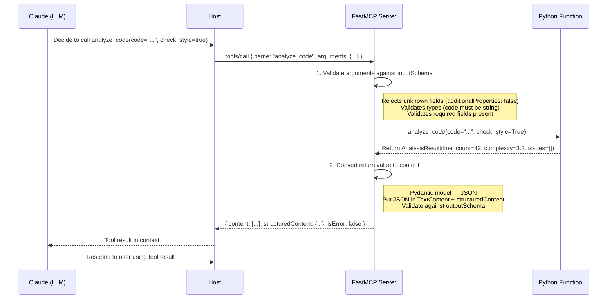
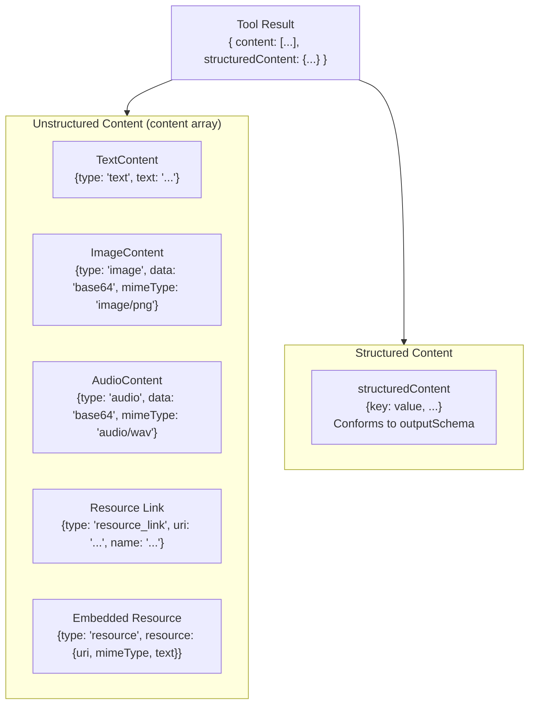
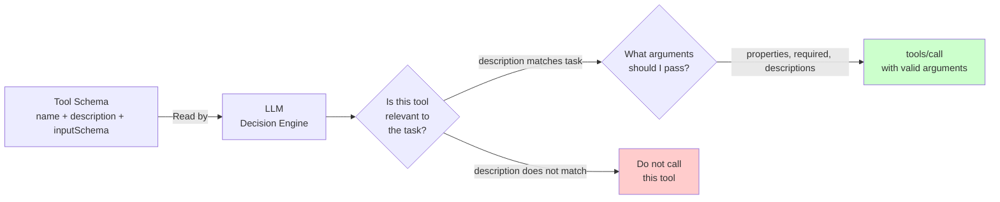
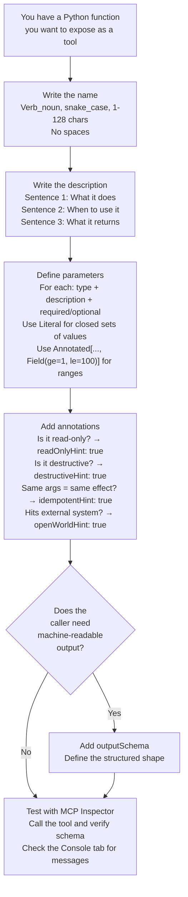
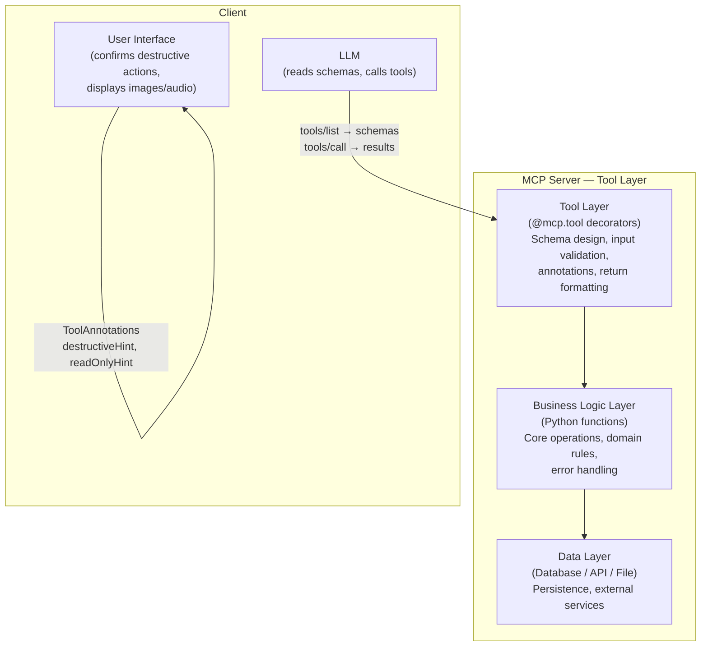

# Chapter 04: MCP Tools — The Primary Primitive

---

## Front Matter

**Learning Objectives**

By the end of this chapter you will be able to:

- Design tool schemas that produce correct, reliable AI behaviour — not just schemas that are technically valid
- Apply all five tool annotation fields and explain what clients do with each one
- Return all six MCP content types from a tool: text, image, audio, resource link, embedded resource, and structured content
- Define an `outputSchema` and explain when it is worth the added complexity
- Implement cursor-based pagination for servers with large tool collections
- Explain the security trust model for tool annotations and why they cannot replace input validation
- Name the seven most common tool schema mistakes that cause wrong AI behaviour
- Build and test a complete production-grade tool library with FastMCP

**Prerequisites**

- Chapter 03 complete — you have a working FastMCP server and can connect it to Claude Code
- `uv` and Python 3.11+ installed
- MCP Inspector available: `npx @modelcontextprotocol/inspector --version`
- Your Chapter 03 Developer Notes Server running (we extend it in this chapter)

**Estimated Reading Time:** 65 minutes

**Estimated Hands-on Time:** 75 minutes

---

## ⚡ Fast Read

> **Skim time: 5 minutes** — Read this if you're returning for reference, or already understand JSON Schema basics.

- **What it is:** A tool is a Python function wrapped in a JSON Schema contract — the schema tells the LLM what the function expects, and the LLM uses that contract to form valid calls.
- **Why it matters:** The quality of your tool schema is the single biggest determinant of how well Claude uses your server. A vague description causes wrong tool calls. A precise schema prevents them. This is the engineering decision with the highest ROI in MCP development.
- **Key insight:** Two tools with identical Python logic but different descriptions will produce different AI behaviour. The AI reads descriptions; it does not inspect code. Writing descriptions for the AI, not for human developers, is the skill this chapter teaches.
- **What you build:** A Code Analysis MCP Server with six tools that collectively demonstrate all six content types, all four annotation hints, structured output with `outputSchema`, and a dynamic tool list.
- **Jump to:** [Schema Design](#beginner-implementation) | [Annotations](#tool-annotations) | [Return Types](#all-six-content-types) | [Best Practices](#best-practices) | [Mini Project](#mini-project)

---

## Why This Topic Exists

In Chapter 03 you built a complete server and connected it to three clients. The tools worked. The AI called them. Everything functioned.

But "functioning" and "working well" are different things. Consider two descriptions for the same tool:

```
Version A: "list_notes — Lists notes."
Version B: "list_notes — Return all saved developer notes, optionally filtered by a tag.
             Use this BEFORE add_note to check whether a similar note already exists.
             Returns a formatted list with note IDs and tags."
```

Both descriptions are syntactically valid. Both produce the same JSON Schema. But Version A causes the AI to guess — and sometimes guess wrong. In production, Version A leads to duplicate notes, missing context in responses, and frustrated users wondering why the AI isn't using the server correctly.

Version B takes 30 additional seconds to write. It pays back in every single tool call for the lifetime of the server.

This chapter teaches you to write Version B — not by accident, but by design.

Beyond descriptions, Chapter 04 covers:
- The full range of what a tool can *return* (text is just one of six content types)
- How to signal tool intent to clients via annotations
- How to define structured output that clients and AI can both consume
- How to design a tool library that scales beyond a dozen tools

---

## Real-World Analogy

### Analogy 1: The OpenAPI Specification

REST APIs have OpenAPI (Swagger) specs. Every endpoint has a `summary`, a `description`, `parameters` with their own descriptions, and a `responses` schema. The spec is not for the server — the server already knows what it does. The spec is for every consumer of the API: developers reading it, tools generating client code, gateways routing requests.

An MCP tool schema plays the same role, with one critical difference: the primary consumer is an AI, not a human developer. The AI reads your description and parameters to decide (1) whether this tool is relevant to the current task, and (2) what values to pass as arguments.

Your target reader for a tool description is not a developer who will read it once in documentation. It is an LLM that will read it on every request and decide whether to call the tool and how.

### Analogy 2: The Type Signature Contract

In a statically typed language like TypeScript or Java, a function signature is a contract:

```typescript
function searchNotes(query: string, tag?: string, limit: number = 10): Note[]
```

Any caller that violates this contract gets a compile error. The contract is enforced at call time.

An MCP `inputSchema` is the same kind of contract, but enforced by the LLM rather than a compiler. If your schema says `tag` is a `string`, the LLM will pass a string. If your schema says `limit` is a number between 1 and 100, a well-behaved LLM will pass a number in that range.

The difference: the LLM has to *interpret* your schema using natural language understanding. A TypeScript type is unambiguous. A JSON Schema description is only as precise as the English you write in it.

### Analogy 3: The Job Listing

Imagine hiring for a role. A job listing that says "Programmer — writes programs" will attract every programmer. A listing that says "Senior Go engineer for distributed systems, 3+ years experience, familiar with Kubernetes and Prometheus" will attract candidates who fit the role.

Your tool description is the job listing. A vague description puts the tool "in consideration" for every task. A precise description targets the exact situations where the tool is the right choice. Precision reduces wrong calls.

---

## Core Concepts

### The Tool Definition Object

Every tool registered in an MCP server produces a JSON object sent to clients in the `tools/list` response. Understanding this object is understanding what you are actually publishing:

```json
{
  "name": "analyze_code",
  "title": "Code Analyser",
  "description": "Analyse a Python code snippet for quality metrics: line counts, complexity, and style issues. Use this when reviewing code for a PR, diagnosing a bug, or explaining what a function does.",
  "inputSchema": {
    "type": "object",
    "properties": {
      "code": {
        "type": "string",
        "description": "The Python source code to analyse. Can be a function, class, or full module."
      },
      "check_style": {
        "type": "boolean",
        "description": "If true, also check for PEP 8 style violations. Defaults to false.",
        "default": false
      }
    },
    "required": ["code"],
    "additionalProperties": false
  },
  "outputSchema": {
    "type": "object",
    "properties": {
      "line_count": { "type": "integer" },
      "complexity": { "type": "number" },
      "issues": { "type": "array", "items": { "type": "string" } }
    },
    "required": ["line_count", "complexity", "issues"]
  },
  "annotations": {
    "readOnlyHint": true,
    "destructiveHint": false,
    "idempotentHint": true,
    "openWorldHint": false
  }
}
```

**Fields:**

| Field | Required | Purpose |
|-------|----------|---------|
| `name` | Yes | Unique identifier — what clients and the LLM use to call the tool |
| `title` | No | Human-readable display name shown in client UIs |
| `description` | Strongly recommended | Natural language explanation — what the LLM reads to decide when to call this tool |
| `inputSchema` | Yes | JSON Schema defining parameters — must be a valid JSON Schema object |
| `outputSchema` | No | JSON Schema for the `structuredContent` field in the response |
| `annotations` | No | Behavioral hints for clients (readOnly, destructive, idempotent, openWorld) |

---

### Tool Naming Rules

The MCP spec defines exact rules for tool names:

- **Length:** 1–128 characters
- **Allowed characters:** `A-Z`, `a-z`, `0-9`, `_`, `-`, `.` — nothing else
- **No spaces** — `get weather` is invalid; use `get_weather`
- **Case-sensitive** — `GetWeather` and `get_weather` are different tools
- **Unique per server** — no two tools on the same server may share a name

**Convention (not enforced by spec, but strongly recommended):**

```python
# snake_case verb_noun pattern — clearest and most common
get_weather        # read operation
create_note        # write operation
delete_file        # destructive operation
list_repositories  # collection read
update_status      # update operation
search_docs        # search operation

# Acceptable alternatives
GetWeather         # PascalCase (more common in TypeScript)
getWeather         # camelCase (also TypeScript-typical)
admin.create_user  # dot-namespaced (useful for large tool libraries)

# Avoid
weather            # ambiguous — get or set?
w                  # too short
get weather data   # spaces not allowed
```

FastMCP uses the Python function name as the tool name. Python convention is `snake_case`, which aligns with the most common MCP convention.

---

### The inputSchema — JSON Schema for Tool Parameters

The `inputSchema` is a JSON Schema 2020-12 object that describes every parameter the tool accepts. The LLM uses this schema to form valid `tools/call` requests.

**Mandatory structure:**

```json
{
  "type": "object",
  "properties": { ... },
  "required": [...],
  "additionalProperties": false
}
```

**`additionalProperties: false`** is critical. Without it, the LLM may add extra parameters not in your schema. FastMCP sets this automatically. Raw SDK implementations must set it explicitly.

**For tools with no parameters:**

```json
{
  "type": "object",
  "additionalProperties": false
}
```

Never use `null` or an empty object `{}` for a no-parameter tool. The spec requires a valid JSON Schema object.

---

### Tool Annotations — The Five Hints

Tool annotations are metadata hints about how a tool behaves. They are declared in the `annotations` object on the tool definition.

> **Critical note:** Annotations are **hints, not guarantees**. The MCP spec states that clients MUST treat annotations as untrusted unless they come from a verified trusted server. A malicious server can lie about its annotations. Annotations inform client UX decisions — they do not enforce security.

**The five annotation fields:**

| Field | Type | Default | What it signals |
|-------|------|---------|----------------|
| `title` | `string` | — | Human-readable display name for client UIs |
| `readOnlyHint` | `bool` | `false` | Tool does not modify any state — safe to call without confirmation |
| `destructiveHint` | `bool` | `true` | Tool may make irreversible changes — client should warn user |
| `idempotentHint` | `bool` | `false` | Calling the tool twice with the same args has no extra effect |
| `openWorldHint` | `bool` | `true` | Tool interacts with external systems (internet, file system, DB) |

> **Note the defaults:** `readOnlyHint` defaults to `false` (modifying), and `destructiveHint` defaults to `true` (destructive). This is the safe default — assume the worst unless explicitly stated otherwise. Always annotate read-only tools explicitly.

**What clients do with annotations:**

- `readOnlyHint: true` → client may skip the "approve this action?" confirmation dialog
- `destructiveHint: true` + `readOnlyHint: false` → client shows a warning or requires explicit user approval
- `idempotentHint: true` → client may retry the call automatically on transient failure
- `openWorldHint: false` → client knows the tool only touches its own internal data (lower risk)

**The lethal trifecta (security pattern):** A session with a tool that accesses private data + a tool that reads untrusted external content + a tool that sends data externally is high-risk regardless of annotations. No combination of annotations makes this safe — only architectural controls do.

---

### The Six Content Types

A tool result's `content` array can contain any mix of these six types:

| Type | JSON `type` field | What it carries |
|------|-------------------|----------------|
| Text | `"text"` | Plain text or Markdown |
| Image | `"image"` | Base64-encoded image + MIME type |
| Audio | `"audio"` | Base64-encoded audio + MIME type |
| Resource link | `"resource_link"` | URI pointing to a resource (client fetches separately) |
| Embedded resource | `"resource"` | Resource content inlined in the result |
| Structured content | (in `structuredContent` field) | JSON object conforming to `outputSchema` |

Multiple content items can be returned in a single tool response by returning a list.

---

## Architecture Diagrams

### From Tool Call to Result — The Complete Path



---

### The Content Type Family



---

### How the LLM Uses Your Schema



The schema answers two questions for the LLM: **should I call this?** (description) and **how do I call it?** (inputSchema). Both must be clear for the tool to be used correctly.

---

## Flow Diagrams

### Tool Schema Design Flowchart



---

## Beginner Implementation

### The Seven Rules of Tool Schema Design

These rules come from studying how LLMs actually use tool schemas in production. Each rule has a measurable impact on call accuracy.

---

**Rule 1: Name with Verb + Noun, snake_case**

```python
# Wrong names — ambiguous or non-standard
@mcp.tool
def notes(): ...       # Is this get_notes or create_note or list_notes?

@mcp.tool
def n(): ...           # Meaningless outside of context

@mcp.tool
def NoteManager(): ... # PascalCase is unusual in Python MCP servers

# Correct names — verb + noun, purpose is clear from the name alone
@mcp.tool
def list_notes(): ...

@mcp.tool
def create_note(): ...

@mcp.tool
def delete_note(): ...
```

---

**Rule 2: Description = What + When + Returns (three sentences)**

```python
# Wrong: one vague sentence
@mcp.tool
def search_notes(query: str) -> str:
    """Search notes."""
    ...

# Correct: three focused sentences
@mcp.tool
def search_notes(query: str) -> str:
    """Search saved developer notes by text content.
    
    Use this when the user asks to find notes about a topic, recall something
    from a previous session, or locate a specific note without knowing its ID.
    Returns a formatted list of matching notes with their IDs and tags, or a
    message if no matches are found.
    """
    ...
```

The three-sentence pattern: *What it does. When to reach for it. What comes back.* An LLM reading this knows exactly when to call `search_notes` vs `list_notes` vs `get_note`.

---

**Rule 3: Document every parameter — not just the obscure ones**

```python
# Wrong: no parameter documentation
@mcp.tool
def list_notes(tag: str | None = None, limit: int = 20) -> str:
    """List all saved developer notes, optionally filtered by tag."""
    ...

# Correct: every parameter documented in Args section
@mcp.tool
def list_notes(tag: str | None = None, limit: int = 20) -> str:
    """List all saved developer notes, optionally filtered by tag.
    
    Use this to see what has been noted before adding a new note.
    Returns a formatted list sorted by most recently added first.
    
    Args:
        tag: If provided, only return notes with this exact tag string.
             Tags are case-sensitive: 'bug' and 'Bug' are different tags.
             Use list_tags to see available tags if unsure.
        limit: Maximum number of notes to return. Default is 20.
               Use a smaller value for a quick overview, or increase
               for a complete audit. Maximum allowed: 100.
    """
    ...
```

The LLM reads `Args` sections. If you don't document `tag`, the LLM may guess at formatting ("bug fix" instead of "bug"). If you don't document `limit`, the LLM doesn't know there's a max value.

---

**Rule 4: Use `Literal` for closed sets of values**

```python
from typing import Literal

# Wrong: open string — LLM may hallucinate values like "yaml", "xml", "table"
@mcp.tool
def export_notes(format: str = "markdown") -> str:
    """Export all notes in the specified format."""
    ...

# Correct: Literal constrains to valid values
# FastMCP converts Literal to { "type": "string", "enum": ["markdown", "json", "csv"] }
@mcp.tool
def export_notes(format: Literal["markdown", "json", "csv"] = "markdown") -> str:
    """Export all notes in the specified format.
    
    Args:
        format: Output format. 'markdown' for human reading, 'json' for
                programmatic processing, 'csv' for spreadsheet import.
    """
    ...
```

`Literal` in Python type hints becomes a JSON Schema `enum`. The LLM will only send one of the listed values. Without `Literal`, the LLM can send any string, and invalid values reach your function.

---

**Rule 5: Constrain numeric ranges with `Field`**

```python
from typing import Annotated
from pydantic import Field

# Wrong: unconstrained integer — LLM might send 0 or -1 or 9999
@mcp.tool
def list_notes(limit: int = 20) -> str: ...

# Correct: Field constraints become JSON Schema constraints
@mcp.tool
def list_notes(
    limit: Annotated[int, Field(ge=1, le=100, description="Max notes to return (1–100).")] = 20
) -> str: ...
```

FastMCP converts `Field(ge=1, le=100)` to `{ "type": "integer", "minimum": 1, "maximum": 100 }` in the schema. The LLM respects these bounds.

---

**Rule 6: Separate concerns into separate tools**

```python
# Wrong: one tool does too many things — LLM must guess which mode to use
@mcp.tool
def manage_note(
    action: str,       # "create", "read", "update", "delete" ?
    note_id: str | None = None,
    content: str | None = None,
) -> str:
    """Manage developer notes. Action can be create, read, update, or delete."""
    ...

# Correct: one tool per operation — each schema is clear and focused
@mcp.tool
def create_note(content: str, tags: list[str] = []) -> str:
    """Create a new developer note..."""

@mcp.tool
def get_note(note_id: str) -> str:
    """Get a specific note by ID..."""

@mcp.tool
def update_note(note_id: str, content: str) -> str:
    """Update the content of an existing note..."""

@mcp.tool
def delete_note(note_id: str) -> str:
    """Delete a note permanently..."""
```

One tool per operation makes each schema simpler and each description sharper. The LLM never has to guess what `action` value to pass — it picks the right tool from the list.

---

**Rule 7: Tell the LLM what comes back — not just how to call the tool**

```python
# Wrong: description says how to call it, not what you get
@mcp.tool
def get_note(note_id: str) -> str:
    """Get a note. Pass the note_id."""
    ...

# Correct: description explains the output format so the LLM can use it
@mcp.tool
def get_note(note_id: str) -> str:
    """Get a specific developer note by its ID.
    
    Returns the note as JSON with fields: id, content, tags (list of strings),
    and created_at (ISO 8601 timestamp). Returns an error if the note ID
    does not exist — use list_notes to find valid IDs.
    
    Args:
        note_id: The 8-character hexadecimal note ID returned by create_note.
    """
    ...
```

The LLM uses the return description to parse and present the result to the user. If it doesn't know the response format, it will infer it — sometimes incorrectly.

---

### The No-Parameters Tool

Some tools need no input — they operate on the current server state.

```python
# Correct: no-parameter tool
# FastMCP generates: { "type": "object", "additionalProperties": false }

@mcp.tool
def get_session_stats() -> str:
    """Get statistics for the current session: note count, tag count, most-used tags.
    
    Use this to give the user an overview of their notes without listing all of them.
    Returns a formatted summary with counts and the top 5 most-used tags.
    """
    total = len(notes)
    tag_counts: dict[str, int] = {}
    for note in notes.values():
        for tag in note["tags"]:
            tag_counts[tag] = tag_counts.get(tag, 0) + 1
    
    top_tags = sorted(tag_counts.items(), key=lambda x: x[1], reverse=True)[:5]
    tag_summary = ", ".join(f"{t}({c})" for t, c in top_tags) if top_tags else "none"
    
    return f"Session: {total} notes | Tags used: {tag_summary}"
```

---

### Schema Patterns for Common Parameter Types

```python
from typing import Annotated, Literal
from pydantic import Field
from datetime import date

# String with length constraint
content: Annotated[str, Field(min_length=1, max_length=5000)]

# Integer range
limit: Annotated[int, Field(ge=1, le=100)] = 20

# Float range
confidence: Annotated[float, Field(ge=0.0, le=1.0)] = 0.8

# Enum (closed set of strings)
format: Literal["json", "markdown", "csv"] = "markdown"
priority: Literal["low", "medium", "high"] = "medium"

# Optional string (either a value or absent)
tag: str | None = None

# Optional with description
tag: Annotated[str | None, Field(description="Filter by this exact tag.")] = None

# Date input (ISO 8601)
since: Annotated[str, Field(
    description="Filter notes created after this date. ISO 8601 format: 'YYYY-MM-DD'.",
    pattern=r"^\d{4}-\d{2}-\d{2}$",
)] = "2000-01-01"

# List of strings
tags: list[str] = []
# With constraint:
tags: Annotated[list[str], Field(max_length=10, description="Up to 10 tags.")] = []
```

FastMCP converts all of these to their correct JSON Schema equivalents. The AI respects the constraints.

---

## Intermediate Implementation

### Tool Annotations

Add annotations to every tool that has non-default behaviour:

```python
# tools_annotated.py — Intermediate example
# Demonstrates all four behavioural annotation hints.

from fastmcp import FastMCP
from fastmcp.exceptions import ToolError
from mcp.types import ToolAnnotations

mcp = FastMCP(name="annotated-demo")


# ── Read-only: safe to call anytime, no confirmation needed ───────────────────

@mcp.tool(
    annotations=ToolAnnotations(
        readOnlyHint=True,     # Does not change any state
        destructiveHint=False, # Cannot destroy anything
        idempotentHint=True,   # Calling twice = same result
        openWorldHint=False,   # Only reads internal in-memory data
    )
)
def list_notes(tag: str | None = None) -> str:
    """List all saved notes, optionally filtered by tag.
    
    Read-only. Returns the same result on repeated calls with the same tag.
    
    Args:
        tag: If provided, filter to only notes with this tag.
    """
    ...


# ── Write operation: not destructive, not idempotent ─────────────────────────

@mcp.tool(
    annotations=ToolAnnotations(
        readOnlyHint=False,    # Modifies state (creates a note)
        destructiveHint=False, # Creates, doesn't destroy
        idempotentHint=False,  # Calling twice creates two notes
        openWorldHint=False,   # Only touches internal storage
    )
)
def create_note(content: str, tags: list[str] = []) -> str:
    """Create a new note in the developer notebook.
    
    Each call creates a new note. Calling twice with the same content
    creates two separate notes with different IDs.
    
    Args:
        content: The note text.
        tags: Optional tags for categorisation.
    """
    ...


# ── Destructive operation: requires confirmation in careful clients ────────────

@mcp.tool(
    annotations=ToolAnnotations(
        readOnlyHint=False,   # Modifies state
        destructiveHint=True, # Irreversible — deleted notes cannot be recovered
        idempotentHint=True,  # Deleting an already-deleted note = same final state
        openWorldHint=False,  # Only touches internal storage
    )
)
def delete_all_notes() -> str:
    """Delete ALL notes permanently. This cannot be undone.
    
    Use only when the user explicitly requests clearing all notes.
    Individual note deletion: use delete_note instead.
    """
    count = len(notes)
    notes.clear()
    return f"Deleted {count} notes. The notebook is now empty."


# ── External API call: open world, network-dependent ─────────────────────────

@mcp.tool(
    annotations=ToolAnnotations(
        readOnlyHint=True,     # Does not change local state
        destructiveHint=False,
        idempotentHint=False,  # Network calls may return different data each time
        openWorldHint=True,    # Makes HTTP requests to external API
    )
)
def fetch_github_issue(repo: str, issue_number: int) -> str:
    """Fetch a GitHub issue's title, body, and status.
    
    Use when the user references a GitHub issue number and wants details.
    Makes a live GitHub API request — requires network access.
    Rate-limited to 60 requests/hour without authentication.
    
    Args:
        repo: Repository in 'owner/name' format (e.g. 'anthropics/claude-code').
        issue_number: The GitHub issue number (positive integer).
    """
    import urllib.request
    url = f"https://api.github.com/repos/{repo}/issues/{issue_number}"
    try:
        with urllib.request.urlopen(url, timeout=5) as response:
            import json
            data = json.loads(response.read())
            return f"#{data['number']} [{data['state']}] {data['title']}\n\n{data['body'] or '(no body)'}"
    except Exception as e:
        raise ToolError(f"Failed to fetch issue: {e}")
```

---

### All Six Content Types

```python
# content_types_demo.py — Intermediate example
# One tool demonstrating each content type.

import base64
import json
from fastmcp import FastMCP
from fastmcp.utilities.types import Image, Audio, File
from fastmcp.exceptions import ToolError

mcp = FastMCP(name="content-types-demo")


# ── 1. Text Content (most common) ─────────────────────────────────────────────

@mcp.tool
def get_summary(topic: str) -> str:
    """Get a plain-text summary for a topic.
    
    Args:
        topic: The topic to summarise.
    """
    # A str return → TextContent automatically
    return f"Summary of {topic}: [example text content]"


# ── 2. Image Content ──────────────────────────────────────────────────────────

@mcp.tool
def generate_bar_chart(
    values: list[float],
    labels: list[str],
    title: str = "Chart",
) -> Image:
    """Generate a bar chart image from data values.
    
    Returns a PNG image showing the values as a bar chart.
    Use when the user wants to visualise numeric data.
    
    Args:
        values: List of numeric values (one bar per value).
        labels: Labels for each bar — must match the length of values.
        title: Chart title displayed above the bars.
    """
    if len(values) != len(labels):
        raise ToolError(f"values ({len(values)}) and labels ({len(labels)}) must have the same length.")
    
    # Generate chart image — using Pillow (uv add pillow)
    try:
        from PIL import Image as PILImage, ImageDraw, ImageFont
    except ImportError:
        raise ToolError("Pillow not installed. Run: uv add pillow")
    
    W, H = 600, 400
    MARGIN = 60
    img = PILImage.new("RGB", (W, H), color="white")
    draw = ImageDraw.Draw(img)
    
    # Draw title
    draw.text((W // 2, 20), title, fill="black", anchor="mm")
    
    if values:
        max_val = max(values) or 1
        bar_w = (W - 2 * MARGIN) // len(values) - 4
        for i, (val, label) in enumerate(zip(values, labels)):
            x0 = MARGIN + i * (bar_w + 4)
            bar_h = int((val / max_val) * (H - 2 * MARGIN))
            y0 = H - MARGIN - bar_h
            draw.rectangle([x0, y0, x0 + bar_w, H - MARGIN], fill="#4A90D9")
            draw.text((x0 + bar_w // 2, H - MARGIN + 10), label, fill="black", anchor="mm")
            draw.text((x0 + bar_w // 2, y0 - 10), str(round(val, 1)), fill="black", anchor="mm")
    
    # Serialise to PNG bytes
    import io
    buf = io.BytesIO()
    img.save(buf, format="PNG")
    
    # Return Image — FastMCP converts to base64 ImageContent automatically
    return Image(data=buf.getvalue(), format="png")


# ── 3. Audio Content ──────────────────────────────────────────────────────────

@mcp.tool
def get_audio_alert(message: str, tone: Literal["info", "warning", "error"] = "info") -> Audio:
    """Generate a short audio alert tone.
    
    Returns a WAV audio file. Useful for accessibility features or
    ambient notification sounds in tools with audio output support.
    
    Args:
        message: Text description (used for accessibility label).
        tone: Alert tone type — info (low), warning (medium), error (high pitch).
    """
    import struct, math
    
    # Generate a simple sine wave tone — no external deps required
    freq = {"info": 440, "warning": 880, "error": 1760}[tone]
    sample_rate = 22050
    duration = 0.3  # seconds
    num_samples = int(sample_rate * duration)
    
    samples = [
        int(32767 * math.sin(2 * math.pi * freq * i / sample_rate))
        for i in range(num_samples)
    ]
    
    # Build WAV file in memory
    buf = io.BytesIO()
    buf.write(b"RIFF")
    data_size = num_samples * 2
    buf.write(struct.pack("<I", 36 + data_size))  # File size - 8
    buf.write(b"WAVEfmt ")
    buf.write(struct.pack("<IHHIIHH", 16, 1, 1, sample_rate, sample_rate * 2, 2, 16))
    buf.write(b"data")
    buf.write(struct.pack("<I", data_size))
    for s in samples:
        buf.write(struct.pack("<h", s))
    
    # Return Audio — FastMCP converts to base64 AudioContent automatically
    return Audio(data=buf.getvalue(), format="wav")


# ── 4. Resource Link ──────────────────────────────────────────────────────────

from mcp.types import TextContent, EmbeddedResource, ResourceLink

@mcp.tool
def find_related_notes(query: str) -> list:
    """Find notes related to a query and return links to them.
    
    Returns a summary text plus resource links for each matching note.
    The client can fetch the full note content using the provided URIs.
    
    Args:
        query: Search term to find in note content or tags.
    """
    # Find matching notes
    matches = [n for n in notes.values() if query.lower() in n["content"].lower()]
    
    if not matches:
        return [TextContent(type="text", text=f"No notes found matching '{query}'.")]
    
    result = [TextContent(
        type="text",
        text=f"Found {len(matches)} note(s) matching '{query}'. Resource links below:"
    )]
    
    # Add a resource_link for each match — client can subscribe or fetch
    for note in matches:
        result.append(ResourceLink(
            type="resource_link",
            uri=f"notes://{note['id']}",
            name=f"Note {note['id']}",
            description=note["content"][:80] + ("..." if len(note["content"]) > 80 else ""),
            mimeType="application/json",
        ))
    
    return result


# ── 5. Embedded Resource ──────────────────────────────────────────────────────

@mcp.tool
def get_note_with_context(note_id: str) -> list:
    """Get a note with its full content embedded in the response.
    
    Unlike find_related_notes which returns resource links, this embeds the
    full note content directly so the AI can read it without a separate fetch.
    Use when you need the note content analysed, not just referenced.
    
    Args:
        note_id: The 8-character note ID.
    """
    from mcp.types import TextContent, EmbeddedResource, TextResourceContents
    
    note = notes.get(note_id)
    if not note:
        raise ToolError(f"Note '{note_id}' not found. Use list_notes to find valid IDs.")
    
    return [
        TextContent(type="text", text=f"Note {note_id} content:"),
        EmbeddedResource(
            type="resource",
            resource=TextResourceContents(
                uri=f"notes://{note_id}",
                mimeType="application/json",
                text=json.dumps(note, indent=2),
            )
        )
    ]


# ── 6. Structured Content with outputSchema ───────────────────────────────────

from pydantic import BaseModel

class NoteStats(BaseModel):
    total_notes: int
    total_tags: int
    unique_tags: list[str]
    most_used_tag: str | None
    average_content_length: float


@mcp.tool
def get_note_statistics() -> NoteStats:
    """Get detailed statistics about the current note collection.
    
    Returns structured data suitable for programmatic consumption.
    Fields: total_notes, total_tags, unique_tags, most_used_tag,
    average_content_length (characters).
    
    Use when you need exact counts or want to display a statistics summary.
    """
    if not notes:
        return NoteStats(
            total_notes=0, total_tags=0, unique_tags=[],
            most_used_tag=None, average_content_length=0.0
        )
    
    all_tags: list[str] = []
    for note in notes.values():
        all_tags.extend(note["tags"])
    
    tag_counts: dict[str, int] = {}
    for tag in all_tags:
        tag_counts[tag] = tag_counts.get(tag, 0) + 1
    
    most_used = max(tag_counts, key=tag_counts.get) if tag_counts else None
    avg_len = sum(len(n["content"]) for n in notes.values()) / len(notes)
    
    # Return Pydantic model → FastMCP produces both TextContent (JSON) + structuredContent
    return NoteStats(
        total_notes=len(notes),
        total_tags=len(all_tags),
        unique_tags=sorted(set(all_tags)),
        most_used_tag=most_used,
        average_content_length=round(avg_len, 1),
    )
```

**What the LLM receives for each type:**

```
Text:    "Found 3 notes matching 'bug'."
Image:   [visual image displayed in the UI, if client supports images]
Audio:   [audio played, if client supports audio]
Resource link: URI the client can fetch or subscribe to
Embedded: Full resource content readable by the LLM directly
Structured: JSON object the LLM and client can parse programmatically
```

---

### Returning Multiple Content Items

Return a `list` to include multiple content items in a single tool response:

```python
@mcp.tool
def analyse_session() -> list:
    """Analyse the current session and return a chart plus a text summary.
    
    Returns: a bar chart image of note counts by tag, plus a text summary.
    Use at the end of a session for a visual overview.
    """
    import io
    from fastmcp.utilities.types import Image
    
    # Calculate tag frequencies
    tag_counts: dict[str, int] = {}
    for note in notes.values():
        for tag in note["tags"]:
            tag_counts[tag] = tag_counts.get(tag, 0) + 1
    
    if not tag_counts:
        return ["No tagged notes yet. Add notes with tags to see the chart."]
    
    # Generate chart (abbreviated)
    labels = list(tag_counts.keys())
    values = list(tag_counts.values())
    chart_bytes = _make_bar_chart(labels, values, "Notes by Tag")
    
    # Return text + image in the same response
    return [
        f"Session summary: {len(notes)} total notes, {len(tag_counts)} unique tags.",
        Image(data=chart_bytes, format="png"),
        f"Top tag: '{max(tag_counts, key=tag_counts.get)}' ({max(tag_counts.values())} notes)",
    ]
```

**Rules for list returns:**

- `str` items → `TextContent`
- `Image` items → `ImageContent`
- `Audio` items → `AudioContent`
- `TextContent`, `ImageContent` etc. from `mcp.types` → used directly
- Nested structures (dict of Image) → must convert manually using `.to_image_content()`

---

### outputSchema — Structured Output for Machine Consumers

`outputSchema` tells clients and the LLM what shape the `structuredContent` object will have. When a Pydantic model is the return type, FastMCP generates the `outputSchema` automatically:

```python
from pydantic import BaseModel
from fastmcp import FastMCP

mcp = FastMCP("structured-demo")


class WeatherData(BaseModel):
    city: str
    temperature_celsius: float
    condition: str
    humidity_percent: int
    wind_kmh: float


@mcp.tool
def get_weather(city: str) -> WeatherData:
    """Get current weather data for a city.
    
    Returns structured weather data with temperature, conditions, humidity,
    and wind speed. The client receives both a JSON text representation and
    a structured object conforming to the outputSchema.
    
    Args:
        city: City name, e.g. 'London', 'New York', 'Tokyo'.
    """
    # In production: call a weather API
    return WeatherData(
        city=city,
        temperature_celsius=18.5,
        condition="Partly cloudy",
        humidity_percent=65,
        wind_kmh=12.3,
    )
```

FastMCP automatically:
1. Generates an `outputSchema` from `WeatherData`'s fields
2. Serialises the return value to JSON and puts it in `TextContent` (for backward compatibility)
3. Also puts the structured object in `structuredContent` (for clients that support it)

The `tools/list` response for this tool:

```json
{
  "name": "get_weather",
  "description": "Get current weather data for a city...",
  "inputSchema": { "type": "object", "properties": { "city": { "type": "string" } }, "required": ["city"] },
  "outputSchema": {
    "type": "object",
    "properties": {
      "city": { "type": "string" },
      "temperature_celsius": { "type": "number" },
      "condition": { "type": "string" },
      "humidity_percent": { "type": "integer" },
      "wind_kmh": { "type": "number" }
    },
    "required": ["city", "temperature_celsius", "condition", "humidity_percent", "wind_kmh"]
  }
}
```

**When to use `outputSchema`:**

| Use case | Use outputSchema? |
|----------|------------------|
| Tool result is read by the AI and presented as text | No — simple `str` return is sufficient |
| Tool result is consumed programmatically by the client | Yes — structured output enables schema validation |
| Tool is called by another tool or automated system | Yes — reliable parsing without text scraping |
| Result is complex multi-field data | Yes — makes structure explicit |
| Result is a simple message like "Note deleted" | No — overkill |

---

## Advanced Implementation

### Dynamic Tool Lists — `tools/list_changed`

Sometimes a server's available tools change at runtime: based on user permissions, feature flags, or server state. MCP supports this via the `notifications/tools/list_changed` notification.

```python
# dynamic_tools.py — Advanced example
# Tools that appear or disappear based on server state.

from fastmcp import FastMCP

mcp = FastMCP(
    name="dynamic-tools-demo",
    # Declare that our tool list can change
    # FastMCP sets this in capabilities automatically when you use mcp.enable/disable
)

# Tags control which tools are active
_admin_mode = False


@mcp.tool(tags={"always"})
def get_status() -> str:
    """Get the current server status and available mode."""
    mode = "admin" if _admin_mode else "standard"
    return f"Server running in {mode} mode."


@mcp.tool(tags={"always"})
def enable_admin_mode(secret: str) -> str:
    """Enable admin mode to unlock additional tools.
    
    Admin mode provides access to system management tools.
    Requires the admin secret.
    
    Args:
        secret: The admin secret phrase.
    """
    global _admin_mode
    if secret != "letmein":  # In production: proper auth (Chapter 12)
        from fastmcp.exceptions import ToolError
        raise ToolError("Invalid secret. Admin mode not enabled.")
    
    _admin_mode = True
    # Enable the admin-tagged tools — FastMCP sends tools/list_changed automatically
    mcp.enable(tags={"admin"})
    return "Admin mode enabled. Additional tools are now available."


@mcp.tool(tags={"admin"})
def reset_all_data() -> str:
    """[ADMIN] Reset all server data. IRREVERSIBLE.
    
    Only available in admin mode. Clears all notes and session state.
    """
    # ... do reset ...
    return "All data reset."


@mcp.tool(tags={"admin"})
def view_server_logs() -> str:
    """[ADMIN] View recent server log entries."""
    return "No log entries."


# Disable admin tools at startup — they only appear after enable_admin_mode()
mcp.disable(tags={"admin"})

if __name__ == "__main__":
    mcp.run()
```

When `mcp.enable(tags={"admin"})` runs:
1. FastMCP adds the admin-tagged tools to the registry
2. FastMCP sends `notifications/tools/list_changed` to the client
3. The client re-calls `tools/list` and discovers the new tools
4. The LLM now has access to `reset_all_data` and `view_server_logs`

---

### Cursor-Based Pagination for Large Tool Collections

For servers with many tools, the `tools/list` response supports pagination via opaque cursors. FastMCP handles this automatically when the client sends a `cursor` parameter.

Understanding what the protocol looks like helps when building custom clients (Chapter 08) or debugging:

```python
# Pagination example — what clients see with many tools
# Server with 30 tools — FastMCP may paginate automatically based on client request

# Client sends (page 1):
# { "jsonrpc": "2.0", "id": 1, "method": "tools/list", "params": {} }

# Server responds:
# {
#   "result": {
#     "tools": [ ...first 20 tools... ],
#     "nextCursor": "eyJvZmZzZXQiOiAyMH0="   ← base64-encoded page marker
#   }
# }

# Client sends (page 2):
# { "jsonrpc": "2.0", "id": 2, "method": "tools/list", "params": { "cursor": "eyJvZmZzZXQiOiAyMH0=" } }

# Server responds:
# {
#   "result": {
#     "tools": [ ...next 10 tools... ]
#     // No nextCursor → this is the last page
#   }
# }
```

FastMCP paginates automatically. The cursor is opaque — treat it as a bookmark, not a page number.

**Practical guidance:** If your server reaches 30+ tools without pagination being a concern, consider whether you have too many tools in one server. The better architectural choice is usually to split into focused domain servers (covered in Chapter 08).

---

### Tool Versioning Patterns

MCP tools do not have a native versioning concept — `name` is the identifier. For versioning, three patterns exist:

**Pattern 1: Name suffix (simplest)**

```python
@mcp.tool
def search_notes_v2(
    query: str,
    tag: str | None = None,
    created_after: str | None = None,  # new in v2
) -> str:
    """[v2] Search notes by text, tag, and date.
    
    Improved over search_notes: adds date filtering and returns structured results.
    Use this instead of search_notes for new integrations.
    """
    ...
```

Keep `search_notes` (v1) for backward compatibility. Deprecate in description. Remove in a future release.

**Pattern 2: Dot-namespacing**

```python
@mcp.tool
def notes_v1_search(query: str) -> str: ...    # original

@mcp.tool
def notes_v2_search(query: str, tag: str | None = None) -> str: ...  # current
```

**Pattern 3: Feature detection in description**

```python
@mcp.tool
def search_notes(query: str, tag: str | None = None, created_after: str | None = None) -> str:
    """Search notes. If created_after is provided, filters to notes after that date (added in
    server version 2.0). Omit created_after for behaviour identical to version 1.0."""
    ...
```

**Recommended:** Use Pattern 1 (name suffix `_v2`) for breaking changes. Use Pattern 3 (optional params + description note) for backward-compatible additions.

---

## TypeScript SDK — Tool Implementation

The TypeScript SDK uses Zod schemas instead of Python type hints. The design principles are identical — good descriptions, constrained parameters, appropriate annotations — but the syntax is different.

### Schema Design with Zod

```typescript
// tools_typescript.ts — Learning example
import { McpServer } from "@modelcontextprotocol/sdk/server/mcp.js";
import { StdioServerTransport } from "@modelcontextprotocol/sdk/server/stdio.js";
import { z } from "zod";

const notes: Record<string, { id: string; content: string; tags: string[]; created_at: string }> = {};

const server = new McpServer({ name: "developer-notes-ts", version: "1.0.0" });


// ── Zod equivalents of Python type hint patterns ──────────────────────────────

// Python: query: str
//     Zod: z.string()

// Python: limit: Annotated[int, Field(ge=1, le=100)] = 20
//     Zod: z.number().int().min(1).max(100).default(20)

// Python: format: Literal["markdown", "json", "csv"] = "markdown"
//     Zod: z.enum(["markdown", "json", "csv"]).default("markdown")

// Python: tag: str | None = None
//     Zod: z.string().optional()

// Python: tags: list[str] = []
//     Zod: z.array(z.string()).default([])


// ── Basic tool — text result ──────────────────────────────────────────────────

server.tool(
  "list_notes",
  // Description: three sentences — what, when, returns
  "List all saved developer notes, optionally filtered by tag. " +
  "Use this before add_note to check for similar existing notes. " +
  "Returns one note per line with ID and tag list, or 'No notes' if empty.",
  {
    tag: z.string().optional().describe(
      "If provided, only return notes with this exact tag. Case-sensitive."
    ),
    limit: z.number().int().min(1).max(100).default(20).describe(
      "Max notes to return (1–100). Default 20."
    ),
  },
  async ({ tag, limit }) => {
    const allNotes = Object.values(notes);
    const filtered = tag
      ? allNotes.filter(n => n.tags.includes(tag))
      : allNotes;

    const page = filtered.slice(0, limit);
    if (page.length === 0) {
      return { content: [{ type: "text" as const, text: "No notes found." }] };
    }
    const lines = page.map(n => `[${n.id}] [${n.tags.join(", ")}] ${n.content.slice(0, 80)}`);
    return { content: [{ type: "text" as const, text: lines.join("\n") }] };
  }
);


// ── Enum (Literal equivalent) ─────────────────────────────────────────────────

server.tool(
  "export_notes",
  "Export all notes in the requested format. " +
  "Use 'markdown' for human reading, 'json' for programmatic use, 'csv' for spreadsheets. " +
  "Returns the full export as a string in the chosen format.",
  {
    format: z.enum(["markdown", "json", "csv"]).default("markdown").describe(
      "Output format: 'markdown', 'json', or 'csv'."
    ),
  },
  async ({ format }) => {
    const allNotes = Object.values(notes);
    let output: string;

    if (format === "json") {
      output = JSON.stringify(allNotes, null, 2);
    } else if (format === "csv") {
      output = "id,content,tags,created_at\n" +
        allNotes.map(n => `${n.id},"${n.content}","${n.tags.join("|")}",${n.created_at}`).join("\n");
    } else {
      output = allNotes.map(n => `## [${n.id}]\n${n.content}\n*Tags: ${n.tags.join(", ")}*`).join("\n\n");
    }

    return { content: [{ type: "text" as const, text: output || "No notes to export." }] };
  }
);


// ── Tool with annotations ─────────────────────────────────────────────────────

server.tool(
  "delete_note",
  "Delete a developer note permanently. This cannot be undone. " +
  "Use only when the user explicitly requests deletion. " +
  "Returns a confirmation message with the deleted note ID.",
  { note_id: z.string().describe("The 8-character note ID to delete.") },
  // Annotations — 4th argument when provided before the handler
  {
    title: "Delete Note",
    readOnlyHint: false,
    destructiveHint: true,   // Irreversible — client should confirm with user
    idempotentHint: true,    // Deleting a deleted note = same final state
    openWorldHint: false,    // Only touches internal storage
  },
  async ({ note_id }) => {
    if (!(note_id in notes)) {
      // isError: true — recoverable error the AI can respond to
      return {
        content: [{ type: "text" as const, text: `Note '${note_id}' not found. Use list_notes to find valid IDs.` }],
        isError: true,
      };
    }
    delete notes[note_id];
    return { content: [{ type: "text" as const, text: `Deleted note ${note_id}.` }] };
  }
);


// ── Image content ─────────────────────────────────────────────────────────────

server.tool(
  "get_note_count_chart",
  "Generate a simple bar chart image showing note count by tag. " +
  "Use when the user wants a visual overview of their note distribution. " +
  "Returns a PNG image.",
  {},
  { readOnlyHint: true, idempotentHint: false },
  async () => {
    // In production: use canvas or a charting library to generate PNG
    // Here: placeholder base64 PNG (1x1 white pixel for demonstration)
    const PLACEHOLDER_PNG_B64 =
      "iVBORw0KGgoAAAANSUhEUgAAAAEAAAABCAYAAAAfFcSJAAAADUlEQVR42mNkYPhfDwAChwGA60e6kgAAAABJRU5ErkJggg==";

    return {
      content: [{
        type: "image" as const,
        data: PLACEHOLDER_PNG_B64,
        mimeType: "image/png",
      }],
    };
  }
);


// ── Structured content (outputSchema via object return) ───────────────────────

server.tool(
  "get_session_stats",
  "Get statistics for the current note collection: counts, tag usage, averages. " +
  "Use for a quick overview without listing all notes. " +
  "Returns JSON with total_notes, total_tags, unique_tags, most_used_tag.",
  {},
  { readOnlyHint: true, idempotentHint: true, openWorldHint: false },
  async () => {
    const allNotes = Object.values(notes);
    const tagCounts: Record<string, number> = {};
    for (const note of allNotes) {
      for (const tag of note.tags) {
        tagCounts[tag] = (tagCounts[tag] ?? 0) + 1;
      }
    }
    const mostUsed = Object.keys(tagCounts).sort((a, b) => tagCounts[b] - tagCounts[a])[0] ?? null;

    const stats = {
      total_notes: allNotes.length,
      total_tags: Object.values(tagCounts).reduce((s, n) => s + n, 0),
      unique_tags: Object.keys(tagCounts).sort(),
      most_used_tag: mostUsed,
    };

    return {
      content: [{ type: "text" as const, text: JSON.stringify(stats, null, 2) }],
      structuredContent: stats,  // Clients that support outputSchema consume this
    };
  }
);

async function main() {
  const transport = new StdioServerTransport();
  await server.connect(transport);
}

main();
```

**Key Zod patterns at a glance:**

| Python | Zod equivalent |
|--------|---------------|
| `str` | `z.string()` |
| `int` | `z.number().int()` |
| `float` | `z.number()` |
| `bool` | `z.boolean()` |
| `list[str]` | `z.array(z.string())` |
| `str \| None = None` | `z.string().optional()` |
| `Literal["a", "b"]` | `z.enum(["a", "b"])` |
| `Annotated[int, Field(ge=1, le=100)]` | `z.number().int().min(1).max(100)` |
| `Annotated[str, Field(description="...")]` | `z.string().describe("...")` |
| `= "default"` | `.default("default")` |

**Tool handler return format:**

```typescript
// Standard result
return { content: [{ type: "text", text: "..." }] };

// Error result (isError: true — recoverable)
return { content: [{ type: "text", text: "Not found..." }], isError: true };

// Multiple content items
return {
  content: [
    { type: "text" as const, text: "Summary text" },
    { type: "image" as const, data: "base64...", mimeType: "image/png" },
  ],
};

// With structured content
return {
  content: [{ type: "text" as const, text: JSON.stringify(data) }],
  structuredContent: data,
};
```

**Annotation argument position:** In the TypeScript SDK, annotations are the 4th argument to `server.tool()` — between the schema object and the handler function. If you omit annotations, the handler is the 4th argument.

---

## Production Architecture

In production, tools are the interface between the AI and your business logic. The architectural principles:



**Three-layer principle:**
- **Tool layer:** Handles MCP protocol concerns — schema, validation, content type conversion, error mapping
- **Business logic:** Pure Python with no MCP awareness — testable independently
- **Data layer:** Database, API, file system — swappable without changing tool layer

```python
# Production example: Tool layer delegates to business logic

# business_logic.py — no FastMCP imports
def search_notes_logic(notes: dict, query: str, tag: str | None, limit: int) -> list[dict]:
    """Pure Python — testable without running an MCP server."""
    results = [
        n for n in notes.values()
        if query.lower() in n["content"].lower()
        and (tag is None or tag in n["tags"])
    ]
    return sorted(results, key=lambda n: n["created_at"], reverse=True)[:limit]


# tools.py — MCP tool layer wraps business logic
@mcp.tool
def search_notes(query: str, tag: str | None = None, limit: int = 20) -> str:
    """Search notes..."""
    # Tool layer: validate MCP-specific concerns
    if limit < 1 or limit > 100:
        raise ToolError("limit must be between 1 and 100.")
    
    # Delegate to business logic
    results = search_notes_logic(notes, query, tag, limit)
    
    # Tool layer: format for AI consumption
    if not results:
        return f"No notes found for '{query}'."
    lines = [f"[{n['id']}] {n['content'][:80]}" for n in results]
    return f"Found {len(results)} note(s):\n" + "\n".join(lines)
```

---

## Best Practices

**1. Write descriptions for the AI, not for humans reading documentation.**

Humans read docstrings in IDEs. AIs read `description` fields in tool schemas before every call. These have different readers with different needs. The AI needs: what the tool does, *when to pick it over alternatives*, and what comes back.

**2. Always set `additionalProperties: false` in raw SDK implementations.**

FastMCP sets this automatically. If you use the raw SDK, set it explicitly on every tool. Without it, the LLM may add extra fields that could cause security issues or confusion.

```python
inputSchema={
    "type": "object",
    "properties": { ... },
    "required": [...],
    "additionalProperties": False,   # Required in raw SDK
}
```

**3. Annotate every tool with at least `readOnlyHint`.**

The default for `readOnlyHint` is `false` (modifying). Clients that use annotations for UX decisions will ask for confirmation on every unannotated tool. Read-only tools should always declare `readOnlyHint: true`.

```python
@mcp.tool(annotations=ToolAnnotations(readOnlyHint=True, idempotentHint=True))
def get_note(note_id: str) -> str: ...
```

**4. Use `ToolError` for recoverable business logic failures; let unexpected exceptions propagate.**

```python
@mcp.tool
def get_note(note_id: str) -> str:
    note = notes.get(note_id)
    if note is None:
        # Recoverable: AI can suggest list_notes
        raise ToolError(f"Note '{note_id}' not found. Use list_notes to see valid IDs.")
    # Unexpected errors (network failure, DB error) propagate as -32603
    return json.dumps(note)
```

**5. Include the return format in the description when it is not obvious.**

```python
# Without format description: AI may misparse response
@mcp.tool
def list_notes() -> str:
    """List all notes."""  # How is the list formatted? IDs first? One per line?

# With format description: AI knows exactly what to expect
@mcp.tool
def list_notes() -> str:
    """List all saved notes.
    
    Returns one note per line in format: [note_id] [tags] content_preview.
    Returns 'No notes' if the notebook is empty.
    """
```

**6. For tools with side effects, include the consequence in the description.**

```python
@mcp.tool
def delete_note(note_id: str) -> str:
    """Delete a note permanently. The note cannot be recovered after deletion."""
    # The phrase "cannot be recovered" is important — the AI will warn the user
```

**7. Test every tool with an adversarial mindset in Inspector.**

For each tool:
- Call it with the minimum valid input
- Call it with missing required parameters (expect -32602)
- Call it with wrong types (expect -32602)
- Call it with boundary values for numeric ranges
- Call it when the target does not exist (expect ToolError or useful message)

---

## Security Considerations

### Input Validation Beyond Type Checking

FastMCP validates that parameters match their JSON Schema types. But type-safe is not security-safe:

```python
@mcp.tool
def read_file(path: str) -> str:
    """Read a file from the data directory."""
    import os
    
    # FastMCP validates: path is a string. Safe so far.
    # Security requires: path does not escape the allowed directory.
    
    DATA_DIR = "/Users/yourname/data"
    
    # WRONG: attacker sends "../../etc/passwd"
    # os.path.join(DATA_DIR, "../../etc/passwd") = "/etc/passwd" — path traversal!
    full_path = os.path.join(DATA_DIR, path)          # Vulnerable
    
    # CORRECT: resolve to canonical path, verify it starts with DATA_DIR
    full_path = os.path.realpath(os.path.join(DATA_DIR, path))
    if not full_path.startswith(DATA_DIR + os.sep):
        raise ToolError("Access denied: path is outside the allowed directory.")
    
    if not os.path.isfile(full_path):
        raise ToolError(f"File not found: {path}")
    
    with open(full_path) as f:
        return f.read()
```

### Never Execute User-Supplied Code or Commands

```python
# WRONG: catastrophic — allows arbitrary code execution
@mcp.tool
def run_python(code: str) -> str:
    """Run Python code."""
    result = eval(code)      # Never do this
    return str(result)

@mcp.tool
def run_command(cmd: str) -> str:
    """Run a shell command."""
    import subprocess
    return subprocess.check_output(cmd, shell=True).decode()  # Never do this

# CORRECT: provide specific, safe operations
@mcp.tool
def calculate(expression: Literal["sum", "mean", "max", "min"], values: list[float]) -> float:
    """Perform a safe mathematical calculation."""
    ops = {"sum": sum, "mean": lambda v: sum(v) / len(v), "max": max, "min": min}
    return ops[expression](values)
```

### Annotations Are Hints, Not Security Controls

```python
# WRONG mental model: "readOnlyHint: true means the tool is safe to call"
# A malicious server can declare readOnlyHint: true on a delete_all_data tool.
# Annotations cannot be trusted as security controls.

# CORRECT: use annotations for UX, use access control for security
@mcp.tool(
    annotations=ToolAnnotations(readOnlyHint=True)  # UX hint
)
def read_secret_data(user_id: str) -> str:
    """Read user data."""
    # Security is here — in the tool logic, not in the annotation
    if not is_authorized(current_user, user_id):
        raise ToolError("Access denied.")
    return get_user_data(user_id)
```

### Sanitise Tool Outputs Before Returning

Tool results flow into the AI's context. A malicious external data source could inject prompt injection attacks through tool results:

```python
@mcp.tool
async def fetch_webpage(url: str, ctx: Context) -> str:
    """Fetch and return webpage text content."""
    import httpx
    
    # Fetch from external source
    async with httpx.AsyncClient() as client:
        response = await client.get(url, timeout=10.0)
    
    content = response.text
    
    # Warn the AI that this content is untrusted
    await ctx.warning(f"Returning untrusted external content from {url}")
    
    # Truncate to avoid context overflow from malicious large responses
    if len(content) > 10_000:
        content = content[:10_000] + "\n[Content truncated at 10,000 characters]"
    
    return f"[UNTRUSTED EXTERNAL CONTENT FROM {url}]\n{content}"
```

---

## Cost Considerations

### The Token Cost of Tool Definitions

Every tool schema is included in the `tools/list` response and injected into the Claude API context on every request. This has a direct cost:

```
Approximate token cost per tool (Claude API):
  Name (avg 20 chars):           ~5 tokens
  Description (avg 100 chars):  ~25 tokens
  Parameter name + desc (each): ~15 tokens
  JSON Schema overhead:          ~20 tokens
  ────────────────────────────────────────
  Typical tool total:            ~65–120 tokens
```

At Claude Sonnet 4.6 (~$3/M input tokens):

| Tool count | Tokens added | Cost per 1,000 requests |
|-----------|-------------|------------------------|
| 4 tools | ~400 tokens | ~$0.001 |
| 10 tools | ~1,000 tokens | ~$0.003 |
| 20 tools | ~2,000 tokens | ~$0.006 |
| 50 tools | ~5,000 tokens | ~$0.015 |

At typical usage volumes, tool schema cost is negligible. It becomes significant at >1M requests/day with large tool libraries (50+ tools, verbose descriptions).

**Optimisation strategies:**

```python
# Verbose description (50 tokens):
"""Retrieve the full content of a specific developer note from the in-memory
notebook store, identified by its unique 8-character hexadecimal identifier
that was returned when the note was originally created by the create_note tool.
Returns the complete note object as a JSON-formatted string."""

# Tight description (20 tokens) — same AI behaviour:
"""Get a developer note by ID. Returns JSON with content, tags, created_at.
Use list_notes to find valid IDs."""
```

Write tight descriptions. Short and precise beats long and vague — for cost AND for AI behaviour (AI models perform better with concise, clear instructions).

---

## Common Mistakes

**Mistake 1: Description that only describes the function, not when to use it**

```python
# Wrong: technically accurate but useless for selection
@mcp.tool
def search_notes(query: str) -> str:
    """Searches notes by content."""
    # When should the AI call this vs list_notes? Unknown.

# Correct: explains selection criteria
@mcp.tool
def search_notes(query: str) -> str:
    """Search saved notes for content matching a query string.
    
    Use when the user asks about a specific topic, bug, or decision they
    mentioned earlier. For a full list without filtering, use list_notes instead.
    Returns matching notes with their IDs, or a message if nothing matches.
    """
```

**Symptom:** The AI calls `list_notes` and then manually filters the results, instead of calling `search_notes` — because it didn't know `search_notes` existed for exactly this purpose.

---

**Mistake 2: Using `str` for parameters that should be `Literal`**

```python
# Wrong: open-ended string
@mcp.tool
def format_note(note_id: str, output_format: str = "markdown") -> str:
    """Format a note as markdown, json, or html."""
    # LLM may send "yaml", "XML", "HTML", "md", "text" — all invalid

# Correct: Literal constrains to valid values
@mcp.tool
def format_note(note_id: str, output_format: Literal["markdown", "json", "html"] = "markdown") -> str:
    """Format a note in the requested format.
    
    Args:
        output_format: 'markdown' for human display, 'json' for programmatic use, 'html' for web embed.
    """
```

**Symptom:** The tool raises a `KeyError` or `ValueError` because the AI passed `"md"` instead of `"markdown"`.

---

**Mistake 3: Returning raw Python exceptions as `ToolError`**

```python
# Wrong: exposes internal implementation details to the AI
@mcp.tool
def get_note(note_id: str) -> str:
    try:
        return json.dumps(notes[note_id])
    except Exception as e:
        raise ToolError(str(e))  # "KeyError: 'a3f7c1d2'" — useless to the AI

# Correct: map exceptions to helpful messages
@mcp.tool
def get_note(note_id: str) -> str:
    note = notes.get(note_id)
    if note is None:
        raise ToolError(
            f"Note '{note_id}' not found. "
            "Use list_notes to see available notes and their IDs."
        )
    return json.dumps(note, indent=2)
```

**Symptom:** The AI receives `ToolError: 'a3f7c1d2'` and does not know how to recover. With the correct message, it knows to call `list_notes` first.

---

**Mistake 4: Tool that does too many things**

```python
# Wrong: single tool with 'action' parameter
@mcp.tool
def manage_notes(
    action: str,  # "create", "read", "update", "delete", "list", "search"
    content: str | None = None,
    note_id: str | None = None,
    query: str | None = None,
) -> str:
    """Manage developer notes. action can be: create, read, update, delete, list, or search."""
```

**Symptom:** The AI passes wrong parameter combinations — `action="create"` with no `content`, or `action="read"` with no `note_id`. The description is too vague to guide parameter selection.

---

**Mistake 5: Undocumented required vs optional distinction**

```python
# Wrong: no indication which params are required
@mcp.tool
def create_note(content: str, tags: list[str] = [], priority: str = "medium") -> str:
    """Create a note with content, tags, and priority."""
    # AI doesn't know tags and priority are optional — may ask user for them
```

```python
# Correct: document which are optional
@mcp.tool
def create_note(content: str, tags: list[str] = [], priority: Literal["low", "medium", "high"] = "medium") -> str:
    """Create a new developer note.
    
    Args:
        content: The note text. Required.
        tags: Tags for organisation. Optional, defaults to no tags.
        priority: Importance level. Optional, defaults to 'medium'.
    """
```

**Symptom:** The AI asks the user "what priority should this note be?" before creating it — unnecessary friction when the default is acceptable.

---

**Mistake 6: Returning data in a format the AI can't parse**

```python
# Wrong: binary data or opaque format as text
@mcp.tool
def get_note_bytes(note_id: str) -> str:
    return str(notes[note_id])  # "{'id': 'a3f7', 'content': 'Fix bug', ...}" — invalid JSON

# Correct: proper JSON
@mcp.tool
def get_note(note_id: str) -> str:
    return json.dumps(notes[note_id], indent=2)  # Valid JSON the AI can parse
```

---

**Mistake 7: No `title` annotation for client UIs**

```python
# Fine for AI: name is fine for tool calling
@mcp.tool
def get_weather_data(location: str) -> WeatherData: ...

# Better for client UIs: title is displayed in pickers and confirmations
@mcp.tool(
    annotations=ToolAnnotations(title="Weather Data Fetcher", readOnlyHint=True, openWorldHint=True)
)
def get_weather_data(location: str) -> WeatherData: ...
```

The `title` appears in client UI tool pickers and confirmation dialogs. The `name` (`get_weather_data`) is used for calling. Both matter.

---

## Debugging Guide

### Diagnostic Flowchart

```
Tool is registered but AI doesn't call it when expected?
│
├── Step 1: Is it visible in Inspector?
│   npx @modelcontextprotocol/inspector uv run python server.py
│   → Tools tab → does your tool appear?
│   ├── No → @mcp.tool not applied, or tool disabled
│   └── Yes → Continue to Step 2
│
├── Step 2: Read the schema in Inspector
│   Click the tool → expand "Input Schema"
│   Does the schema match what you intended?
│   ├── Missing required field? → Type hint not set or wrong
│   ├── Wrong type? → Check Literal, int vs str, list vs str
│   ├── additionalProperties not false? → FastMCP sets it; raw SDK requires manual setting
│   └── Schema correct → Continue to Step 3
│
├── Step 3: Test the tool manually in Inspector
│   Fill in valid arguments → click Run
│   ├── -32602 Invalid Params → argument doesn't match schema
│   ├── isError: true → ToolError raised inside tool — read the message
│   ├── -32603 Internal Error → unhandled Python exception — check server stderr
│   └── Success → Tool works; problem is in AI selection (Step 4)
│
└── Step 4: AI won't select the tool
    The tool works but the AI doesn't reach for it?
    ├── Description too vague → Add the "when to use it" sentence
    ├── Tool name ambiguous → Rename with clearer verb_noun
    ├── Better-fitting tool exists → Differentiate descriptions
    └── instructions parameter not set → Add server-level guidance to FastMCP(instructions=...)
```

### Error Reference Table

| Symptom | Likely cause | Fix |
|---------|-------------|-----|
| Tool missing from `tools/list` | `@mcp.tool` not applied, or tool disabled via `mcp.disable()` | Apply decorator; check `mcp.disable()` calls |
| `-32602` on `tools/call` | Required param missing, wrong type, or unknown tool name | Read the error message; check schema in Inspector |
| `-32603` on `tools/call` | Unhandled Python exception in tool function | Check server stderr; add try/except |
| `isError: true` with unhelpful message | `ToolError` raised with internal Python error text | Rewrite error message to guide recovery |
| AI calls wrong tool | Ambiguous description between two similar tools | Rewrite: add "use this, not X" to each description |
| AI passes wrong value type | Parameter documented as string but AI sends number | Add explicit type + example to description |
| Image not displayed in client | Client doesn't support `ImageContent` | Check client's MCP capability; Claude Desktop and Code support images |
| Structured content missing | Return type is not a Pydantic model or dict | Return Pydantic model or dict for `structuredContent` |
| Audio not played | Client doesn't support `AudioContent` | Claude Code currently has limited audio support |

---

## Performance Optimisation

### Async for All I/O-Bound Tools

FastMCP runs synchronous tools in a threadpool. For heavy I/O (HTTP requests, DB queries, file reads), use `async def` to avoid blocking:

```python
import httpx

# Sync — blocks a thread in the pool while waiting for HTTP
@mcp.tool
def fetch_url(url: str) -> str:
    response = requests.get(url, timeout=10)  # Blocks one thread
    return response.text

# Async — does not block; other requests can be handled while waiting
@mcp.tool
async def fetch_url(url: str) -> str:
    async with httpx.AsyncClient() as client:
        response = await client.get(url, timeout=10.0)  # Non-blocking
    return response.text
```

For concurrent I/O (fetching multiple URLs), use `asyncio.gather`:

```python
@mcp.tool
async def fetch_multiple_urls(urls: list[str]) -> str:
    """Fetch multiple URLs concurrently. Returns status for each URL.
    
    Args:
        urls: List of HTTP URLs to fetch. Maximum 10 at once.
    """
    if len(urls) > 10:
        raise ToolError("Maximum 10 URLs per request.")
    
    async with httpx.AsyncClient() as client:
        tasks = [client.get(url, timeout=5.0) for url in urls]
        responses = await asyncio.gather(*tasks, return_exceptions=True)
    
    results = []
    for url, resp in zip(urls, responses):
        if isinstance(resp, Exception):
            results.append(f"{url}: ERROR {resp}")
        else:
            results.append(f"{url}: {resp.status_code} ({len(resp.text)} bytes)")
    
    return "\n".join(results)
```

### Tool Response Caching

For read-only, idempotent tools that call expensive external APIs, cache results:

```python
import functools
import time

def ttl_cache(seconds: int):
    """Simple time-based cache decorator."""
    def decorator(func):
        cache = {}
        @functools.wraps(func)
        def wrapper(*args, **kwargs):
            key = (args, tuple(sorted(kwargs.items())))
            if key in cache:
                result, timestamp = cache[key]
                if time.time() - timestamp < seconds:
                    return result
            result = func(*args, **kwargs)
            cache[key] = (result, time.time())
            return result
        return wrapper
    return decorator


@mcp.tool(
    annotations=ToolAnnotations(readOnlyHint=True, idempotentHint=True, openWorldHint=True)
)
@ttl_cache(seconds=300)  # Cache for 5 minutes
def get_github_stars(repo: str) -> str:
    """Get the current star count for a GitHub repository.
    
    Results are cached for 5 minutes to reduce API rate limit usage.
    
    Args:
        repo: Repository in 'owner/name' format.
    """
    import urllib.request, json
    url = f"https://api.github.com/repos/{repo}"
    with urllib.request.urlopen(url, timeout=5) as r:
        data = json.loads(r.read())
    return f"{repo}: {data['stargazers_count']:,} stars"
```

### Return Only What the AI Needs

Large tool results consume context tokens and slow processing. Return the minimal useful response:

```python
# Over-returns: 10,000 characters of raw data
@mcp.tool
def get_log_file(path: str) -> str:
    with open(path) as f:
        return f.read()  # Could be megabytes

# Correct: return what the AI actually needs
@mcp.tool
def get_recent_errors(path: str, limit: int = 20) -> str:
    """Get the most recent error lines from a log file.
    
    Returns up to 'limit' most recent ERROR-level log lines. For the full
    log, use get_log_file (avoid for large logs — use search_logs instead).
    
    Args:
        path: Absolute path to the log file.
        limit: Maximum error lines to return (1–50). Default 20.
    """
    errors = []
    with open(path) as f:
        for line in f:
            if "ERROR" in line:
                errors.append(line.rstrip())
    return "\n".join(errors[-limit:]) if errors else "No errors found."
```

---

## Production Issue: The Tool Description Mismatch

### Symptoms

A deployed server has a `search_notes` tool. In testing, Claude uses it correctly. In production with real users, Claude frequently calls `list_notes` and then manually scans the output for the query term, ignoring `search_notes` entirely — even when the user explicitly asks "find notes about the database bug."

Some users complain that "the AI seems slow" (because listing 200 notes and scanning takes more tokens and time than a targeted search).

### Root Cause

The `search_notes` description was written during development when the team had 5 notes:

```python
@mcp.tool
def search_notes(query: str) -> str:
    """Search notes by text content."""
```

This description does not tell Claude *when* to prefer search over list. With a 5-note store, `list_notes` is just as fast as `search_notes` — so Claude uses whichever comes first in the list. In production with 200+ notes, this is wrong but Claude doesn't know that.

### How to Diagnose It

```bash
# Reproduce with many notes in Inspector
# Add 50+ notes with varied content
# Then test in Inspector: ask "find notes about database bugs"
# Watch which tool Claude selects in the Inspector Console tab

# If Claude calls list_notes: the description is the problem
# If Claude calls search_notes: the problem is elsewhere
```

### How to Fix It

```python
# Before (production bug):
@mcp.tool
def search_notes(query: str) -> str:
    """Search notes by text content."""

# After (fixed):
@mcp.tool
def search_notes(query: str) -> str:
    """Search saved notes for content matching a query term.
    
    PREFER this over list_notes when looking for a specific topic, bug,
    decision, or keyword. list_notes returns everything; search_notes
    returns only matches. Use search_notes when the user asks to 'find',
    'search for', 'look for', or 'recall' something specific.
    Returns matching notes with IDs, or 'No matches' if none found.
    
    Args:
        query: The word or phrase to search for in note content (case-insensitive).
    """
```

### How to Prevent It in Future

Add description testing to your development process. Before deploying any server:
1. Load it with 50+ realistic items (not just 3 test items)
2. Connect to Claude Code
3. Ask 10 representative user queries
4. Verify Claude calls the intended tool for each query
5. For any query where Claude calls the wrong tool: update the description

The rule: **test descriptions at production data volumes, not at toy data volumes.**

---

## Exercises

**Exercise 1 — Schema quality audit (30 minutes)**

Take your Developer Notes Server from Chapter 03. Read each tool description as if you were an LLM encountering this server for the first time. For each tool, answer:
- Does the description tell you *when* to use this tool vs the others?
- Does each parameter description explain what values are valid?
- Does it tell you what the tool returns?

Rewrite any descriptions that fail these questions. Connect to Claude Code and test whether the improved descriptions change which tool Claude selects for ambiguous queries.

**Exercise 2 — Add a Literal parameter (20 minutes)**

Add a `sort_by` parameter to `list_notes` using `Literal["newest", "oldest", "alphabetical"]` with default `"newest"`. Write a good description for the parameter. Test in Inspector — verify the schema shows an `enum` field. Test in Claude Code — ask Claude to list notes alphabetically and verify it passes `sort_by="alphabetical"`.

**Exercise 3 — Return an image (45 minutes)**

Install Pillow (`uv add pillow`) and add a `generate_tag_chart` tool to the Developer Notes Server that generates a horizontal bar chart showing how many notes each tag has. Return it as an `Image`. Test in MCP Inspector (Inspector may not render images; check the Console tab for the `ImageContent` with `base64` data). Connect to Claude Desktop and ask "show me a chart of my note tags" — Claude Desktop renders images in responses.

**Exercise 4 — Implement structured output (30 minutes)**

Create a `get_session_report` tool that returns a Pydantic model with fields: `total_notes: int`, `total_tags: int`, `top_tags: list[str]`, `session_start: str`. Verify in Inspector that the `tools/list` response includes an `outputSchema`. Call the tool and confirm `structuredContent` appears in the result alongside the text content.

**Exercise 5 — Annotations and client behaviour (30 minutes)**

Add `ToolAnnotations` to every tool in the Developer Notes Server:
- `list_notes`, `get_note`, `get_session_report`: `readOnlyHint=True, idempotentHint=True`
- `create_note`: `readOnlyHint=False, destructiveHint=False, idempotentHint=False`
- `delete_note`: `readOnlyHint=False, destructiveHint=True, idempotentHint=True`

Connect to Claude Desktop. Ask Claude to delete a note. Observe whether Claude Desktop shows a different confirmation UI for `delete_note` vs `create_note`. Document what you observe.

---

## Quiz

**Question 1:** What are the MCP spec rules for tool names?

**Answer:** Tool names must be 1–128 characters, case-sensitive, using only uppercase letters (A-Z), lowercase letters (a-z), digits (0-9), underscore (_), hyphen (-), and dot (.). Spaces, commas, and other special characters are not allowed. Names must be unique within a server. Examples of valid names: `get_weather`, `DATA_EXPORT_v2`, `admin.create_user`.

---

**Question 2:** A tool has `readOnlyHint: true` in its annotations. Can you trust that the tool will not modify server state?

**Answer:** No. Annotations are hints, not guarantees. The MCP spec explicitly states that clients MUST treat annotations as untrusted unless they come from a verified trusted server. A malicious or buggy server can lie about its annotations. `readOnlyHint: true` is a UX hint that tells clients "you can probably skip the confirmation dialog" — it is not a security control. For actual enforcement, validate and control behaviour inside the tool function itself.

---

**Question 3:** What is the difference between returning `raise ToolError("...")` and `return {"error": "..."}` from a tool?

**Answer:** `raise ToolError(...)` causes FastMCP to return a result with `isError: true` — the client receives a proper MCP tool execution error that the AI can read and potentially recover from. `return {"error": "..."}` returns a successful result containing a dict — `isError` is `false`, and the AI may not realise this is an error condition. Always use `raise ToolError(...)` for error cases so the AI knows the operation failed.

---

**Question 4:** You have a parameter `format: str = "markdown"`. How do you change it so the LLM can only pass `"markdown"`, `"json"`, or `"csv"`?

**Answer:**
```python
from typing import Literal
format: Literal["markdown", "json", "csv"] = "markdown"
```
FastMCP converts `Literal` to `{"type": "string", "enum": ["markdown", "json", "csv"]}` in the JSON Schema. A well-behaved LLM will only send one of these three values.

---

**Question 5:** What are the five tool annotation fields, and what is the default for each?

**Answer:**
- `title` (string) — no default; optional display name for UIs
- `readOnlyHint` (bool) — default `false` (assume the tool modifies state)
- `destructiveHint` (bool) — default `true` (assume the tool can be destructive)
- `idempotentHint` (bool) — default `false` (assume calling twice has extra effects)
- `openWorldHint` (bool) — default `true` (assume the tool accesses external systems)

The defaults are conservative — assume the worst case unless explicitly stated otherwise.

---

**Question 6:** A tool returns `[Image(data=bytes_data, format="png"), "Analysis complete"]`. What does the MCP `content` array look like in the response?

**Answer:**
```json
{
  "content": [
    {
      "type": "image",
      "data": "<base64-encoded-bytes>",
      "mimeType": "image/png"
    },
    {
      "type": "text",
      "text": "Analysis complete"
    }
  ],
  "isError": false
}
```
FastMCP converts `Image(data=..., format="png")` to an `ImageContent` with base64-encoded data and `mimeType: "image/png"`. The `str` item becomes a `TextContent`. The list becomes the `content` array with both items.

---

**Question 7:** What is `outputSchema` for, and when should you add it to a tool?

**Answer:** `outputSchema` is a JSON Schema describing the `structuredContent` field in the tool result. It tells clients and the LLM what shape the structured JSON output will have, enabling schema validation and better programmatic consumption. Add it when: the tool result will be consumed programmatically (not just read by the AI for a text response); the result has a complex multi-field structure; or you want the LLM and client to both have a validated structured representation of the output. FastMCP generates `outputSchema` automatically when you return a Pydantic model.

---

**Question 8:** You call `tools/list` and get a response with `"nextCursor": "eyJv..."`. What does this mean, and what do you do?

**Answer:** The response is paginated — there are more tools that didn't fit in this page. The `nextCursor` is an opaque string (a bookmark) pointing to the next page. To get the remaining tools, send another `tools/list` request with `{ "cursor": "eyJv..." }` in the params. Repeat until the response has no `nextCursor` field — that means you have all tools. As a server author, FastMCP handles this automatically; as a client author (Chapter 08), you must handle pagination explicitly.

---

**Question 9:** What should the three sentences of a tool description cover?

**Answer:**
1. **What it does** — the operation the tool performs (verb phrase, 1 sentence)
2. **When to use it** — the situation or user intent that should trigger this tool, including how to choose between similar tools (1–2 sentences)
3. **What it returns** — the format and content of the response so the AI knows how to use the result (1 sentence)

This pattern ensures the LLM knows: is this the right tool for the task? and if so, what will I get back?

---

**Question 10:** A tool named `process` is registered on your server. A client sends `tools/call` with `name: "Process"` (capital P). Does the call succeed?

**Answer:** No. MCP tool names are case-sensitive. `"Process"` and `"process"` are different names. The client will receive a JSON-RPC error `-32602 Invalid Params` with a message like "Unknown tool: Process". Always use the exact name as registered.

---

## Mini Project

### Code Quality MCP Server

**Time estimate:** 2–3 hours

**What you build:** A server that analyses Python code snippets and returns quality metrics, demonstrating text + structured output + image return types.

**Setup:** `uv init code-quality-server && cd code-quality-server && uv add fastmcp pillow`

**Required tools:**

1. `count_lines(code: str) -> LineStats` — returns Pydantic model with `total`, `code_lines`, `comment_lines`, `blank_lines` (use `outputSchema`)

2. `find_functions(code: str) -> str` — returns a formatted list of all `def` and `async def` function names found in the code, with their line numbers

3. `check_for_todos(code: str) -> str` — finds all `# TODO`, `# FIXME`, `# HACK`, `# XXX` comments and returns them with line numbers. Returns `"No TODOs found."` if clean.

4. `summarise_complexity(code: str, max_functions: int = 10) -> Image` — generates a Pillow bar chart where each bar is a function and its height is the number of lines in the function body. Returns `Image(data=..., format="png")`.

5. `review_code(code: str, language: Literal["python", "javascript", "typescript"] = "python") -> str` — returns a formatted code review noting: function count, longest function, any TODO/FIXME comments, and 1-3 style recommendations.

**Requirements:**
- All tools have complete 3-sentence descriptions + Args sections
- `count_lines` uses a Pydantic model return type
- `summarise_complexity` returns an `Image`
- All tools are annotated with `readOnlyHint=True, idempotentHint=True, openWorldHint=False`
- Server has `instructions` explaining what the server is for and when to use each tool
- Tested end-to-end in MCP Inspector before connecting to any client

**Acceptance criteria:**
- [ ] All 5 tools appear in MCP Inspector with correct schemas
- [ ] `count_lines` returns a `structuredContent` object alongside the text result
- [ ] `summarise_complexity` returns a visible PNG image (check via base64 data in Console tab)
- [ ] Connected to Claude Code, and Claude correctly selects each tool when asked about the relevant aspect of code
- [ ] All tools use `ToolAnnotations` correctly

---

## Production Project

### Enterprise Note Management Server

**Time estimate:** 1–2 days

**What you build:** A production-ready note management server that extends the Chapter 03 Developer Notes Server with all the patterns from this chapter.

**Requirements:**

**Tool quality:**
1. Every tool has a 3-sentence description + Args section documenting every parameter
2. All enum parameters use `Literal` types
3. All numeric parameters use `Annotated[int, Field(ge=..., le=...)]` constraints
4. All tools annotated with appropriate `ToolAnnotations`

**New tools:**
5. `search_notes(query: str, tag: str | None, created_after: str | None, limit: int = 20) -> str` — full-text search with date and tag filtering
6. `export_notes(format: Literal["markdown", "json", "csv"]) -> str` — export all notes in the requested format
7. `get_note_statistics() -> NoteStatistics` — Pydantic model with: total_notes, total_tags, unique_tags, most_used_tag, oldest_note_date, newest_note_date, average_content_length
8. `bulk_delete_notes(tag: str) -> str` — delete all notes with a specific tag; annotated as `destructiveHint=True`

**Dynamic tools:**
9. Implement read-only mode: `enable_readonly()` and `disable_readonly()` tools that toggle a server flag; when read-only is enabled, `create_note`, `delete_note`, and `bulk_delete_notes` are disabled via `mcp.disable()`

**Structured output:**
10. `get_note_statistics` uses a Pydantic model and has a visible `outputSchema` in `tools/list`

**Acceptance criteria:**
- [ ] All 4 original tools have improved descriptions (from Exercise 1)
- [ ] All 8 tools have correct `ToolAnnotations`
- [ ] `get_note_statistics` returns `structuredContent` visible in Inspector
- [ ] Read-only mode works: after `enable_readonly()`, create_note returns "Server is in read-only mode"
- [ ] `bulk_delete_notes` is correctly annotated as destructive and clients show appropriate warnings
- [ ] `search_notes` outperforms `list_notes` for specific queries (test with 50+ notes)
- [ ] All tools pass the protocol compliance test suite from Chapter 02

---

## Key Takeaways

- The quality of tool descriptions is the single biggest determinant of AI tool-use quality. Two tools with identical Python logic but different descriptions produce different AI behaviour.
- Every tool description needs three things: what it does, when to use it over alternatives, and what it returns. Missing any one of these causes incorrect tool selection or argument formation.
- Use `Literal["a", "b", "c"]` for closed sets of values — FastMCP converts it to a JSON Schema `enum`, preventing the LLM from sending invalid values.
- Use `Annotated[int, Field(ge=1, le=100)]` for numeric ranges — this produces schema `minimum` and `maximum` constraints the LLM respects.
- Tool annotations (`readOnlyHint`, `destructiveHint`, `idempotentHint`, `openWorldHint`) are UX hints for clients — not security controls. Clients use them to decide whether to show confirmation dialogs. The defaults assume worst case: not read-only, possibly destructive, not idempotent, open world.
- MCP tools can return six content types: text, image, audio, resource links, embedded resources, and structured content. Return a list to include multiple items in one response.
- `outputSchema` explicitly defines the structure of `structuredContent`. FastMCP generates it automatically from Pydantic model return types. Use it when callers need machine-readable, validated output.
- Separate tool logic (MCP layer) from business logic (pure Python). This makes business logic independently testable and keeps tools thin.
- Test tool descriptions at production data volumes. A description that works with 5 notes may fail with 200 notes — the AI's selection behaviour changes with more data.
- Tool names are case-sensitive. `get_note` and `Get_Note` are different tools.

---

## Chapter Summary

| Concept | Key Takeaway |
|---------|-------------|
| Tool description | Three sentences: what, when, returns. Written for the LLM, not the developer. |
| Tool naming | snake_case verb_noun, 1–128 chars, [A-Za-z0-9_.-] only, unique per server |
| `inputSchema` | JSON Schema 2020-12 object; `additionalProperties: false`; `Literal` for enums; `Field` for ranges |
| `outputSchema` | Optional; validates `structuredContent`; auto-generated by FastMCP from Pydantic models |
| `readOnlyHint` | Default `false` (modifying). Set `true` for read-only tools — enables clients to skip confirmation |
| `destructiveHint` | Default `true` (destructive). Set `false` for non-destructive writes |
| `idempotentHint` | Default `false`. Set `true` when calling twice with same args has no extra effect |
| `openWorldHint` | Default `true` (accesses external systems). Set `false` for purely internal tools |
| TextContent | `str` return → automatic; `{"type": "text", "text": "..."}` |
| ImageContent | `Image(data=bytes, format="png")` or `Image(path="img.png")` → base64 ImageContent |
| AudioContent | `Audio(data=bytes, format="wav")` → base64 AudioContent |
| Resource link | `ResourceLink(type="resource_link", uri="...", name="...")` → URI client fetches separately |
| Embedded resource | `EmbeddedResource(type="resource", resource=TextResourceContents(...))` → content inline |
| structuredContent | Pydantic model return → JSON in `structuredContent` + text fallback |
| `ToolError` | `raise ToolError("msg")` → `isError: true` in result; AI can recover |
| Annotations ≠ security | Annotations are hints; input validation inside the function is the real control |

---

## Resources

**Official Documentation**
- [MCP Tools Specification — 2025-11-25](https://modelcontextprotocol.io/specification/2025-11-25/server/tools) — complete tool protocol reference
- [FastMCP Tools Guide](https://gofastmcp.com/servers/tools) — decorators, return types, annotations
- [MCP Tool Annotations Blog Post](https://blog.modelcontextprotocol.io/posts/2026-03-16-tool-annotations/) — official explanation of annotation semantics

**Reference Materials (this course)**
- [FastMCP API Cheat Sheet](../reference/06-fastmcp-api.md) — decorator params, Image/Audio/File classes
- [MCP Spec Cheat Sheet](../reference/02-mcp-spec-cheat-sheet.md) — all tool fields at a glance
- [Error Codes](../reference/04-error-codes.md) — `-32602` and `-32603` diagnosis

**Further Reading**
- [JSON Schema 2020-12 Specification](https://json-schema.org/specification) — the schema standard MCP tools use
- [Pydantic Documentation](https://docs.pydantic.dev) — for `Field`, validators, and model definitions used in `outputSchema`
- [OpenAPI Specification](https://swagger.io/specification/) — REST API comparison for understanding tool schema design

---

## Glossary Terms Introduced

| Term | Definition |
|------|-----------|
| **`inputSchema`** | JSON Schema object defining the parameters a tool accepts; validated before the function is called |
| **`outputSchema`** | Optional JSON Schema object defining the shape of `structuredContent` in the tool result |
| **`ToolAnnotations`** | MCP object containing five behavioural hints: title, readOnlyHint, destructiveHint, idempotentHint, openWorldHint |
| **`readOnlyHint`** | Annotation hint indicating a tool does not modify state; default `false` |
| **`destructiveHint`** | Annotation hint indicating a tool may make irreversible changes; default `true` |
| **`idempotentHint`** | Annotation hint indicating repeated calls with the same args produce the same result; default `false` |
| **`openWorldHint`** | Annotation hint indicating a tool interacts with external systems; default `true` |
| **`TextContent`** | MCP content type for plain text; `{"type": "text", "text": "..."}` |
| **`ImageContent`** | MCP content type for images; base64-encoded data + mimeType |
| **`AudioContent`** | MCP content type for audio; base64-encoded data + mimeType |
| **`resource_link`** | MCP content type pointing to a resource URI; client fetches the content separately |
| **embedded resource** | MCP content type with resource content inlined in the tool result |
| **`structuredContent`** | JSON object in the tool result alongside `content`; conforms to `outputSchema` |
| **`Image` helper** | FastMCP class for returning images: `Image(path=...)` or `Image(data=bytes, format="png")` |
| **`Audio` helper** | FastMCP class for returning audio: `Audio(path=...)` or `Audio(data=bytes, format="wav")` |
| **`File` helper** | FastMCP class for returning files as embedded resources |
| **`ToolResult`** | FastMCP class for full control over tool result content, structured content, and metadata |
| **cursor-based pagination** | Pattern where `tools/list` returns a `nextCursor` token; client uses it to request the next page |
| **lethal trifecta** | Security anti-pattern: a session that combines private data access + untrusted content exposure + external communication |
| **`Literal` type hint** | Python typing construct that constrains a parameter to specific values; FastMCP converts to JSON Schema `enum` |

---

## See Also

| Chapter / Resource | Connection |
|-------------------|-----------|
| [Ch 03 — Your First MCP Server](./chapter-03-first-server.md) | Introduced `@mcp.tool`; this chapter goes deep on schema quality and content types |
| [Ch 05 — Resources and Prompts](./chapter-05-resources-prompts.md) | Resources and prompts — the other two primitives; covers resource_link and embedded resource targets |
| [Ch 06 — Advanced Protocol Features](./chapter-06-advanced-protocol.md) | Progress notifications (for long-running tools), cancellation, logging via `ctx` |
| [Ch 12 — Auth and Security](./chapter-12-auth-security.md) | Why annotations can't replace security controls; OAuth 2.1 for tool access control |
| [Ch 13 — Testing and Debugging](./chapter-13-testing-debugging.md) | Automated testing of tool schemas; LLM-behaviour testing for description quality |
| [MCP Tools Spec](https://modelcontextprotocol.io/specification/2025-11-25/server/tools) | Ground truth for tool definition fields and content types |
| [FastMCP Tools Docs](https://gofastmcp.com/servers/tools) | Complete FastMCP decorator API and return type reference |
| [Vol 1 Ch 10 — Tool Definitions](https://github.com/Bschouha19/AI-Engineering-Handbook) | The inline tool approach MCP replaces; comparison reveals why server-side schemas are superior |

---

## Preparation for Next Chapter

**Chapter 05: MCP Resources and Prompts**

Chapter 05 covers the two remaining primitives in depth: resources (URI-based data sources with subscriptions and templates) and prompts (reusable message templates with arguments). Chapter 04 introduced these briefly in Chapter 03's context — Chapter 05 is the complete treatment.

### Technical Checklist

Before Chapter 05:

- [ ] You can define a tool schema that the AI uses correctly — test by asking Claude 10 different queries and verifying it calls the right tool
- [ ] You have added `ToolAnnotations` to at least one tool and can explain each field
- [ ] You have returned at least one non-text content type (Image, structured output, or multi-item list)
- [ ] You understand the difference between `ToolError` (isError: true) and an unhandled exception (-32603)
- [ ] Your Developer Notes Server has improved descriptions from Exercise 1
- [ ] MCP Inspector shows `outputSchema` for at least one of your tools

### Conceptual Check

After this chapter, you should be able to answer:

1. Why does a tool called `manage_notes(action="create", ...)` produce worse AI behaviour than a tool called `create_note(...)`?
2. A tool has `destructiveHint: true`. Can you trust it will ask the user for confirmation before running?
3. What is the JSON Schema type for `Literal["small", "medium", "large"]`?
4. When would you return a `resource_link` instead of embedding the content directly?

### Optional Challenge

Build a tool that returns different content types based on a `format` parameter:

```python
@mcp.tool
def get_note_visual(note_id: str, format: Literal["text", "image", "json"] = "text") -> list:
    """Get a note in different formats: plain text, a PNG card image, or structured JSON."""
```

When `format="image"`: generate a simple PNG "note card" with Pillow (white background, note content in black text, tags in blue). When `format="json"`: return the note as `structuredContent`. When `format="text"`: return a formatted text string. This exercise combines all three major content types in one tool.

> **Note:** Information in this section was verified in mid-2026. The MCP spec and FastMCP evolve rapidly. Always confirm against [modelcontextprotocol.io/specification/latest](https://modelcontextprotocol.io/specification/latest) and [gofastmcp.com](https://gofastmcp.com) before building production servers.
